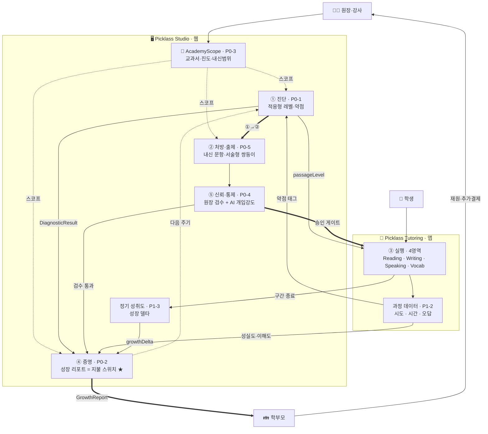

> 📄 본 문서는 통합 기획서 v0.21(→ `_archive/`)에서 분리된 문서이다. 본문 내 **§번호는 구 통합 기획서 기준**이며, §번호 → 신규 문서 매핑은 [README](../README.md)의 매핑표를 참조한다.

## 1. 문서 개요

### 1.1 문서 목적과 범위

본 문서는 Picklass(ClassSnap) 플랫폼의 **전체 서비스 구조·비즈니스 모델·핵심 도메인·AI 엔진·기술 아키텍처**를 통합적으로 정리한 기획서이다. 폴더 내에 흩어져 있던 다음 자료들을 단일 프레임에 통합한다.

- 백오피스(Admin) 문서군 (`picklass-backoffice/docs/*`)
- 스튜디오(Studio) 문서군 (`studio.picklass.com3/docs/*`)
- 튜터링(Tutoring) 기획 문서 (`tutoring.picklass.com/docs/picklass-tutoring-planning.md`)
- 스피킹 튜터 설계 자료 (`speaking.picklass.com/*`)
- 랜딩 페이지 및 공통 정책 (`www.picklass.com`)
- 파고다 개발 마일스톤 계약 및 스펙 PDF

본 문서는 **기획 관점의 통합본**으로, 개별 기능의 상세 개발 스펙은 각 서비스별 docs 폴더를 참조한다.

### 1.2 대상 독자

| 독자 | 주 활용 장 |
|---|---|
| 경영진 / 투자자 | §2, §5, §15, §20, §21 |
| 프로덕트 매니저 | §3 ~ §17 |
| 개발 / AI 엔지니어 | §9, §10, §12, §14, §15, §18, §19 |
| 디자이너 | §6, §8, §11, §14.9 |
| 파트너사(파고다 등) | §2, §5, §20.4, §23.3 |

### 1.3 용어 정의 / 약어표

| 용어 | 정의 |
|---|---|
| **LessonPlan** | 지문 1개 + 모듈 시퀀스로 구성된 학습 계획 |
| **PlannedModule** | LessonPlan 내 개별 모듈 슬롯 |
| **ModuleData / ModuleResult** | 실제 학습 콘텐츠 / 모듈 완료 결과 |
| **OrchestratorContext / ToolCall** | Agent 입력 컨텍스트 / 출력(도구 호출 결정) |
| **PassageAnalysis** | CurriculumPlannerAgent의 지문 분석 결과 |
| **ModulePedagogyProfile** | 모듈의 교수법 특성(채점/피드백/지문노출 모드) |
| **ContentConfig** | UI 배치 정책 |
| **KpiResult** | 모듈별 성과 지표 |
| **STT / TTS** | Speech-to-Text / Text-to-Speech |
| **WPM** | Words Per Minute (발화 속도) |
| **SRS** | Spaced Repetition System (간격 반복 학습) |
| **CEFR** | Common European Framework of Reference (A1~C2) |
| **Tool Use** | Anthropic Claude API의 구조화 출력 기능 |
| **SSE** | Server-Sent Events (스트리밍 방식) |
| **Guardrail** | Agent 출력 유효성 검증 레이어 |
| **Rolling Window** | 최근 N개 메시지만 유지하는 컨텍스트 관리 전략 |
| **TTFT** | Time To First Token (스트리밍 첫 토큰 지연) |

---


## 2. 서비스 개요 (Executive Summary)

### 2.1 제품 비전

> **"AI 기반 영어 4기능 통합 교육 플랫폼 — ClassSnap(Picklass)"**

Picklass는 Reading · Writing(서술형·첨삭) · Speaking · Vocabulary 4기능을 아우르는 B2B 중심 영어 교육 플랫폼이다. 검증된 교수법과 생성형 AI를 결합하여 학원/어학원/학교/기업교육 시장에 **"영어 수업 준비, 바로 딱!"** 경험을 제공한다.

> ⚠️ **v1.2 업데이트**: Listening은 시장에서 제외(코드에 폐기 확정)되어 **4기능 = Reading · Writing · Speaking · Vocabulary**로 재정의하였다. 특히 Writing(서술형·첨삭)은 어학원 1순위 수요(50%)로 이퓨쳐 시장조사에서 정식 편입 (→ [09 P1-1](09_로드맵_리스크_보안.md#p1)).

#### 2.1.1 제품 히어로 — "진단 → 처방 → 증명" 폐쇄 루프 *(v1.1 신설 — 시장조사 재정렬 반영)*

> 📋 **기획 — 포지셔닝 재배치**. 출처: `참고문서/Picklass_서비스기획서_v0.1.md` §1. 이 프레이밍은 이퓨쳐 2차 정성조사(12인)·569명 정량설문 결과를 반영해 제품의 주인공을 재배치한 것이다.

제품의 히어로는 **"AI가 학생을 가르친다"가 아니라 "진단 → 처방(자동출제·자료 생성) → 증명(학부모 리포트)의 끊기지 않는 루프"** 이다. 이 루프가 원장의 자료제작·출제·채점 노동을 없애고, 그 과정에서 쌓인 데이터로 성과를 증명한다.

| 단계 | 정의 | 담당 엔진·기능 (본 문서군 내 위치) |
|---|---|---|
| **① 진단 (Diagnose)** | 학생의 레벨·약점을 자동 분석 | Level Test / PPD ([06_진단평가_PPD](06_진단평가_PPD.md)) |
| **② 처방 (Prescribe)** | 진단 결과 기반 맞춤 콘텐츠·문항 자동 생성 | 콘텐츠 생성 엔진 · 모듈 시퀀싱 · 강사 진단카드 "처방 권장" ([05](05_모듈시퀀싱엔진_analyzer.md)·[06](06_진단평가_PPD.md)·[콘텐츠생성엔진](../Studio/기획서_콘텐츠생성엔진.md)) |
| **③ 증명 (Prove)** | 학습·과정 데이터를 학부모용 성장 리포트로 자동 생성 | 성장 리포트 · Achievement Test Δ ([06](06_진단평가_PPD.md), 리포트 상세는 후속 과제) |

> 💡 06·05·콘텐츠생성엔진에 세 단계의 **개별 요소는 이미 존재**하나, 이를 하나의 폐쇄 루프로 묶는 상위 서사가 없었다. 본 절이 그 상위 프레이밍의 SSoT이며, 각 단계 상세는 위 링크 문서가 소유한다.

#### 2.1.2 서비스 구조도 — MVP 루프 *(v1.2 신설 — 이퓨쳐/03_서비스구조도.md 통합)*

```text
 👨‍🏫 원장·강사
   │
   │  학원 범위 등록 · AcademyScope (P0-3)  →  진단·출제·리포트 공통 스코프
   ▼
 ━━━━  🔄 진단 → 처방 → 실행 → 증명  ·  끊기지 않는 폐쇄 루프  ━━━━
   │
 ① 진단      · P0-1 적응형 진단 · P1-3 정기 성취도
   │           └ DiagnosticResult → 리포트 초기값  ·  passageLevel → 수업 난이도
   ▼
 ② 처방·출제  · P0-5 내신 자동출제 · 서술형 쌍둥이
   │           └ 생성물 → ⑤검수(P0-4, 승인 게이트) → 🖨️ 출력(PDF·POD·QR)
   ▼
 ③ 실행      · Tutoring 앱 4영역 (Reading · Writing[P1-1] · Speaking · Vocab)
   │           └ 과정 데이터(시도·시간·오답, P1-2)
   ▼
 ④ 증명  ★   · P0-2·P0-2-1 성장 리포트 = 지불 스위치
   │           └ 과정데이터 → 성실도·이해도 반영  ·  약점태그 → ①진단 환류
   ▼
 👪 학부모  →  재원 · 추가결제  →  👨‍🏫 원장    ↺ 루프 반복
```



### 2.2 핵심 가치 제안

1. **B2B 기관 중심** — 학원 관리자가 강사/학생을 일괄 관리하고, 액세스코드 배포를 통해 빠르게 온보딩
2. **AI 맞춤형 학습** — CurriculumPlannerAgent가 지문·목표·레벨을 보고 레슨을 자동 설계
3. **모듈식 교수법** — 지문 1개 + 교수법 모듈 N개 조합으로 유연한 레슨 구성
4. **음성 기반 대화 학습** — Speaking Tutor(Free-talking)를 통한 실시간 양방향 음성 세션
5. **데이터 기반 성장** — 모듈별 KPI / 레벨별 WPM / 5지표 스피킹 KPI로 정량적 진도 추적

### 2.3 시장 포지셔닝 및 차별점

| 구분 | 기존 LMS | 기존 AI 영어앱 | **Picklass** |
|---|---|---|---|
| 주 고객 | 기관 | 개인(B2C) | **기관(B2B) 우선 + SaaS 병행** |
| 콘텐츠 | 강사 제작 | 고정 커리큘럼 | **AI 자동 생성 + 강사 편집** |
| 평가 방식 | 객관식 위주 | 음성 평가 중심 | **4기능 통합 + 교수법 모듈** |
| 피드백 | 사후 리포트 | 즉시 채점 | **실시간 적응형(Orchestrator)** |

#### 2.3.1 시장 근거 및 1차 타겟 *(v1.1 신설 — 시장조사 재정렬 반영)*

> 📋 **기획 — 사업 판단**. 출처: `참고문서/Picklass_서비스기획서_v0.1.md` §2~§3, `참고문서/Picklass_서비스개발기획_재정렬_v0.1.md`, 오이지 사업계획서(2026.02). 근거 데이터: 이퓨쳐 2차 정성조사 12인(2026.07) · 569명 정량설문(2026.06).

**1차 타겟 = 중소형 보습학원의 '설계형' 원장.** 이미 AI를 프롬프트로 직접 써보고 있어 니즈·지불의향이 가장 뚜렷한 층이다. **대형 어학원은 이미 자체 시스템을 보유해 오히려 니즈가 낮다**(양쪽 다 경험한 증인 확인) — 파고다 등 대형 파트너는 "구매자"가 아니라 **유통·판로 채널**로 위치시킨다.

| 시장 신호 | 수치 (근거) | 제품 함의 |
|---|---|---|
| 지불의향 세그먼트 1위 | **보습학원 86%** (보습 AI 진단 니즈 59%) | 1차 타겟을 중소형 보습으로 고정 |
| 현장 최대 병목 | 수업자료·교재 준비 **52%** · 평가·시험관리 **39%** · 채점·피드백 **38%** (정량 Q18) | 처방(자동출제·자료) 자동화가 핵심 가치 |
| 학부모 클레임 1위 | **"학습 상황을 잘 모르겠다" 21%** (Q19) | 성장 리포트 = 지불 스위치 |
| AI 기대영역 1위 | **자동출제 51%** | 내신 자동출제 트랙 신설 근거 (§9.1.1) |
| 과금 가능 부가서비스 1위 | **AI 진단 리포트 31%** | 리포트 정확성이 재원(매출)과 직결 |
| 신사업 미시도 이유 1위 | **"시간 부족" 22.8%** (비용 부담 9.3%의 2.5배) | "싸게"가 아니라 "노동 절감·증명"으로 승부 |

**핵심 학습층**: 초등 고학년~중등, 수도권(초등고학년 75%·수도권 63%).

**3대 차별점** (경쟁 도구가 못 하는 것):
1. **우리 학원 범위 종속형** — 표준 문제은행이 아니라 그 학원이 실제 가르친 진도·교과서·시험범위 안에서만 작동. (넬트·클래스카드가 "우리 학원에 안 맞아서" 버려진 사유의 정반대)
2. **진단→증명 폐쇄 루프** — 출제로 끝나지 않고 학부모 리포트까지 하나로 연결 (§2.1.1).
3. **원장이 통제하는 AI** — 완제품 강요가 아니라 검수·수정·개입강도 조절 가능(Human-in-the-loop). 완제품 불신·자기주도 침해 우려(각 23%) 대응.

**IP 근거**: "AI 기반 맞춤형 수업 자동 설계 장치 및 방법" **특허 출원 완료(10-2025-0197727, 2025.12)** — 자동 수업 설계 차별점의 방어 근거. (출처: 오이지 사업계획서)

> ⚠️ **정합성 주의** — 본 절의 "중소형 보습 우선" 판단은 기존 §2.1 비전의 "B2B 중심(파고다 등 대형 파트너)" 서술과 **긴장 관계**에 있다. 두 트랙은 배타적이지 않으며(대형 = 유통 채널 유지 + 중소형 셀프서브 병행), 로드맵상 병행 트랙으로 관리한다([09 §20.6](09_로드맵_리스크_보안.md) 참조). 최종 우선순위는 사업 측 확정 필요.

### 2.4 현재 상태

- **Reading 베타 운영 중** (지문 관리, 유창성 읽기, 전략적 읽기)
- **Writing / Listening / Speaking 순차 출시 예정**
- Speaking은 별도 독립 앱(speaking.picklass.com)으로도 운영 계획

### 2.5 ❌ 핵심 성과 지표 요약 *(v0.17 삭제 — §20 로드맵·§21 성공 지표로 일원화)*

> 본 절은 §20·§21로 통합 이관되어 v0.17에서 폐기되었다.

### 2.6 On-demand 콘텐츠 생성 원칙

> Picklass는 수업 콘텐츠(레슨 구성·문항·피드백·추천 주제)를 **사용자가 모듈에 진입하는 시점에 실시간으로 생성**하는 On-demand 방식을 원칙으로 한다. 지문 등록 시점에 레슨·문항을 미리 만들어 두는 선생성(Pre-generation) 방식은 채택하지 않는다.

| 항목 | 내용 |
|---|---|
| 생성 시점 | **모듈 진입 시점** (레슨·수업 진행 중) |
| 선생성 여부 | ❌ 없음 — 지문 등록 시 레슨·문항·피드백을 미리 만들지 않음 |
| 적용 위치 | Tutoring Lesson Player, Studio 수업 미리보기, Speaking 세션 |
| 목적 | **비용 효율화** (사용되지 않는 콘텐츠 생성 낭비 제거) + **최신 컨텍스트 반영** (AI 모델 최신 버전·지문 수정사항·학습자 이력 즉시 반영) |
| 예외 | 지문 자체 텍스트(§9.3)와 레벨 분석 결과(§9.4)는 사전 분석 후 저장 — 모듈 단위 콘텐츠만 on-demand |

**이 원칙의 설계적 파급**
- **§9 콘텐츠 생성·분석 엔진**: 지문은 저장하되, 모듈별 활동 콘텐츠는 진입 시 생성
- **§10 모듈 시퀀싱 엔진**: LessonPlan은 저장하되, 개별 문항·피드백은 런타임 생성
- **§12 Orchestrator Agent**: 학습자 상태에 따라 매 상호작용마다 다음 콘텐츠 결정
- **§14 Speaking Tutor**: 3-Phase 대화 루프가 완전한 on-demand 구조로 동작

**실패 처리 (후속 과제)** — On-demand 생성 실패 시 폴백(캐시된 기본 콘텐츠 or 재시도 + 사용자 대기 UI) 정책은 후속 과제로 등록 (§20 로드맵 연동).

---


## 3. 전체 서비스 구조

### 3.1 서비스 아키텍처 개관 (도메인 · 채널)

Picklass는 **B2B 채널과 B2C 채널을 도메인으로 분리**한다. 서브도메인은 `admin.picklass.com` 외 신규 추가하지 않으며, studio.picklass.com은 **루트(/) = B2B 홍보 랜딩**, **/app = Studio 저작 앱**의 이중 용도로 운영한다.

| 구분 | 도메인 / 경로 | 역할 | 주 사용자 | 공개성 |
|---|---|---|---|---|
| **B2C 랜딩 · 학생 진입** | **www.picklass.com** | Phase 1: B2C 티저 + 학생 로그인·액세스코드 CTA<br>Phase 2: 풀 B2C 브랜드 랜딩 | 학생 · 학부모 · 개인 학습자 | 공개 · SEO 집중 |
| **B2B 홍보 랜딩** | **studio.picklass.com/** (루트) | 제휴 문의 · 데모 신청 · 사례 소개 · 기관장·강사 로그인 | 학원 관리자 · 강사 · 파트너 | 공개 · B2B 키워드 SEO |
| **Studio 저작 앱** | **studio.picklass.com/app/** | 지문/과정/레슨 제작, 모듈 편집, 학생 관리 | 강사 · 기관장 | 로그인 필수 · noindex |
| **Admin 백오피스** | **admin.picklass.com** | 기관/사용자/콘텐츠/요금제/AI모듈/액세스코드 중앙 관리 | 시스템·학원관리자 | 내부 · noindex |
| **튜터링** | **tutoring.picklass.com** | AI 튜터 Pickle과의 개인 맞춤 학습, 학생 로그인 화면 | 학생 | 로그인/코드 필수 · noindex |
| **스피킹 튜터** | **speaking.picklass.com** | 실시간 음성 대화 학습 (독립 앱 + 통합 모듈) | 학생 · 개인 구독자 | 로그인/코드 필수 · noindex |

**핵심 원칙**
- 학부모/학생에게 노출되는 공개 홍보 도메인은 **오직 www.picklass.com** 하나
- 학원·강사·파트너 대상 홍보는 **studio.picklass.com/** 루트에서만 진행
- Phase 1 초기에는 B2B 세일즈가 주력 → studio가 활성 홍보 채널, www는 티저 + 학생 진입점
- Phase 2 B2C 확장 시 www가 메인 브랜드 채널로 전환 (도메인 이전/리다이렉트 재작업 불필요)

### 3.2 서비스 간 관계도

**진입 채널이 B2C(www)와 B2B(studio 루트)로 이원화**된다. 학생 로그인은 www에 CTA만 두고 클릭 시 `tutoring.picklass.com/login`으로 리다이렉트한다(옵션 B).

```
┌──────────────────────────────────────────────────────────────────┐
│                        [진입 채널 분리]                          │
├──────────────────────────────────────────────────────────────────┤
│                                                                  │
│   B2C / 학생 · 학부모                   B2B / 기관 · 강사        │
│        │                                       │                 │
│        ▼                                       ▼                 │
│  ┌─────────────────────┐             ┌──────────────────────┐   │
│  │ www.picklass.com    │             │ studio.picklass.com/ │   │
│  │ Phase1: B2C 티저    │             │  (루트)              │   │
│  │       + 학생 CTA    │             │  B2B 홍보 랜딩       │   │
│  │ Phase2: B2C 주력 ★  │             │  제휴/데모 문의       │   │
│  │ [공개 SEO]          │             │  강사·기관장 로그인  │   │
│  └─────────┬───────────┘             └───────┬──────────────┘   │
│            │                                 │                   │
│            │ [학생 로그인] CTA 클릭           │ 로그인             │
│            │   ↓ 리다이렉트                   │                   │
│            │                                 │                   │
│            ▼                                 ▼                   │
│  ┌─────────────────────────┐      ┌───────────────────────────┐ │
│  │ tutoring.picklass.com   │      │ studio.picklass.com/app/  │ │
│  │ /login  (학생 로그인)   │      │ (Studio 저작 앱)          │ │
│  │                         │      │  · 지문/레슨 제작         │ │
│  │ → 모듈식 레슨 진행      │      │  · 학생 배정              │ │
│  │   · Pickle AI 튜터      │      │  · 성과 모니터링          │ │
│  └─────────┬───────────────┘      └───────────────────────────┘ │
│            │                                                     │
│            │ Speaking 모듈 호출 or 독립 진입                      │
│            ▼                                                     │
│  ┌─────────────────────────────────────┐                         │
│  │ speaking.picklass.com      │                         │
│  │  · 실시간 음성 대화 (Free-talking)  │                         │
│  │  · 통합 모듈 + 독립 앱 양쪽 지원    │                         │
│  └─────────────────────────────────────┘                         │
│                                                                  │
│  ┌─────────────────────────┐                                     │
│  │ admin.picklass.com      │   [시스템/학원 관리자]               │
│  │  · 기관/사용자/코드     │     ↑ studio에서 역할 확인 후        │
│  │  · 요금제/Billing       │       관리 권한으로 진입              │
│  │  · AI 모듈/시스템 설정  │                                     │
│  └─────────────────────────┘                                     │
│                                                                  │
└──────────────────────────────────────────────────────────────────┘
```

**주요 플로우 요약**

- **학생**: www.picklass.com → [학생 로그인] 또는 [액세스코드 입장] → `tutoring.picklass.com/login` → 학습
- **강사/기관장**: studio.picklass.com/ 홍보 랜딩 → [로그인] → `studio.picklass.com/app`
- **시스템/학원 관리자**: studio 로그인 후 역할 확인 → `admin.picklass.com`
- **Speaking**: tutoring 내 모듈 호출 or `speaking.picklass.com` 직접 진입

### 3.3 Speaking Tutor 이중 운영 모델 *(+ 외부 임베드 보조 채널)*

> ⚠️ **재정의 (v0.10)**: 기획상 "이중 운영 모델"은 유지하되, 외부 시스템(예: 파고다SCS) 연동을 위한 **외부 임베드 채널이 이미 구현·운영 중**임을 명시. 별도 신규 채널이 아닌 기존 외부 API의 재사용 형태.

| 운영 모드 | 진입 경로 | 세션 단위 | 데이터 저장 위치 | 상태 |
|---|---|---|---|---|
| **통합 모듈 (튜터링+스피킹)** | Tutoring 레슨 내 Speaking 모듈 슬롯 | LessonPlan의 PlannedModule | ModuleHistory에 호환 저장 | 📋 기획 단계 |
| **독립 앱 (스피킹 단독)** | speaking.picklass.com 직접 진입 | SpeakingSession (독립 엔터티) | SpeakingSession 테이블 | 📋 기획 단계 |
| **외부 임베드 (이미 구현)** | 외부 시스템이 `X-Access-Token` + `X-Module-Code`로 `GET /external/verify` 호출 → 임베드 위젯 또는 별도 도메인에서 학습 진행 | 외부 시스템이 발급한 lessonId 기반 세션 | 외부 시스템 + 픽클래스 자체 학습 로그 | ✅ **구현 완료** (`SNR`, `FRT` 모듈 대상) |

**3가지 모드 모두** 동일한 SpeakingConversationAgent와 음성 인프라(STT/TTS)를 사용하되, **진입점/UI/인증/설정 경로/과금/리포트가 분기**된다.

> 📎 외부 임베드 케이스의 상세 인증 메커니즘과 API 응답 스키마는 **§14.10.4 ONETIME TOKEN + 외부 verify** 참조.

#### 3.3.1 통합 모듈 플로우 (튜터링 → 스피킹)

학생이 Tutoring에 로그인한 상태에서 Speaking 모듈로 진입하는 경우, 인증·레벨·콘텐츠 설정이 **Tutoring에서 자동 전달**되어 학생이 별도 입력할 필요가 없다.

**사용자 여정**
```
[튜터링 로그인]
    ↓
[수강(모듈) 목록]
    ↓
[스피킹 선택]
    ↓
[새 세션 시작 화면]
  · 이름 (GET_AUTH API 기본값, 수정 가능)
  · 마이크 선택·테스트
  · 튜터(Pickle 등) 선택
    ↓
[세션 시작]  ← 이 시점에 ONETIME TOKEN 소멸
    ↓
[결과 화면]
    ↓
[수강(모듈) 목록]  (원래 화면으로 복귀)
```

**핵심 인증·연동 메커니즘**

| 메커니즘 | 설명 |
|---|---|
| **ONETIME TOKEN** | Tutoring에서 Speaking 서비스로 페이지 이동 시 **일회용 토큰을 생성**하여 쿼리스트링 형태로 전달. 브라우저 이력·북마크로 재진입 불가하도록 보장. |
| **GET_AUTH API** | Speaking 서비스가 ONETIME TOKEN을 키로 호출하는 인증·컨텍스트 조회 API. 응답 필드: **아이디, 이름, 인증코드, 레벨, 콘텐츠, 대화 분량, 음성 모드** |
| **이름 필드 정책** | GET_AUTH 응답의 이름(기관에서 제공 가능)을 기본 설정하고, 세션 시작 화면에서 **사용자가 수정 가능**하도록 노출 |
| **토큰 소멸** | 세션 시작 시점에 ONETIME TOKEN 소멸. **소멸 API**가 Speaking 서비스 → Tutoring 방향으로 호출되어 토큰 상태를 무효화 |

**API 인터페이스 요약**
```
Tutoring → Speaking:
  GET https://speaking.picklass.com/?token={ONETIME_TOKEN}

Speaking → Tutoring:
  POST /api/auth/get-auth        (payload: { token })
       응답: { userId, name, accessCode, level, content, dialogLength, voiceMode }

  POST /api/auth/revoke-token    (payload: { token })
       세션 시작 시 호출, 토큰 소멸
```

#### 3.3.2 독립 앱 플로우 (스피킹 단독)

사용자가 Tutoring을 거치지 않고 Speaking 서비스에 **직접 진입**하는 경우. 스피킹 단독 앱은 **두 가지 경로**로 새 세션을 시작할 수 있다.

**(공통) 로그인 직후 화면 구조**

```
[스피킹 아이디 로그인]
    ↓
┌────────────────────────────────────────────────┐
│ 대시보드                                        │
│  ├─ 진행중인 세션 목록 (이어하기)              │
│  ├─ 수강 중인 과정 (My Courses)                │
│  │     └─ 레슨 선택 → 경로 A 또는 B 진입       │
│  └─ 수강할 수 있는 과정 (Available Courses)    │
│        └─ [인증코드 입력] → 수강 목록에 추가    │
└────────────────────────────────────────────────┘
```

##### 경로 A. 사전 세팅 과정 기반 수업

과정 제작자(기관·강사)가 **레벨·콘텐츠·대화 분량·음성 모드**를 사전에 지정한 레슨을 수강하는 경우. 사용자는 세션 개시에 관련된 최소 항목만 선택한다.

```
[수강 중인 과정] → [레슨 선택]
    ↓
[새 세션 시작 화면]
  · 이름 / 마이크 / 튜터 선택
  · 레벨·콘텐츠·대화 분량·음성 모드 = 과정 사전 설정값 (수정 불가)
    ↓
[세션 시작]
    ↓
[결과 화면]
```

**특징**
- 사용자가 전체 설정을 직접 하지 않음 — 과정 제작자의 의도가 반영됨
- 동일 과정 내 여러 레슨을 순차 수강 가능 (학습 곡선 설계)
- **인증코드는 "과정 단위"로 발급·사용**된다 — 인증코드 1개 = 과정 1개 수강권. 수강할 수 있는 과정에서 인증코드 입력 시 해당 과정이 "수강 중인 과정"으로 승격되며, 이후 과정 내 모든 레슨은 추가 인증 없이 수강 가능

##### 경로 B. 개인 관심사 기반 수업 (플랜 옵션)

사용자의 **현재 플랜에 "개인 관심사 수업" 상품 옵션이 포함된 경우**에만 활성화된다. 이 옵션은 **Admin이 플랜 레벨에서 상품 구성 옵션으로 일괄 관리**한다 (§7 참조). 사용자는 관심 주제를 직접 선택하여 자유 대화 세션을 생성하되, 레벨·음성 모드·대화 분량 등 학습 파라미터는 과정 기본값을 따른다.

```
[수강 중인 과정] (개인 관심사 수업 옵션 노출)
    ↓
[인증]  ← 수강 자격 확인 (플랜 권한)
    ↓
[관심 영역 등록]
  · AI 자동 생성 추천 주제 리스트 (최신 뉴스·이슈·트렌드 기반)
  · 사용자 자유 입력도 허용
    ↓
[새 세션 시작 화면]
  · 이름 / 마이크 / 튜터 선택
  · 레벨·음성 모드·대화 분량 = 과정 기본값 (수정 불가)
    ↓
[세션 시작]
    ↓
[결과 화면]
```

**특징**
- 과정에 귀속되지만 **주제는 사용자가 선택** — 흥미 유지·장기 학습 동기 부여
- **레벨·음성 모드·대화 분량은 과정 기본값으로 고정** — 경로 A와 학습 난이도·경험 일관성 유지
- **추천 주제는 AI가 최신 뉴스·이슈·트렌드를 실시간 수집하여 자동 생성** (일정 주기 갱신 및 캐시)
  - 데이터 소스: 뉴스 API, 소셜 트렌드, 공개 시사 이슈
  - 필터: 연령·레벨·과정 맥락에 맞는 주제로 정제 (성인/미성년 안전 분류 포함)
- 플랜에 옵션이 없는 사용자에게는 경로 B 진입점(UI) 자체가 노출되지 않음

##### 공통 특징 (경로 A·B)

- 자체 로그인 · 인증코드 · 세션 히스토리 모두 Speaking 서비스 내에서 관리
- ONETIME TOKEN / GET_AUTH API **사용하지 않음** (Tutoring 연동 없음)
- 세션 종료 후 Tutoring 수강 목록으로 돌아가지 않음 (Speaking 대시보드로 복귀)
- 과금·리포트는 Speaking 구독 플랜 기준 (§5.3 연동)
- "진행중인 세션 목록"에서 미완료 세션을 이어서 진행 가능

##### 과정 · 레슨 · 세션 계층 구조 (Speaking 독립)

```
Plan (플랜 · Admin에서 상품 구성)
 │   └─ [개인 관심사 수업] 옵션 (플랜 레벨 토글)         ← 경로 B 활성화 조건
 │
 └─ Course (과정 · 인증코드 1개로 수강권 부여)
     ├─ Lesson 1 (레벨/콘텐츠/분량/음성모드 사전 설정)    ← 경로 A
     ├─ Lesson 2
     └─ (플랜 옵션 ON 시) 개인 관심사 수업 진입점         ← 경로 B
           └─ AI 추천 주제 선택 시 Session 생성
```

> 📎 "개인 관심사 수업" 옵션은 **Admin에서 플랜(상품) 레벨 토글로 관리**된다 (§7 참조). 해당 옵션이 포함된 플랜을 보유한 사용자에게만 경로 B UI가 노출된다.

#### 3.3.3 세 가지 플로우 + B2B 제휴 모드 대조 *(v0.16 보강)*

독립 앱의 두 경로(A/B)를 통합 모듈과 함께 비교하며, **B2B 제휴 모드**(§16)는 별도 운영 형태로 모든 플로우 위에 적용 가능한 메타 모드이다.

> 🔁 **v0.16 — B2B 제휴 모드 도입**: 위 3개 플로우는 픽클래스 자체 운영 기준이다. **B2B 제휴 모드**가 적용되면 (a) 진입은 제휴사 사이트에서 시작 (b) 인증은 외부 토큰(`X-Access-Token` + `X-Module-Code`, §14.10.5) (c) 운영(상품·과금·수료)은 제휴사 자체 기획 (d) 수업 진행만 픽클래스 임베드 실행. 상세는 **§16** 참조.

| 항목 | 통합 모듈 (튜터링+스피킹) | 독립 앱 — 경로 A (과정 기반) | 독립 앱 — 경로 B (개인 관심사) |
|---|---|---|---|
| 진입 경로 | 튜터링 로그인 → 수강 목록 → 스피킹 선택 | 스피킹 로그인 → 수강 중인 과정 → 레슨 선택 | 스피킹 로그인 → 수강 중인 과정(개인관심사 UI 노출) → 인증 → 관심 영역 등록 |
| 인증 방식 | ONETIME TOKEN + GET_AUTH API | 스피킹 자체 아이디 + 인증코드 (**과정 단위**) | 스피킹 자체 아이디 + 수강 자격 확인 |
| 사전 설정 (레벨/콘텐츠/분량/음성모드) | Tutoring이 GET_AUTH로 전달 | **과정 제작자가 사전 지정** (수정 불가) | **과정 기본값으로 고정** (사용자 수정 불가) |
| 사용자 선택 항목 | 이름 · 마이크 · 튜터 (+ Tutoring 기본값 수정) | 이름 · 마이크 · 튜터 | **관심 주제(AI 추천)** · 이름 · 마이크 · 튜터 |
| 이름 필드 | GET_AUTH 제공값 기본 + 수정 가능 | 사용자 직접 입력 (프로필 값 기본) | 사용자 직접 입력 |
| 세션 종료 후 복귀 | 튜터링 수강 목록 | Speaking 대시보드 (수강 중인 과정) | Speaking 대시보드 |
| 세션 저장 | ModuleHistory (통합) + SpeakingSession 연결 | SpeakingSession (과정·레슨 FK 포함) | SpeakingSession (과정 FK + 관심 주제) |
| 옵션 노출 조건 | Tutoring 레슨에 Speaking 모듈 슬롯 존재 | 기본 경로 | **사용자 플랜에 "개인 관심사 수업" 상품 옵션 포함** |
| 옵션 관리 주체 | Studio 강사 (레슨 편집) | Studio 강사 (과정 편집) | **Admin (플랜 레벨 상품 구성)** |
| 과금 | 기관 플랜 번들 또는 Tutoring 구독 | Speaking 구독/**과정 단위 과금** (인증코드 1건 = 과정 1건) | Speaking 구독 중 옵션 포함 플랜 이용 |

> 📎 통합 모듈의 상세 데이터 흐름과 UX 구성은 **§14.10 통합 모듈 연동**, 독립 앱 UX는 **§14.9 독립 앱 UX**를 참조한다. "개인 관심사 수업" 옵션은 **§7 Admin의 플랜 상품 구성**에서 관리되며, 과정 단위 인증코드 정책은 **§7.5 액세스코드**의 Speaking 확장 항목을 참조한다.

#### 3.3.4 1:1 회화 채널 (파고다 외부 시스템 연계) *(v0.11 신설 — 회의록 260413)*

> 📋 **기획 단계** — 파고다 합동 회의(2026-04-13)에서 확정된 채널 운영 정책. 외부 임베드 채널의 **상위 운영 형태**를 정의한다.
>
> 📎 **v0.19 cross-ref**: 본 §3.3.4는 **§16. B2B 제휴 운영 모델**의 **첫 번째 표준 사례**이다. 운영 책임 분리·인증·상품 매핑·운영 도구 등 일반화된 모델은 §16 참조, 1:1 회화 채널 특수 정책(앱 설치 선택권·전환경 지원·라인업 등)은 본 절에서 상세 다룬다. §16.10.3에서 본 절을 cross-ref로 인용한다.

회의록 결정 사항을 다음 4개 정책으로 정리한다.

**① 채널 명칭 변경**

- 파고다 측 사이트(전화외국어 도메인)의 상단 서비스명을 **"전화외국어"** → **"1:1 회화"** 로 변경.
- 픽클래스 측 외부 임베드 채널은 이 1:1 회화 사이트의 **AI 상품 라인업** 위치에 배치된다.

**② 상품 라인업 구성**

| 라인업 구분 | 운영 주체 | 픽클래스 연관 |
|---|---|---|
| 전화 회화 | 파고다 강사 매칭 | 없음 |
| 화상 회화 | 파고다 강사 매칭 | 없음 |
| **AI 회화 (신규)** | 픽클래스 임베드 | ✅ §3.3 외부 임베드 모드, §14.10.5 GET /external/verify |

AI 회화 라인업의 학습 모듈은 픽클래스 측에서 **`SNR`(Speaking N-Reply, 본 대화 학습) · `FRT`(Free Talking, 자유 대화)** 기준으로 임베드되며, 외부 시스템이 발급한 액세스 토큰으로 인증된다(§14.10.5).

**③ 플랫폼 제공 범위 — 전환경 지원**

| 환경 | 지원 여부 | 설명 |
|---|---|---|
| PC Web | 📋 기획 | 데스크탑 브라우저 임베드 |
| Mobile Web | 📋 기획 | 모바일 브라우저 임베드 |
| Native App (iOS/Android) | 📋 기획 | 파고다 앱 또는 1:1 회화 전용 앱 |

**④ 앱 설치 선택권 (Soft App-Install)**

학습자가 AI 회의실 입장 시 다음 분기를 갖는다.

```
[1:1 회화 사이트 → AI 회화 입장]
    ↓
[앱 설치 여부 감지]
    ├─ 설치된 경우  → 앱으로 자동 연결 (Universal Link / Deep Link)
    └─ 미설치인 경우 → 다음 두 옵션을 학습자에게 제공
                       (a) 브라우저에서 계속 진행
                       (b) 앱 다운로드 후 참가
```

> ⚠️ **확인 필요**: 회의록 기록상 "오이지 측 확인 필요" — 앱 미설치 시 브라우저 계속 진행/앱 참가 분기 UX 구현 가능성 확인. 결과에 따라 (a)/(b) 분기를 자동/수동 모드로 운영.

**⑤ 피드백 페이지 정책 (참고)**

회의록에서 결정된 피드백 노출 정책 — 학습자 페이지(파고다 사이트 내 노출)에서 다음 기준으로 데이터를 표시한다.

| 표기 단위 | 기준 | 설명 |
|---|---|---|
| **일간 학습성취** | **레벨별 상대값** | 학습자 레벨 대비 상대 진척률 (예: A2 기준 110%) |
| **월간 학습성취** | **절대값** | 누적 발화량·시간·미션 완료 등 절대 수치 |

상세 수료 기준 및 학습자 페이지 노출 항목은 **§11.10 수료 기준** 참조.

**⑥ 상품 라인업·환경 지원 매트릭스**

| 상품 라인업 \\ 환경 | PC Web | Mobile Web | App | 인증 방식 |
|---|---|---|---|---|
| 전화 회화 | ⭕ | ⭕ | ⭕ | 파고다 자체 |
| 화상 회화 | ⭕ | ⭕ | ⭕ | 파고다 자체 |
| **AI 회화 (픽클래스 임베드)** | 📋 | 📋 | 📋 | **`X-Access-Token` + `X-Module-Code`** (§14.10.5) |

> 📎 외부 임베드 인증 메커니즘은 **§14.10.5 외부 시스템 임베드 GET /external/verify**, 콘텐츠 생성 방식 3종(교재/주제+레벨/프리토킹)은 **§10.5 Speaking 콘텐츠 생성 모드** 참조.

### 3.4 도메인 맵

- **Identity**: User, Institution, AccessCode, Role, Session
- **Content**: Passage, Lesson, Course, Module(Reading/Writing/Speaking)
- **Learning**: ModuleHistory, LessonResult, KpiResult, SpeakingSession/Turn
- **Commerce**: Plan, Subscription, Invoice, Payment, AIUsage
- **System**: AIModule, Level(파고다 1~18), Status, Duration

> 📎 CEFR는 **7밴드**(PreA1·A1·A2·B1·B2·C1·C2), **1~18은 파고다/파트너 레벨**(별도 축)이다. 두 척도의 매핑은 [06_진단평가_PPD §15.2.4](06_진단평가_PPD.md) 참조.

### 3.5 공통 인프라 및 도메인/SEO 정책

**공통 인프라**
- **인증**: 이메일 + 소셜 OAuth (Google / Kakao / Naver)
- **DB**: PostgreSQL (Backoffice/Tutoring), Supabase (Studio/www)
- **AI API**: Anthropic Claude(claude-haiku-4-5-20251001, Tool Use), Google GenAI
- **음성**: Azure Speech (TTS 우선), Google STT, 추후 Azure STT 대체 검토

**도메인/SEO 정책**

| 도메인 / 경로 | 인덱싱 | 타겟 키워드 유형 | 근거 |
|---|---|---|---|
| www.picklass.com | **index 허용** | B2C (AI 영어 튜터, 영어 회화 학습 등) | Phase 2 브랜드 주력 채널 |
| studio.picklass.com/ (루트) | **index 허용** | B2B (학원 AI 교재, 영어 학원 솔루션 등) | 파트너 유입 필요 |
| studio.picklass.com/app/** | **noindex** | - | 앱 화면 공개 차단 |
| admin.picklass.com | **noindex** | - | 관리자 전용, 공개 불필요 |
| tutoring.picklass.com | **noindex** | - | 학생 로그인/학습 전용 |
| speaking.picklass.com | **noindex** | - | 학생 로그인/학습 전용 |

**인증 쿠키 스코프**
- www ↔ tutoring/speaking 간 SSO가 필요한 경우 `.picklass.com` 상위 도메인 쿠키 사용
- studio ↔ admin 간 역할 검증 핸드오프는 서버 사이드 세션 또는 JWT 전달

**레거시 URL 리다이렉트 (Phase 1 전환)**
- 기존 www.picklass.com의 B2B 경로(`/partners`, `/demo`, `/pricing`, `/institution` 등) → `studio.picklass.com/*` 301 영구 이동
- www 루트(`/`)는 **리다이렉트하지 않음** — B2C 티저/학생 진입점으로 유지

---


