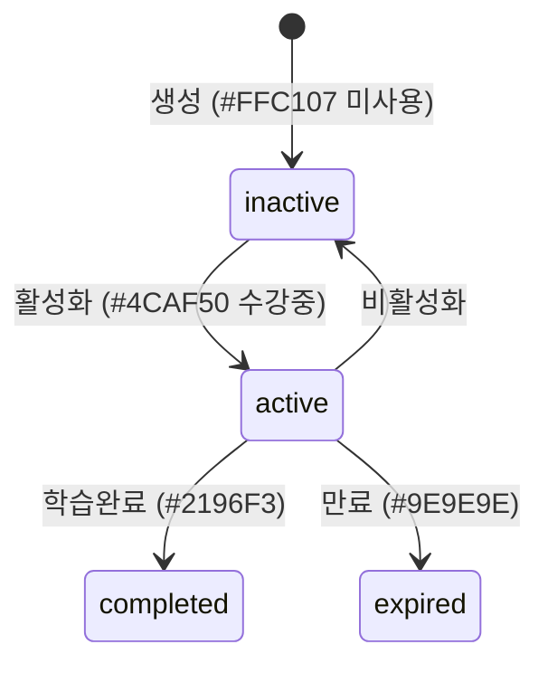

# Backoffice 기획서 §6 · 정책·규칙

> 참고문서(`참고문서/picklass_docs/backoffice/`) 기반. 적용 대상은 §4(화면)·§5(기능) ID로 표기.
> 백오피스 IA의 핵심인 **2-Tier 접근제어·데이터 스코프**를 §1·§2에서 상세히 다룹니다.

---

## 0. 정책 카탈로그

| 정책ID | 분류 | 규칙 요약 | 적용 대상 |
|---|---|---|---|
| BO-P-001 | 접근·권한 | 역할 상수 4종(ALL/ORG_ABOVE/PARTNER_ABOVE/PLATFORM_ONLY) | 전역 |
| BO-P-002 | 접근·권한 | Tier 1 메뉴 차단(SYS ONLY) | 시스템·API로그·일부 통계 |
| BO-P-003 | 접근·권한 | Tier 2 데이터 범위 제한 | 조직·사용자·콘텐츠·통계 |
| BO-P-004 | 데이터 스코프 | resolveUserScope 재귀 CTE | BO-F-010, 020, 030, 040 |
| BO-P-005 | 데이터 스코프 | fixedLevel별 필터 LOCK | 전 필터 화면 |
| BO-P-006 | 데이터 스코프 | 엔티티별 scope 필드 | 백엔드 전역 |
| BO-P-007 | 데이터 스코프 | PARTNER_ABOVE partner 단위 | BO-F-036, 060~061 |
| BO-P-010 | 검증 | 개수·이메일·날짜 검증 | 등록·생성 기능 |
| BO-P-011 | 정량제약 | 페이지네이션 | 목록 화면 |
| BO-P-012 | 정량제약 | JWT·세션·핸드오프 | BO-F-023 |
| BO-P-013 | 정량제약 | 플랜 자동채움 DEFAULT_PLANS | BO-F-011 |
| BO-P-020 | 수명주기 | 액세스코드(effectiveStatus) | BO-F-033~035 |
| BO-P-021 | 수명주기 | 사용자 상태 | BO-F-021~022 |
| BO-P-022 | 수명주기 | 기관 상태 | BO-F-011~012 |
| BO-P-023 | 수명주기 | 기관 수업설정 쓰기권한 | BO-F-013 |
| BO-P-030 | 카테고리 | 카테고리 파트너 소유 | BO-F-036 |
| BO-P-031 | 카테고리 | 배정 규칙(L2만·동일파트너) | BO-F-037 |
| BO-P-032 | 콘텐츠 | 과정 읽기전용(역할분리) | BO-F-030 |
| BO-P-033 | 콘텐츠 | 수강인원·배포횟수 실시간 집계 | BO-F-030 |

---

## 1. 접근·권한 (2-Tier)

### BO-P-001 · 역할 상수
- `ALL_ADMIN` = [system, partner, group, academy]
- `ORG_ABOVE` = [system, partner, group] (academy 제외)
- `PARTNER_ABOVE` = [system, partner]
- `PLATFORM_ONLY` = [system]

### BO-P-002 · Tier 1 (메뉴 차단, SYS ONLY)
- 대상: 시스템 대메뉴 전체(7소메뉴), API 로그 전체(2소메뉴), 통계 내 플랫폼 현황·B2B 학습데이터, 파트너 연동 테스트, 지문 관리
- 구현: `AdminRoleGate`가 `ADMIN_MENU.allowedRoles` **최장 경로 매칭**으로 통제 → 위반 시 `/admin/dashboard` 리다이렉트(E-004)

### BO-P-003 · Tier 2 (데이터 범위 제한)
- 메뉴는 전 관리자 노출, 검색 필터를 pre-fill + disable(LOCK)로 범위 고정
- 대상: 조직관리·사용자관리·콘텐츠 플랫폼·통계/리포트
- 사이드바 `filterByRole` 재귀 필터링으로 접근 가능 메뉴만 노출

---

## 2. 데이터 스코프

### BO-P-004 · resolveUserScope
- `resolveUserScope(userId, roleCode)` (`institution.service.ts`) → sys=`null`(전체) / partner·group=`string[]`(재귀 CTE 산하 기관) / academy=자기 기관 1개
- `WITH RECURSIVE descendants`(parent_id 순회), 계층 partner→group→institution 3단계
- **역할 스코프 ∩ 선택 필터 = 교집합** 적용
- ⚠️ **[중복 구현 금지]** `InstitutionService.resolveUserScope`를 재사용해야 함 (course.service가 별도 구현하며 발생한 과거 버그 → §7 BO-E-009)

### BO-P-005 · fixedLevel별 필터 LOCK
| fixedLevel | 파트너 | 그룹 | 기관 |
|---|---|---|---|
| `null`(sys) | 검색 | 검색 | 검색 |
| `partner` | 🔒 | 검색 | 검색 |
| `group` | 🔒 | 🔒 | 검색 |
| `institution` | 🔒 | 🔒 | 🔒 |
- orgContext(`GET /auth/me`) → Zustand 저장, 전 페이지 공유
- LOCK 스타일: 배경 `#f5f5f5`·색 `#999`·`not-allowed`·툴팁 "내 소속 기준으로 고정됩니다"

### BO-P-006 · 엔티티별 scope 필드
- Institution: `where.id IN` / User·Course·AccessCode: `where.institutionId IN` / 통계 Raw SQL: `institution_id = ANY(ARRAY[]::uuid[])`
- 백엔드 필수: `@UseGuards(AdminAuthGuard)` + 모듈에 `CoreAuthModule`·`AuthModule`·`CoreInstitutionModule` import (누락 시 서버 크래시 → 로그인 "Failed to fetch"). core 변경 시 `pnpm --filter @repo/core build` + 재시작 필수

### BO-P-007 · PARTNER_ABOVE partner 단위
- `partnerId = req.partnerId` 단순 equality(재귀 불필요). 과정 카테고리·파트너 API 연동에 적용

---

## 3. 검증 · 정량 제약

### BO-P-010 · 검증 규칙
- 액세스코드/사용자 생성 개수 **1~1000**
  - ⚠️ **[버그]** 서비스 내부 `Math.min(count, 100)` 클램핑 — UI 1000 vs 실제 100 (→ §7 BO-E-003)
- 이메일 중복확인 필수 + 정규식 `/^[^\s@]+@[^\s@]+\.[^\s@]+$/`
- 기관명 2자 이상, 숫자 음수 불가, 계약 시작일 < 종료일, expiryDate 오늘 이후

### BO-P-011 · 페이지네이션
- 사용자·액세스코드 10건/페이지, 통계 20행(limit 최대 100)

### BO-P-012 · JWT·세션·핸드오프
- 어드민 JWT 1h, **핸드오프 토큰 60s 단명**, 유휴 타임아웃 3600s(60s throttle), JWT_SECRET 3시스템 공유

### BO-P-013 · 플랜 자동채움 (DEFAULT_PLANS)
| 플랜 | 월요금 | 할인 | 기본인원 | 단가 | 최대 | 계정 | API |
|---|---|---|---|---|---|---|---|
| Starter | 10만 | 5% | 10 | 5천 | 50 | 2 | 무료 |
| Pro | 100만 | 10% | 50 | 1만 | 500 | 5 | 3만 |
| Enterprise | 협의 | 0% | 100 | 협의 | 무제한 | 10 | 협의 |
- 선택 시 자동 채움 후 **전 필드 편집 가능**

---

## 4. 상태 수명주기

### BO-P-020 · 액세스코드 (effectiveStatus)

- **`effectiveStatus()`**: 조회 시점 계산(DB `status_code` 불변). active + usageEndDate 경과 → expired 반환. inactive는 registrationExpiry 별도 판정.
- `completed`/`expired`는 최종 상태(전환 버튼 없음, E-008)

### BO-P-021 · 사용자 상태 (USER_STATUS)
- `active` ↔ `inactive` ↔ `suspended`, `withdrawn` = 불가역 최종. 접근 가능은 `active`만.

### BO-P-022 · 기관 상태 (INSTITUTION_STATUSES)
- `active`(활성)/`inactive`(휴회)/`suspended`(정지)/`withdrawn`(탈퇴) — 코드는 user와 동일, 의미는 맥락별

### BO-P-023 · 기관 수업설정 쓰기권한
- `institution_settings`는 **백오피스 기관 수업설정 탭에서만 쓰기(PUT)**. Studio는 과정 생성 시 초기값으로 **읽기만**. allowedMicModes 최소 1개 강제.

---

## 5. 카테고리 · 콘텐츠

### BO-P-030 · 카테고리 파트너 소유
- 카테고리는 **파트너 단위 소유**(platform 공통 없음). 백오피스 관리자=전체 파트너, partner_admin=자기 파트너만, Studio 강사=배정만. 파트너 없는 독립 기관=카테고리 사용 불가.

### BO-P-031 · 배정 규칙
- 과정은 **L2에만 배정**(L1 단독 금지 → BadRequest, E-011). **동일 파트너 카테고리만** 배정 가능(교차 파트너 가드). 삭제: L2 CASCADE, courses SET NULL.

### BO-P-032 · 과정 읽기전용 (역할 분리)
- 백오피스 과정 목록은 **읽기 전용**. 생성·편집·삭제(POST/PUT/DELETE)는 **Studio 전담**(미개발).

### BO-P-033 · 수강인원·배포횟수 실시간 집계
- 비정규화 컬럼(stale) 폐기 → 응답 시점 access_codes 집계. 배포횟수=courseId 연결 코드 전체수, 수강인원=그중 statusCode='active'. `resolveAccessCodeCounts`(groupBy 배치, N+1 방지). 컬럼은 DB 보존.

---

## 6. 오픈 이슈 (정책 미확정 / 문서 불일치)

| # | 이슈 | 영향 |
|---|---|---|
| O-1 | **Scope 연동 상태 문서 불일치**: 메뉴 구현현황표는 사용자관리·과정목록·액세스코드·통계 "미연동" 표기 / `20260531` 조직필터 문서는 동일 화면 "전Phase 완료" 표기 | BO-P-004, §7 |
| O-2 | 개수 상한 **클램핑 버그**(UI 1000 vs 실제 100) | BO-P-010, BO-F-024, 034 |
| O-3 | **scope 단건조회 갭**: `GET /:id`는 scope 미확인 → 타기관 조회 가능 | BO-P-004, §7 BO-E-006 |
| O-4 | isTempPassword 강제 변경 미구현 + generatedPassword **평문 DB 저장**(보안 위험) | BO-F-024 |
| O-5 | 통계 상위파트너/상위그룹 HARD 필터 = UI 고정만(parent_id 스키마 대기) | BO-F-040 |
| O-6 | student_count/deployment_count 컬럼 제거 여부 미결 | BO-P-033 |
