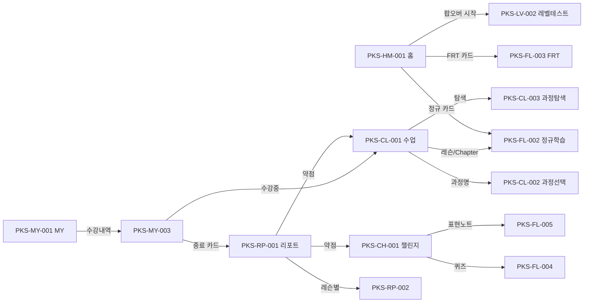

# Speaking 기획서 §4 · IA·화면구조

> 참고문서(`참고문서/picklass_docs/speaking/`) 기반. **화면 ID = 기존 `PKS-**` 체계** 유지.
> 기능은 §5(SP-F-###), 정책은 §6(SP-P-###), 예외는 §7(SP-E-###)이 참조합니다.

---

## 0. 개요 & IA 설계 배경

**Speaking은 학습자가 직접 말하기를 연습하는 모바일 중심 학습 앱**입니다. 설계 3원리:
1. **일상 반복 영역(하단 5탭) ↔ 몰입 학습 영역(풀스크린 플레이어) 분리**
2. **화면 ID 체계**(`PKS-{영역}-{번호}`)로 전 화면 관리
3. **두 갈래 진입 경로**: 통합 모듈(Tutoring 내 호출) vs 독립 앱(직접 로그인) — §6 SP-P-005

공통 UI: `BottomSheet`/`Drawer`(`createPortal`로 `#phone-frame-inner` 마운트, `layer=1`), `PhoneFrame`.

---

## 1. 네비게이션 / 화면 ID 접두어

`PKS-FL`(풀스크린 플레이어, 탭바 없음, 우상단 X→`router.back()`) · `PKS-HM`(홈) · `PKS-CL`(수업) · `PKS-CH`(챌린지) · `PKS-RP`(리포트) · `PKS-MY`(MY) · `PKS-LV`(레벨테스트)

### 하단 탭 5종 — `app/(tabs)/`
| 탭 | ID | 경로 | 역할 |
|---|---|---|---|
| 홈 | PKS-HM-001 | `/home` | 오늘의 학습 진입·현황 요약 |
| 수업 | PKS-CL-001 | `/learn` | 정규 과정 학습·과정 탐색 |
| 챌린지 | PKS-CH-001 | `/challenge` | 복습·발화량·배지 |
| 리포트 | PKS-RP-001 | `/feedback` | 성과 분석·약점 피드백 |
| MY | PKS-MY-001 | `/my` | 계정·수강내역·설정 |

- `/` → `/home` 리다이렉트, `(tabs)/layout.tsx` 인증가드 + BottomNav

---

## 2. 화면 인벤토리 (Screen Inventory)

| 화면ID | 화면명 | 경로/유형 | 연관 기능(§5) | 상태 |
|---|---|---|---|---|
| **홈** | | | | |
| PKS-HM-001 | 홈 | `/home` Page | SP-F-010~012 | ✅ 부분 실연동 |
| **수업** | | | | |
| PKS-CL-001 | 수업 | `/learn` Page | SP-F-020~022 | ✅ 실연동 |
| PKS-CL-002 | 수강 과정 선택 | BottomSheet | SP-F-021 | ✅ |
| PKS-CL-003 | 과정 탐색 | `/learn/explore` Page | SP-F-023 | ✅(카테고리 조건부) |
| — | Chapter 모듈보기 | ChapterSheet BottomSheet | SP-F-020 | ✅ |
| **챌린지** | | | | |
| PKS-CH-001 | 챌린지 | `/challenge` Page | SP-F-030~033 | ⚠️ 시계열 Mock |
| PKS-CH-002 | 발화량 랭킹 | BottomSheet | SP-F-033 | ✅ |
| PKS-CH-003 | 배지 | `/challenge/badges` Page | SP-F-033 | ⚠️ 데이터 Mock |
| **리포트** | | | | |
| PKS-RP-001 | 리포트 | `/feedback` Page | SP-F-040~043 | ⚠️ P0 데이터 대기 |
| PKS-RP-002 | 레슨별 리포트 | `/feedback/lessons` Page | SP-F-042 | ✅ |
| PKS-RP-003 | 1MP 목록 | `/feedback/1mp` Page | SP-F-043 | ⚠️ 준비중 |
| PKS-RP-004 | 레슨 상세 | Drawer | SP-F-042 | ✅ |
| PKS-RP-005 | 1MP 상세 | `/feedback/1mp/[id]` Page | SP-F-043 | ⚠️ 준비중 |
| **MY** | | | | |
| PKS-MY-001 | MY | `/my` Page | SP-F-050, 052 | ✅ |
| PKS-MY-002 | 닉네임 수정 | BottomSheet | SP-F-052 | ✅ |
| PKS-MY-003 | 수강 내역 | `/my/history` Page | SP-F-051 | ✅ |
| PKS-MY-005 | 앱 설정(볼륨) | BottomSheet | SP-F-052 | ✅ |
| PKS-MY-006 | 알림 목록 | `/my/notifications` Page | SP-F-052 | ⚠️ 데이터 대기 |
| PKS-MY-007 | 학습 시간 설정 | BottomSheet | SP-F-052 | ✅ |
| PKS-MY-008 | 학습 알림 설정 | BottomSheet | SP-F-052 | ✅ |
| PKS-MY-009 | AI 페르소나 | BottomSheet | SP-F-052 | ✅ |
| **풀스크린 플레이어** | | | | |
| PKS-FL-001 | 온보딩 | `/onboarding/*` | SP-F-070 | ⚠️ 스텁 |
| PKS-FL-002 | 정규 학습 5단계 | `/learn-flow/*` | SP-F-060 | ⚠️ 스켈레톤(외주) |
| PKS-FL-003 | FRT 대화 | `/player/frt` | SP-F-061 | ⚠️ 스켈레톤 |
| PKS-FL-004 | 복습 퀴즈 | `/player/quiz` | SP-F-031 | ⚠️ 스켈레톤 |
| PKS-FL-005 | 표현 노트 | `/player/expressions` | SP-F-032 | ⚠️ 스켈레톤 |
| PKS-LV-002 | 레벨테스트 P-ALT | `/onboarding/level-test` | SP-F-070 | ⚠️ 빈 스텁 |

---

## 3. 화면 전환 관계

- 플레이어 X → `router.back()` (이전 탭 복귀)
- MY 수강권 드롭다운 → `/learn?courseId=`, `/my/history` 종료 카드 → `/feedback?enrollmentId=`

---

## 4. 근거 문서
- `architecture/2026-06-03_스피킹앱-IA구조정리-개발계획.md`(화면ID·라우팅) · `architecture/2026-06-04_마스터플랜.md`
- `architecture/P-ALT_Speaking_v8.md`(레벨테스트) · `참고문서/Picklass 스피킹 전체서비스구조.md`(도메인·진입)
- `features/홈탭/2026-07-10_*.md` · `features/챌린지/2026-07-10_*.md` · `features/마이페이지/2026-07-*.md`
- `features/리포트-실API연동/2026-06-23_P1-셸바인딩-개발계획.md` · `features/learn페이지-실API연동/*.md`

> 기존 `IA_정보구조_Speaking.md`를 본 문서(§4)로 승격했습니다.
