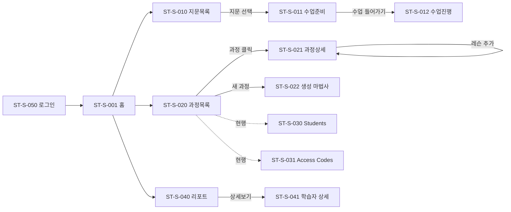

# Studio 기획서 §4 · IA·화면구조

> 참고문서(`참고문서/picklass_docs/studio/`) 기반. **SSOT**: `architecture/menu-structure.md`
> 이 문서가 정의하는 **화면 ID(ST-S-###)** 를 §5(기능상세)·§6(정책규칙)·§7(예외상태)가 참조합니다.

---

## 0. 개요 & IA 설계 배경

**Studio는 강사(teacher)가 학습 콘텐츠를 직접 만들고 배포하는 저작 도구**입니다. 도메인 `studio.picklass.com`(web 3005 / api 3006), 조직 구조 **파트너 > 그룹 > 기관 > 강사**.

**IA의 조직 원리는 "강사의 업무 흐름을 상단 탭 순서로 매핑"**한 것입니다.

> **① 지문 만들기 → ② 과정 구성 → ③ 수강자 배정 → ④ 결과 확인**

이 네 단계가 곧 `My Library → Course Hub → Enrollment → Class Report`입니다. **Backoffice와의 역할 분리**도 전제입니다 — "콘텐츠 생성"은 Studio, "운영·모니터링·계정관리"는 백오피스가 담당하므로, 같은 '과정'도 Studio는 생성·편집(쓰기), 백오피스는 읽기 전용입니다. 현재 수강자 관리가 Course Hub 하위에 있으나 **Enrollment 1depth 분리 개편이 진행 중**입니다.

---

## 1. 네비게이션 / 메뉴 트리

`★` = 신설 예정(미구현).

```
Studio (StudioHeader)
├── 로고 → 홈(/)
├── [1] My Library     /class            ① 지문 만들기·보관
│   ├─ (사이드바) 전체 보기 / My folder(UI만) / 새 폴더(미구현)
│   ├─ 지문 목록 / 수업 준비 / 수업 진행
├── [2] Course Hub     /course           ② 과정 구성
│   ├─ (사이드바) 카테고리 트리(L1·L2) / 미분류 / 검색
│   ├─ 과정 목록 / 과정 상세·편집
├── [3] Enrollment ★   /enrollment       ③ 수강자 배정 (신설 예정)
│   ├─ Students / Access Codes
└── [4] Class Report   /report           ④ 결과 확인
    ├─ 리포트 목록 / 학습자 상세
```

- 현재 헤더: `My Library | Course Hub | Class Report` (3개)
- 목표 헤더: `My Library | Course Hub | Enrollment | Class Report` (4개)

---

## 2. 라우트 맵

```
/ · /login · /signup · /legal/[document]
/class · /class/lesson-setup/[passageId] · /class/lesson/[passageId]
/course · /course/[courseId] · /course/students(→redirect) · /course/accesscode(→redirect)
/enrollment · /enrollment/students · /enrollment/access-codes   (신설)
/report · /report/[studentId]
```

---

## 3. 화면별 구성요소 (요약)

각 화면의 상세 기능은 §5, 걸리는 정책은 §6, 상태·예외는 §7 참조.

- **지문 목록(ST-S-010)**: Greeting + Card Group 3종 / 지문 테이블(제목·수업횟수·제작자·생성일, 10개 페이지) / 필터 바(CEFR·단어수·장르·정렬·검색) / 생성·상세·트윈·미리보기 모달
- **수업 준비(ST-S-011)**: KPI 목표 + 수업 시간 선택 → analyzer 자동 시퀀싱 → 모듈 순서 부여
- **과정 목록(ST-S-020)**: Card Group 3종 / CourseSidebar(L1·L2 트리·미분류·검색) / 과정 테이블(번호·과정명·유형뱃지·레슨·배포코드·수강자·상태) / 생성 마법사·편집 모달
- **과정 상세·편집(ST-S-021)**: 레슨 테이블(회차·제목·레벨·모듈·생성일·상태) / 순서 이동 / 모듈 수정 / 레슨 추가(2스텝) / 과정에서 제외
- **Students(ST-S-030)**: 학생 아이디 목록·필터 / 단건·일괄 등록 / 정보 수정
- **Access Codes(ST-S-031)**: 코드 목록(통계 전체/수강중/미사용) / 일괄 등록 / 활성↔비활성 토글
- **리포트 목록(ST-S-040)**: Card Group / 필터(과정·기간·검색·정렬) / 학생 학습 테이블(진도·KPI 컬럼) / 리포트 출력
- **학습자 상세(ST-S-041)**: 탭1 레슨별 진도 / 탭2 모듈별 KPI + FRT 대화 로그

---

## 4. ★ 화면 인벤토리 (Screen Inventory)

> §5·6·7의 앵커. 유형: Page(라우트 화면) / Modal(오버레이) / Sub(탭·드로어 등 하위 뷰).
> 접근권한은 전 화면 공통 `teacher`(강사) 로그인 필수 — 별도 표기는 예외만.

| 화면ID | 화면명 | 경로 | 유형 | 연관 기능(§5) | 상태 |
|---|---|---|---|---|---|
| **ST-S-001** | 홈(로고 진입) | `/` → 리다이렉트 | Page | — | ✅ |
| **ST-S-050** | 로그인 | `/login` | Page(비인증) | ST-F-001 | ✅ |
| **ST-S-051** | 회원가입 | `/signup` | Page(비인증) | ST-F-002 | ✅ |
| **My Library** | | | | | |
| ST-S-010 | 지문 목록 | `/class` | Page | ST-F-010~014 | ✅ |
| ST-S-013 | 지문 생성 모달 | `/class` 내 | Modal | ST-F-011 | ✅ |
| ST-S-014 | 지문 상세(난이도 8지표) | `/class` 내 | Modal | ST-F-013 | ✅ |
| ST-S-011 | 수업 준비 | `/class/lesson-setup/[passageId]` | Page | ST-F-015 | ✅ |
| ST-S-012 | 수업 진행 | `/class/lesson/[passageId]` | Page | ST-F-016 | ✅ |
| **Course Hub** | | | | | |
| ST-S-020 | 과정 목록 | `/course` | Page | ST-F-020~023 | ✅ |
| ST-S-022 | 과정 생성 마법사 | `/course` 내 | Modal | ST-F-021 | ✅ |
| ST-S-023 | 과정 편집 모달 | `/course` 내 | Modal | ST-F-023 | ✅ |
| ST-S-021 | 과정 상세·편집 | `/course/[courseId]` | Page | ST-F-024~027 | ✅ |
| **Enrollment** ★ | | | | | |
| ST-S-030 | Students(학생 아이디) | `/enrollment/students`(현 `/course/students`) | Page | ST-F-030~032 | ✅(경로 이전 예정) |
| ST-S-031 | Access Codes | `/enrollment/access-codes`(현 `/course/accesscode`) | Page | ST-F-033~035 | ✅(경로 이전 예정) |
| **Class Report** | | | | | |
| ST-S-040 | 리포트 목록 | `/report` | Page | ST-F-040~042 | ✅ |
| ST-S-041 | 학습자 상세 리포트 | `/report/[studentId]` | Page | ST-F-043 | ⚠️ Phase 3 일부 |

---

## 5. 화면 전환 관계



- CourseSidebar L1/L2 클릭 → ST-S-020 테이블 필터
- 과정 행 "액세스코드 생성" → ST-S-031 목록 반영
- Enrollment 신설 시 `/course/students`·`/course/accesscode`는 redirect로 하위 호환

---

## 6. 구현 상태 & 근거 문서

- ✅ My Library, Course Hub, 과정 상세, 학생/액세스코드, Class Report, 과정 유형 선택, 운영·FRT 설정, 카테고리 L1/L2
- 🔲 Enrollment 메뉴 신설(최우선), 교재 PDF 업로드, My Library 실제 폴더, `max_class_minutes`·`hasFrtModule` 실계산, 리포트 상세 Phase 3-B

**근거 문서**
- `참고문서/picklass_docs/studio/architecture/menu-structure.md` — 메뉴 구조 SSOT
- `.../studio/docs/studio_update.md` · `course-detail-20260316.md` · `20260526_리포트_페이지_구현계획.md`
- `.../studio/docs/students-2026-03-24.md` · `20260424_액세스코드관리.md` · `20260424_lesson-setup_시퀀싱_표시_설계.md`
- `.../studio/features/과정생성/20260519_*.md` · `.../features/과정카테고리/20260605_*.md`

---

> 이전 `IA_정보구조_Studio.md`를 본 문서(§4)로 승격했습니다. 기존 파일은 참고용으로 유지하거나 본 문서로 대체하세요.
