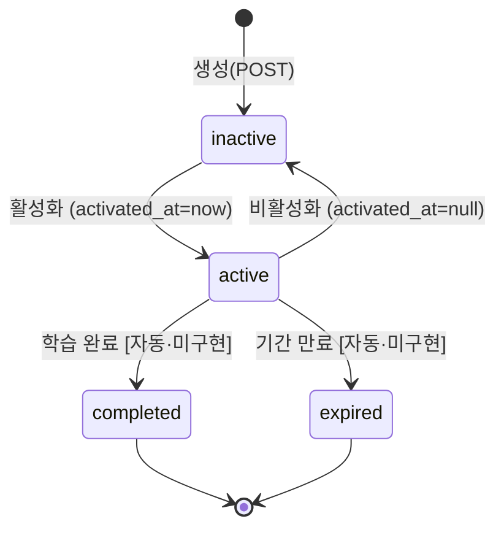
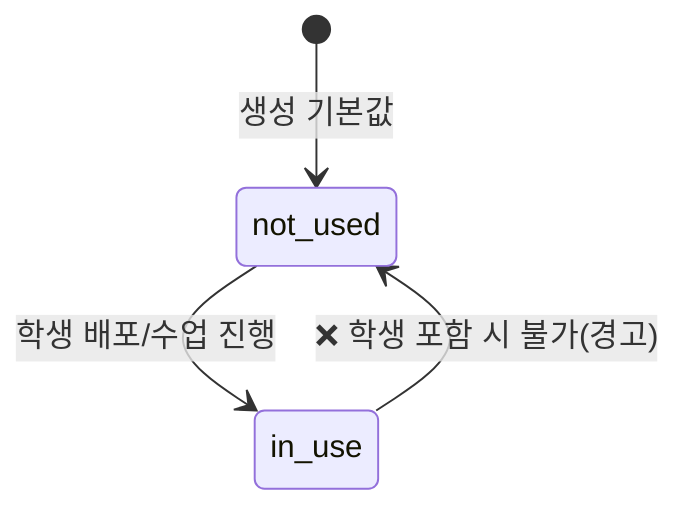

# Studio 기획서 §6 · 정책·규칙

> 참고문서(`참고문서/picklass_docs/studio/`) 기반. 적용 대상은 §4(화면)·§5(기능) ID로 표기.
> 이 문서는 여러 기능이 공유하는 **비즈니스 규칙·제약·상태 수명주기의 SSoT**입니다. 각 기능에서 규칙을 중복 서술하지 않고 여기 정책ID를 참조합니다.

---

## 0. 정책 카탈로그

| 정책ID | 분류 | 규칙 요약 | 적용 대상 |
|---|---|---|---|
| ST-P-001 | 접근·권한 | 계정격리: 콘텐츠=강사 단위, 학생=기관 단위 | ST-F-020, 030 |
| ST-P-002 | 접근·권한 | 강사 가능/불가 범위(백오피스 역할분리) | 전역 |
| ST-P-003 | 접근·권한 | 발급주체별 조회 필터(created_by / institution) | ST-F-020, 034, 040 |
| ST-P-010 | 검증 | 액세스코드/일괄 개수 1~1000 | ST-F-033, 034 |
| ST-P-011 | 검증 | 과정 회차수 1~100(AI topics 1~52) | ST-F-021 |
| ST-P-012 | 검증 | 과정명 100자·설명 500자·중복 불허 | ST-F-021, 023 |
| ST-P-013 | 검증 | 학생 아이디 형식·유니크·중복확인 | ST-F-031, 033 |
| ST-P-014 | 검증 | 액세스코드 형식(6자리 영대문자+숫자, 유니크) | ST-F-034 |
| ST-P-015 | 검증 | 리포트 날짜 `YYYY-MM-DD` | ST-F-040 |
| ST-P-025 | 검증 | 지문 콘텐츠 안전성(금칙어·부적절 콘텐츠 폐기) | ST-F-011 |
| ST-P-020 | 정량제약 | 수업시간 프리셋 | ST-F-015, 021 |
| ST-P-021 | 정량제약 | FRT 시간 프리셋·레벨 기본 | ST-F-021 |
| ST-P-022 | 정량제약 | 이수조건 기본값 | ST-F-021, 023 |
| ST-P-023 | 정량제약 | 페이지네이션 | ST-F-010, 020, 040 |
| ST-P-024 | 정량제약 | 세션·JWT | ST-F-001 |
| ST-P-030 | 수명주기 | 액세스코드 라이프사이클 | ST-F-034, 035 |
| ST-P-031 | 수명주기 | 과정/레슨 status·편집제약 | ST-F-020, 025, 027 |
| ST-P-032 | 수명주기 | 학생 상태 | ST-F-031, 032 |
| ST-P-040 | 기관설정 | 설정 소스·독립 복사 | ST-F-021, 023 |
| ST-P-041 | 기관설정 | 하드 제약(시간/마이크/자유학습) | ST-F-021, 023 |
| ST-P-042 | 기관설정 | 소프트 pre-fill(이수조건) | ST-F-021, 023 |
| ST-P-043 | 기관설정 | 서버 재검증(생성 O / 편집 X) | ST-F-021, 023 |
| ST-P-044 | 기관설정 | 발화량 조건 Speaking 한정 | ST-F-021 |
| ST-P-050 | 카테고리 | 카테고리 파트너 소유 | ST-F-023 |
| ST-P-051 | 카테고리 | 배정 규칙(L1/L2) | ST-F-023 |
| ST-P-052 | 카테고리 | 유형별 모듈 범위·speaking 후순위 | ST-F-021 |

---

## 1. 접근·권한 정책

### ST-P-001 · 계정격리 (부분 계정별)
- **콘텐츠는 강사(계정) 단위, 학생은 기관 단위 공유**로 격리한다.
  - `courses.created_by = user.id`, `classes.instructor_id = user.id`, `access_codes.created_by = user.id`(신규 컬럼), `texts.user_id = user.id`
  - `students(users).institution_id`(기관 단위, 변경 없음)
- ⚠️ **[오픈 이슈]** 액세스코드 **소유권 기준이 문서 간 상충**: 액세스코드 관리 문서(2026-04-24)는 `institution_id` 기준, 계정격리 문서(2026-04-11)는 `created_by` 기준. **정합성 확정 필요**(→ §5 ST-F-034 영향).

### ST-P-002 · 강사 가능/불가 (백오피스 역할분리)
| 구분 | 강사(teacher) 가능 | 강사 불가(백오피스 전용) |
|---|---|---|
| 콘텐츠 | 지문·과정·레슨·코드 생성/편집 | — |
| 학생 | 등록·수정 | — |
| 카테고리 | **배정(선택)만** | 생성·수정·삭제(파트너관리자/백오피스) |
| 액세스코드 | 발급·활성/비활성 토글 | **삭제**, completed/expired 관리, 발행 역할 지정(student 고정) |
| 기관 수업설정 | 읽기(SELECT) | 쓰기(PUT) |

### ST-P-003 · 발급주체별 조회 필터
- studio 강사 = `created_by = user.id`(본인분만), 백오피스 슈퍼관리자 = 전체, 백오피스 기관관리자 = `institution_id`.
- 레거시 `created_by = NULL` 데이터는 강사에게 미노출. `verifyOwnership`은 `system_admin` 예외를 무시(전체 접근).

---

## 2. 검증 규칙 (Validation)

| 정책ID | 규칙 |
|---|---|
| **ST-P-010** | 액세스코드/학생 일괄 생성 개수 **1~1000**. `registration_expiry` 과거 날짜 거부(구현 필요) |
| **ST-P-011** | 과정 회차수 UI 1~100 / AI `generate-topics.lesson_count` 1~52 |
| **ST-P-012** | 과정명 ≤100자, 설명 ≤500자, 과정명 중복 불허(초기 정책) |
| **ST-P-013** | 학생 아이디 `{4자리코드}{3자리일련}@{4자리코드}.pick`(예 `pkls001@pkls.pick`), 전역 유니크, 등록 후 변경 불가, **중복확인 통과 필수** |
| **ST-P-014** | 액세스코드 = **6자리 영대문자+숫자 랜덤, 전역 유니크**(구 prefix `TC-/ST-` 제거) |
| **ST-P-015** | 리포트 날짜 `@Matches(/^\d{4}-\d{2}-\d{2}$/)` |
| **ST-P-025** | 지문 생성 콘텐츠 안전성 검증: 금칙어/부적절 콘텐츠 감지 시 즉시 폐기 후 재생성한다(근거: 콘텐츠생성엔진 §9.2 safety 필터, §9.3.4 재시도·품질 필터). 저작권·편향 점검은 향후 확장(콘텐츠생성엔진 §9.4.6). 적용: ST-F-011 |

> 레슨 추가: 텍스트 미선택 시 "다음" 불가(toast), 모듈 미선택 시 "추가" disabled (→ §7 E-011).

---

## 3. 정량 제약 / 상한 (Limits)

### ST-P-020 · 수업 시간 프리셋
- 수업 준비(lesson-setup): `15 / 20 / 25 / 30분`
- 과정 회차별 수업시간: `[10, 15, 20, 25, 30, 40]`
- 전체 수업 최대시간(운영설정): `[10, 20, 30, 40, 60]`

### ST-P-021 · FRT 시간 프리셋·레벨 기본
- FRT 학습시간: `5 / 10 / 15 / 20 / 25 / 30분`(6종)
- 레벨별 기본값: 초급 미선택 / 중급 5분 / 고급 10분 (기관 max 초과 시 max로 조정 → P-041)

### ST-P-022 · 이수조건 기본값
- 레슨이수율 ≥ **70%**, 발화량 ≥ **200문장**(P-044), 누적시간 = 기관 기본값
- 체크한 조건만 **AND**로 적용

### ST-P-023 · 페이지네이션
- 목록 10건/페이지, 지문 목록 `limit` 기본 20
- ⚠️ 과정 목록 `limit:200` 하드코딩 — **200 초과 시 누락 위험**(알려진 갭)

### ST-P-024 · 세션·JWT
- `JWT_EXPIRES_IN = 7d`, `IDLE_TIMEOUT_SECONDS = 7200`, keepalive 4분 주기 `/auth/me`

---

## 4. 상태 수명주기 (Lifecycle)

### ST-P-030 · 액세스코드 라이프사이클

- `completed`/`expired`는 **최종 상태**(UI 전환 버튼 없음). 자동 전환 로직 **미구현**(→ §7 미구현 목록).
- tutoring에서 학생 등록 시 `active` + user_id + activated_at 갱신(tutoring 측 작업 대기).

### ST-P-031 · 과정/레슨 status·편집 제약

| status | 표시 | 편집 제약 |
|---|---|---|
| `not-used` | 회색 | 제약 없음 |
| `in-use` | 빨간 뱃지 | 과정 **삭제 disabled**, 레슨 **모듈수정·과정에서제외 disabled**(↑/↓ 이동은 활성) → §7 E-009 |

### ST-P-032 · 학생 상태
- `active`(활성, emerald) / `suspended`(정지, red) / `withdrawn`(탈퇴, gray)
- 신규 기본 `active`. 삭제 버튼 없음(정책 미정).

---

## 5. 기관설정 강제 (Institution Settings)

> 백오피스에서 정한 기관 정책이 Studio 과정 생성·편집에 반영되는 규칙. 소스 = `institution_settings`(institution 1:1, `type='institution'`). Studio는 **읽기 전용**, 없으면 permissive 폴백. **저장 값은 과정에 독립 복사**(이후 기관설정 변경 무영향).

### ST-P-040 · 설정 소스·복사
- Prisma 직접 SELECT로 읽기 전용 조회. 과정 저장 시 값을 `course_options`·`speaking_options`에 **복사 스냅샷**.

### ST-P-041 · 하드 제약 (초과 시 disabled)
| 필드 | null 의미 | 강제 |
|---|---|---|
| `max_total_class_minutes` | 무제한 | 초과 수업시간 프리셋 disabled |
| `max_frt_module_minutes` | 무제한 | 초과 FRT 프리셋 disabled |
| `allowed_mic_modes`(text[], 최소1) | — | 미포함 마이크 모드 disabled |
| `free_learning_enabled`(bool) | — | false면 "허용" 잠금 |
| `mic_mode_user_change`(bool) | — | "학습자 변경 허용" 체크박스 초기값+disabled(false 시 툴팁) |

### ST-P-042 · 소프트 pre-fill (수정 가능)
- `default_completion_sentences / lesson_rate / minutes`(Int?, **null = 이수조건 미체크**) → 초기값만 채우고 강사 수정 허용.

### ST-P-043 · 서버 재검증
- **생성 POST**: `assertWithinInstitutionLimits`로 한도초과/비허용마이크/free-learning 위반 시 **400**(E-010).
- ⚠️ **편집 PATCH: 서버 재검증 미이식(미구현)** — UI 제약만 존재. **[오픈 이슈]**

### ST-P-044 · 발화량 조건 Speaking 한정
- 이수조건 "발화량"은 **Speaking 포함 과정(speaking|integrated)만 활성**. 비해당 시 disabled + "Speaking 모듈이 없는 과정은 설정 불가".

> 저장 컬럼 구분: 기관 상한 `institution_settings.max_total_class_minutes`(구현됨) ↔ 과정 저장값 `courses.max_class_minutes`(**미구현**) 는 별개.

---

## 6. 카테고리 / 소유권

### ST-P-050 · 카테고리 파트너 소유
- 카테고리는 **파트너 소유**, platform 공통 카테고리 없음. 파트너 미소속 독립 기관은 카테고리 UI 미표시(빈 배열).
- `GET /course-categories`: JWT `institutionId` → institutions 재귀 CTE로 최상위 파트너 resolve → `course_categories` 조회.

### ST-P-051 · 배정 규칙 (L1/L2)
- `PATCH /courses/:id {l1_category_id, l2_category_id}`(null 전달 시 해제). L1 미선택 시 L2 비활성, L2 선택사항. 미분류 = `l1_category_id=null`.
- ⚠️ `UpdateCourseDto`에 카테고리 필드가 없으면 ValidationPipe(whitelist)가 제거 → 저장 누락(2026-06-07 수정 완료).

### ST-P-052 · 유형별 모듈 범위·speaking 후순위
- tutoring = speaking 제외 전체 / speaking = S만 / integrated = 전체
- speaking 모듈은 integrated에서 **동일 회차 내 항상 후순위**(`applySpeakingLast` 안정정렬).

---

## 7. 오픈 이슈 (정책 미확정)

| # | 이슈 | 영향 |
|---|---|---|
| O-1 | 액세스코드 소유권 기준 `institution_id` vs `created_by` 문서 상충 | ST-P-001, ST-F-034 |
| O-2 | 편집 화면 기관설정 서버 재검증 미이식 | ST-P-043, ST-F-023 |
| O-3 | completed/expired 자동 전환 로직 미구현 | ST-P-030 |
| O-4 | 학생 삭제 정책 미정 | ST-P-032 |
| O-5 | 과정 목록 `limit:200` 하드코딩 상한 | ST-P-023 |
