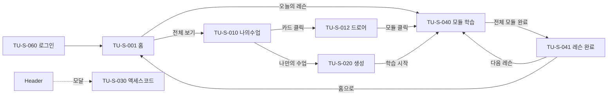

# Tutoring 기획서 §4 · IA·화면구조

> 참고문서(`참고문서/picklass_docs/tutoring/`) 기반. **화면 ID(TU-S-###)** 를 §5(TU-F)·§6(TU-P)·§7(TU-E)가 참조합니다.
> 도메인 `tutoring.picklass.com` / Next.js 15 App Router + NestJS, 공유 Supabase.

---

## 0. 개요 & IA 설계 배경

**Tutoring은 학습자가 AI 튜터와 함께 지문 기반 학습(읽기·쓰기·말하기)을 진행하는 종합 학습 웹앱**입니다. 설계 3원리:
1. **관리 뷰(헤더 O: 홈·나의수업·리포트) ↔ 몰입 학습 뷰(헤더 X: `/modules/[lessonId]`) 분리**
2. **홈=액션 허브(오늘 할 것 1개) ↔ 나의수업=관리 뷰**(2026-04-10 개편)
3. **데이터드리븐 모듈 렌더링**: 학습 화면이 코드 분기 없이 DB 3축(`passageMode`/`uiTemplate`/`questionFlowMode`)으로 구성(§6 TU-P-004)

핵심 렌더 계층: `ModulesPage → LessonSession(시퀀스) → ModuleRunner(어댑터·데이터) → ModuleRunnerInner(단일 렌더) → useModuleOrchestrator(Rule 엔진)`.

---

## 1. 네비게이션 / 라우트

### 상단 네비 (`StudioHeader`, 2026-04-10 개편)
| 메뉴 | 경로 | 역할 |
|---|---|---|
| 튜터링 | `/` | 홈/액션 허브(오늘의 레슨 1카드) |
| 나의수업 | `/my-classes` | 수강 과정 관리(3섹션) |
| 리포트 | `/report` | 학습 리포트(보호경로) |
| 액세스코드 | (모달) | `AccessCodeModal`, 별도 라우트 없음 |

---

## 2. 화면 인벤토리 (Screen Inventory)

| 화면ID | 화면명 | 경로/유형 | 연관 기능(§5) | 상태 |
|---|---|---|---|---|
| TU-S-001 | 튜터링 홈 | `/` Page(헤더 O) | TU-F-010 | ✅ |
| TU-S-010 | 나의수업 | `/my-classes` Page | TU-F-020 | ✅ |
| TU-S-011 | 과정 카드 | CourseCard | TU-F-020 | ✅ |
| TU-S-012 | 과정 드로어 | CourseDrawer | TU-F-021 | ✅ |
| TU-S-020 | 나만의 수업 생성 | `/class/lesson-setup/custom` Page | TU-F-030 | ✅ |
| TU-S-030 | 액세스코드 등록 | AccessCodeModal | TU-F-040 | ✅ |
| TU-S-040 | 모듈 학습 | `/modules/[lessonId]` Page(헤더 X) | TU-F-050 | ✅ |
| TU-S-041 | 레슨 완료 | `/modules/[lessonId]`(완료 분기) LessonCompleteView | TU-F-051 | ✅ |
| TU-S-050 | 리포트 | `/report` Page | — | 🔲 미구현 |
| TU-S-060 | 로그인 | `/login` 모달 | TU-F-001 | ✅ |
| TU-S-061 | 회원가입 | `/signup` 모달 | TU-F-001 | ✅ |

> 보호경로(`/modules/*, /report, /my-classes`)의 `middleware.ts`는 **미구현**(localStorage 토큰이라 SSR 미들웨어가 못 읽음, §6 TU-P-001).

---

## 3. 화면 전환 관계



- **모듈 학습 흐름**: `LessonSession`이 `moduleSequence`를 순회 → 모듈 완료마다 `currentModuleIdx+1` → 마지막 모듈 후 `LessonCompleteView`
- 나의수업 드로어: 레슨 아코디언 → 모듈 클릭 → `/modules/[lessonId]`(depth 추가 없이 드로어 내 전체 탐색)

---

## 4. 모듈 학습 화면 레이아웃 (TU-S-040)

```
LessonSession → ModuleRunner → ModuleRunnerInner
 ├ ModuleProgressBar (모듈 2개↑)
 ├ [Desktop lg+] 좌: ContentPanel + QuestionsPanel|VoiceQuestionPanel / 우: FeedbackPanel + AIQuestionPanel
 └ [Mobile <lg] MobileSplitLayout(상단 55% 탭[지문|문항|쉐도잉] + 드래그 분할 25~72% + 하단 45% 피드백)
```
- 패널: ContentPanel(passageMode) · QuestionsPanel(standard) · VoiceQuestionPanel(voice·deck) · FeedbackPanel(AI채팅+힌트/수동완료) · AIQuestionPanel · ModuleCompleteCard · TypewriterText

---

## 5. 근거 문서
- `docs/picklass-tutoring-planning.md`(핵심 기획) · `docs/modules-lessonId-20260325.md`(학습화면 IA)
- `docs/20260410_튜터링_모듈학습_UI개선및버그수정.md`(홈/나의수업 개편)
- `architecture/20260408-0428_모듈렌더링_passageMode_uiTemplate_기능개발_개발계획.md`(데이터드리븐)
- `architecture/20260409-0512_오케스트레이터_피드백_힌트시스템_개발계획.md` · `architecture/result-data-plan.md`
- `features/레슨완료/레슨완료-페이지-기획.md` · `features/수강현황/*` · `features/나만의수업/*`

> 기존 `IA_정보구조_Tutoring.md`를 본 문서(§4)로 승격했습니다.
