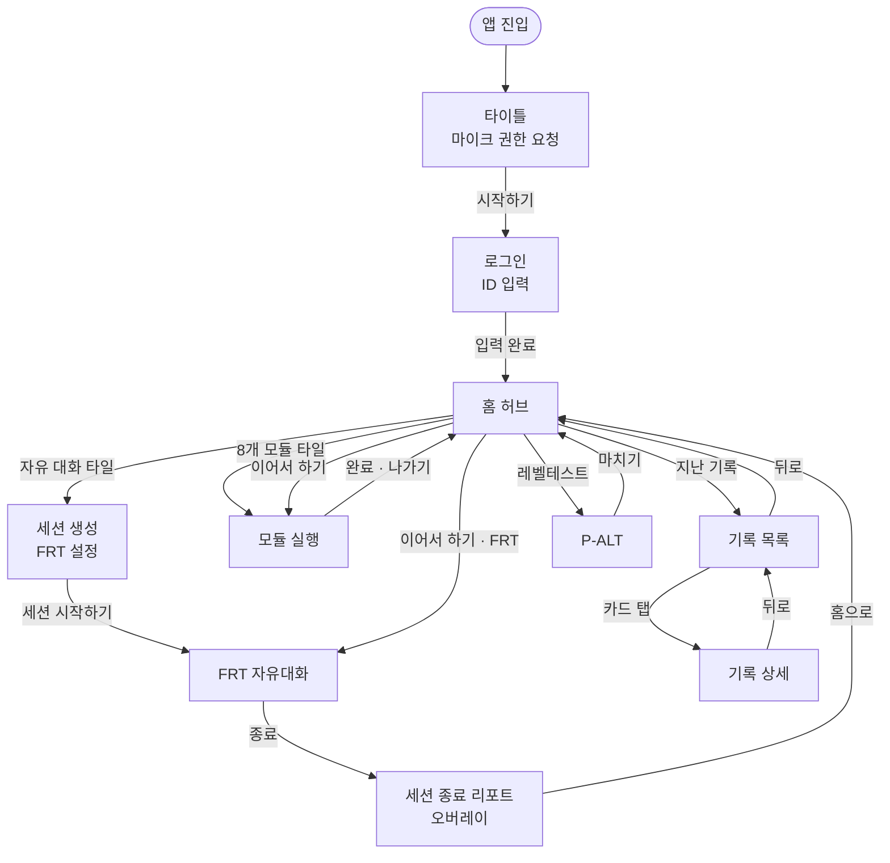
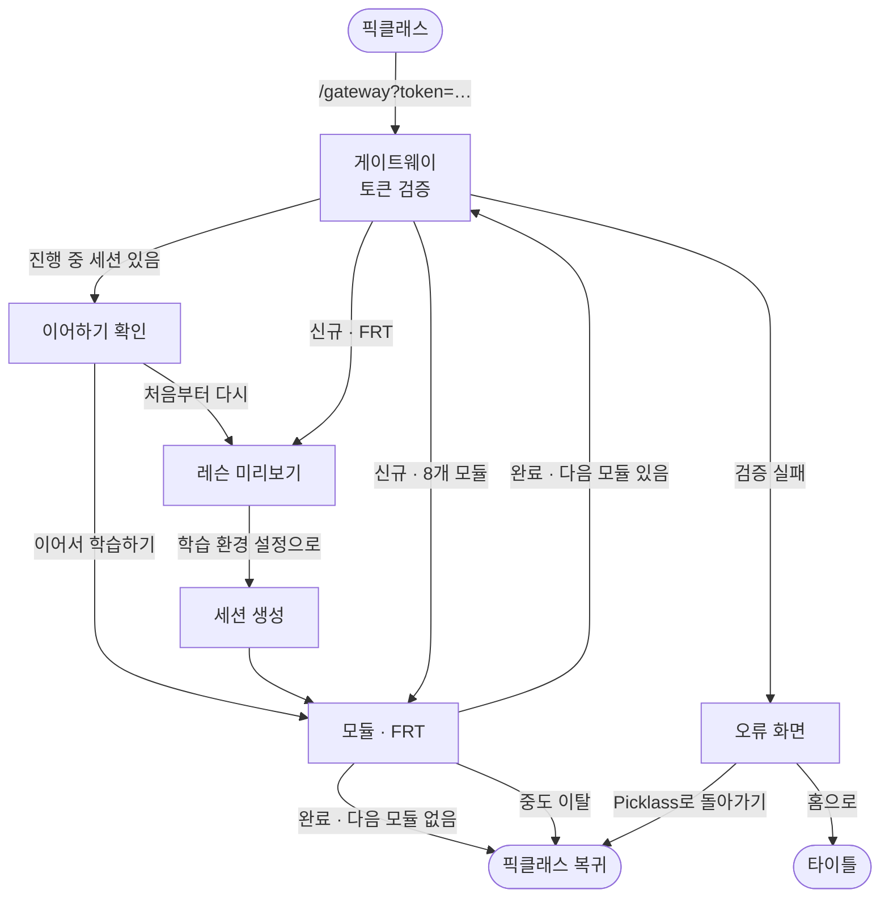
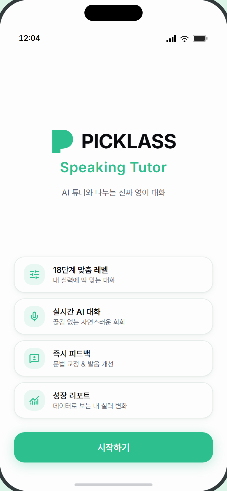
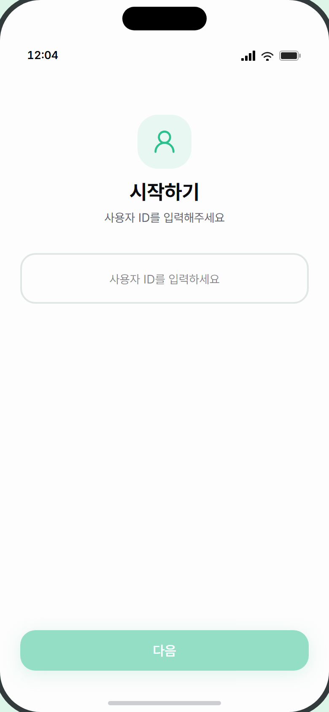
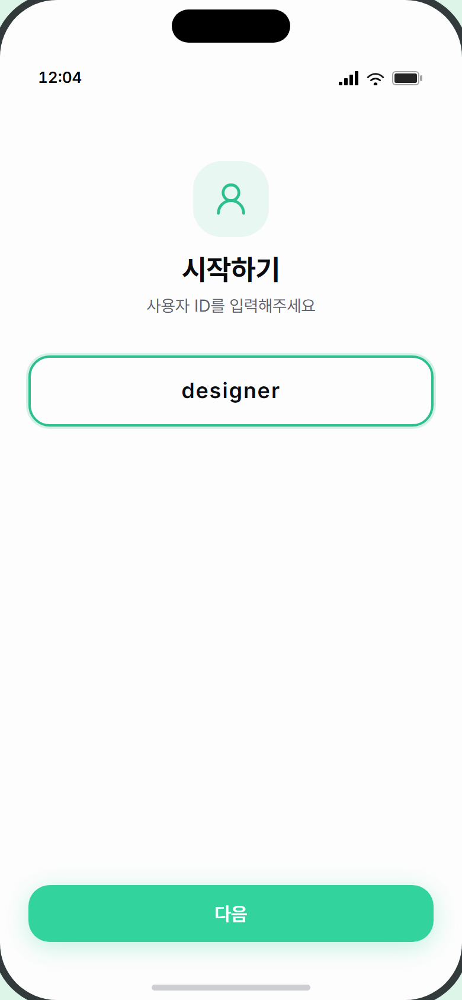
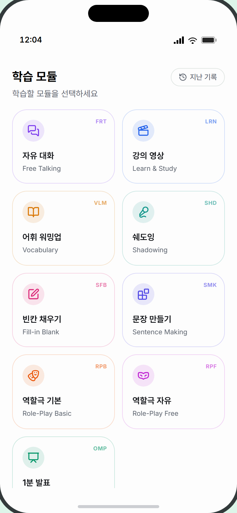
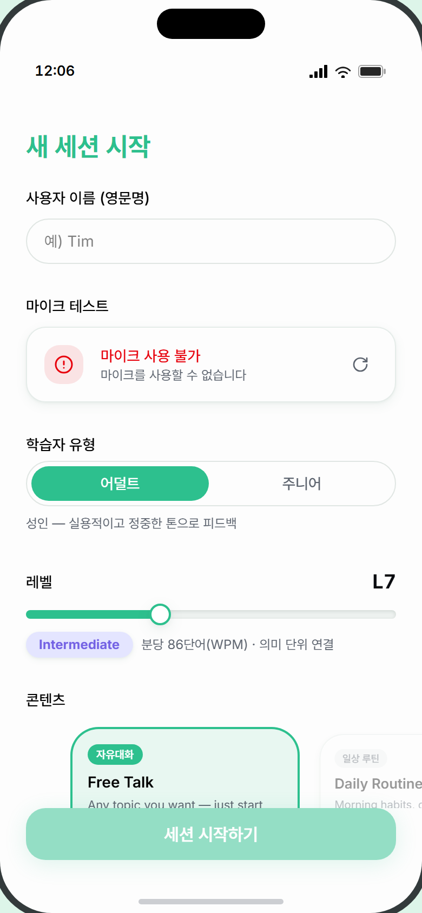

# 1. 화면 흐름도 & 공용 화면 명세

> **대상** — UI/UX 디자이너. 앱의 전체 화면 목록·전환 조건과, 학습 모듈에 속하지 않는 공용 화면들을 정의한다.
> **먼저 읽을 것** — [0. 디자인 브리프](0_디자인브리프.md)
> **이어서 볼 것** — [2. 모듈 공통 화면 패턴](2_모듈공통화면패턴.md) · [3. 모듈별 화면 명세](3_모듈별화면명세.md)

---

## 전체 화면 목록

| ID | 화면 이름 | 역할 | 진입 조건 | 명세 위치 |
|---|---|---|---|---|
| `title` | 타이틀 | 랜딩 · 마이크 권한 요청 | 앱 최초 진입 | 이 문서 |
| `login` | 로그인 | 학습자 ID 입력 | 타이틀 → [시작하기] | 이 문서 |
| `module-demo` | **홈 허브** | 모듈 선택 · 이어하기 · 기록 진입 | 로그인 완료 | 이 문서 |
| `create` | 세션 생성 | FRT 자유대화 설정 | 홈 → [자유 대화] | 이 문서 |
| `session` | **FRT 자유대화** | 실시간 AI 대화 | 세션 생성 완료 | 이 문서 |
| `module` | 모듈 실행 | 8개 학습 모듈 | 홈 타일 탭 / 게이트웨이 | [문서 2](2_모듈공통화면패턴.md)·[3](3_모듈별화면명세.md) |
| `history` | 지난 기록 목록 | 완료 세션 목록 | 홈 → [지난 기록] | [문서 5](5_리포트기록화면명세.md) |
| `history-detail` | 지난 기록 상세 | 결과·대화 재현 | 기록 카드 탭 | [문서 5](5_리포트기록화면명세.md) |
| `alt` | 레벨테스트 P-ALT | P1~P4 + 리포트 | 홈 → [레벨테스트] | [문서 6](6_레벨테스트화면명세.md) |
| `picklass-launch` | 픽클래스 게이트웨이 | 외부 토큰 검증 후 진입 | `/gateway?token=…` 직접 진입 | 이 문서 |
| `admin-*` | 어드민 4화면 | 운영 모니터링 | `/admin` | **디자인 범위 밖** |

> **어드민 4화면(로그인·세션 목록·통계·튜닝)은 디자인 범위에서 제외합니다.** 내부 운영자만 쓰는 화면이라 우선순위가 낮습니다. 필요해지면 별도 요청으로 다뤄 주세요.

---

## 화면 전환 흐름

### 일반 학습자 흐름



### 픽클래스 외부 진입 흐름



> **픽클래스 진입 시에는 홈 허브를 거치지 않습니다.** 모듈이 끝나면 홈으로 오지 않고 픽클래스로 되돌아가거나 다음 모듈로 이어집니다. 이때 모듈 완료 버튼 라벨이 `완료` 대신 **`다음 모듈로`** 가 됩니다.

---
---

# 공용 화면 명세

## SC-1 · 타이틀

**목적** — 브랜드를 보여주고 **마이크 권한을 미리 요청**한다.
**진입** — 앱 최초 로드 · **이탈** — [시작하기] → 로그인

```
┌─────────────────────────────────┐
│                                 │
│         [로고] PICKLASS          │  ← 로고 40px + 34px 볼드
│         Speaking Tutor           │  ← 24px 청록
│    AI 튜터와 나누는 진짜 영어 대화  │
│                                 │
│ ┌─────────────────────────────┐ │
│ │ [⚙] 18단계 맞춤 레벨          │ │  ← 특징 4개
│ │     내 실력에 딱 맞는 대화     │ │
│ ├─────────────────────────────┤ │
│ │ [🎤] 실시간 AI 대화          │ │
│ │ [💬] 즉시 피드백             │ │
│ │ [📈] 성장 리포트             │ │
│ └─────────────────────────────┘ │
│                                 │
│      [ 시작하기 ]                │  ← 청록 채움 + 글로우
└─────────────────────────────────┘
```

| 요소 | 내용 | 제약 |
|---|---|---|
| 로고 | Picklass 심볼 SVG + `Picklass` 워드마크 | 진입 시 페이드인 |
| 제품명 | `Speaking Tutor` | 청록 |
| 특징 카드 | 아이콘 36px + 제목 + 설명, 4개 | 진입 시 아래에서 슬라이드업 |
| [시작하기] | 청록 채움, 그림자 글로우 | 탭 시 **마이크 권한 팝업**이 뜸 |

> ⚠️ **탭하면 브라우저 마이크 권한 팝업이 뜹니다.** 거부해도 다음 화면으로 넘어갑니다(권한 문제는 나중에 발화 화면에서 다룸). **권한 요청 이유를 설명하는 안내가 현재 없습니다** — 추가를 검토해 주세요.

**카피** — `Picklass` · `Speaking Tutor` · `AI 튜터와 나누는 진짜 영어 대화` · `18단계 맞춤 레벨` / `내 실력에 딱 맞는 대화` · `실시간 AI 대화` / `끊김 없는 자연스러운 회화` · `즉시 피드백` / `문법 교정 & 발음 개선` · `성장 리포트` / `데이터로 보는 내 실력 변화` · `시작하기`

**참조** — [TitleScreen.tsx](../../apps/web/src/components/TitleScreen.tsx)



---

## SC-2 · 로그인

**목적** — 학습자 ID를 입력받는다. **비밀번호는 없습니다.**
**진입** — 타이틀 [시작하기] · **이탈** — [다음] → 홈 허브

```
┌─────────────────────────────────┐
│           ╭───────╮             │
│           │  👤   │             │  ← 64px 둥근 사각, 연청록
│           ╰───────╯             │
│           시작하기               │  ← 24px 볼드
│      사용자 ID를 입력해주세요      │
│                                 │
│ ┌─────────────────────────────┐ │
│ │      사용자 ID를 입력하세요   │ │  ← 중앙 정렬, 자간 넓게
│ └─────────────────────────────┘ │     포커스 시 청록 테두리+링
│                                 │
│      [ 다음 ]                    │  ← 입력 전 비활성
└─────────────────────────────────┘
```

| 요소 | 내용 | 제약 |
|---|---|---|
| 입력 필드 | 2px 테두리, **중앙 정렬 18px 볼드**, 자간 넓게 | 이전 값이 자동 채워짐 |
| [다음] | 입력이 비면 비활성. Enter 키로도 진행 | |
| 오류 | 버튼 위 빨간 텍스트 | `사용자 ID를 입력해주세요` |

**상태 변형** — ① 빈 상태(버튼 비활성) ② 입력됨 ③ 포커스 ④ 오류

**참조** — [LoginScreen.tsx](../../apps/web/src/components/LoginScreen.tsx)

| 빈 상태 (버튼 비활성) | 입력됨 |
|---|---|
|  |  |

---

## SC-3 · 홈 허브

**목적** — 모듈을 고르고, 하던 학습을 이어가고, 기록·레벨테스트로 간다.
**진입** — 로그인 완료, 또는 모듈·FRT·기록에서 복귀
**이탈** — 타일·카드 탭

```
┌─────────────────────────────────┐
│ 학습 모듈            [🕐 지난 기록]│  ← 20px 볼드 + 우상단 알약 버튼
│ 학습할 모듈을 선택하세요           │
│                                 │
│ 이어서 하기                      │  ← 진행 중 세션 있을 때만
│ ┌─────────────────────────────┐ │
│ │ 🎤 [L11] 쉐도잉         [>] │ │  ← 최대 화면 38% 높이, 스크롤
│ │    3문항 · 12분 전 활동      │ │
│ └─────────────────────────────┘ │
│                                 │
│ ┌───────────┐ ┌───────────┐    │  ← 2열 격자
│ │ 💬    FRT │ │ 🎬    LRN │    │
│ │ 자유 대화  │ │ 강의 영상  │    │
│ │Free Talking│ │Learn&Study│    │
│ ├───────────┤ ├───────────┤    │
│ │ 📖    VLM │ │ 🎤    SHD │    │
│ │  … 9개 타일                │    │
│ └───────────┘ └───────────┘    │
│                                 │
│ 진단                            │
│ ┌─────────────────────────────┐ │
│ │ 레벨테스트               [>] │ │  ← 전체 너비 카드
│ │ P-ALT Speaking · 낭독·대화… │ │
│ └─────────────────────────────┘ │
└─────────────────────────────────┘
```

| 요소 | 내용 | 데이터 출처 | 제약 |
|---|---|---|---|
| 제목 영역 | `학습 모듈` + `학습할 모듈을 선택하세요` | 고정 | |
| [지난 기록] | **우상단** 테두리 알약 + 시계 아이콘 | — | |
| 이어서 하기 | 모듈 아이콘 + 레벨 뱃지 + 제목 + `N문항/턴 · 상대 시각` | 서버 | **1문항 이상 진행한 세션만.** 없으면 섹션 전체가 사라짐. 최대 화면 38% 높이 후 스크롤 |
| 모듈 타일 | **2열 격자**. 아이콘 칩(악센트 10% 배경) + 이름 + 영문 설명 + 우상단 코드 | 고정 9개 | 항상 9개 |
| 레벨테스트 카드 | `진단` 섹션 아래 전체 너비 카드 | — | |

**상대 시각 표기** — `방금 활동` / `12분 전 활동` / `3시간 전 활동` / `2일 전 활동`

**상태 변형** — ① 이어하기 없음 ② 이어하기 있음 ③ **모듈 진입 준비 중**(타일 탭 후 화면 전체에 스피너 하나)

> ③은 서버에 세션을 먼저 만드느라 잠깐 뜨는 화면입니다. 지금은 스피너 하나뿐이라 허전합니다.

**카피** — `학습 모듈` · `학습할 모듈을 선택하세요` · `지난 기록` · `이어서 하기` · `진단` · `레벨테스트` · `P-ALT Speaking · 낭독·대화·발표로 레벨 진단` · `준비 중`(비활성 타일)

**참조** — [ModuleDemoLauncher.tsx](../../apps/web/src/components/module/ModuleDemoLauncher.tsx) · [ModuleTile.tsx](../../apps/web/src/components/module/ModuleTile.tsx)



---

## SC-4 · 세션 생성 (FRT 설정)

**목적** — 자유 대화의 조건을 정한다. **FRT를 고를 때만 나옵니다** — 8개 모듈은 설정 없이 바로 시작합니다.
**진입** — 홈 → [자유 대화] 타일, 또는 픽클래스 게이트웨이
**이탈** — [세션 시작하기] → FRT 대화

```
┌─────────────────────────────────┐
│ (픽클래스 진입 시)                │
│ [←] Picklass로 돌아가기          │
│ [Picklass 연결됨]                │
│ 새 세션 시작                     │  ← 24px 볼드 청록
├─────────────────────────────────┤
│ 사용자 이름 (영문명)              │
│ [ 예) Tim                     ] │  ← 알약형 입력
│                                 │
│ 마이크 테스트                    │
│ 학습자 유형                      │
│ 레벨          (픽클래스 진입 시   │
│ 토픽           → 지정 레슨 카드로 │
│                  대체·잠김)      │
│ 페르소나                         │
│ 토큰 예산                        │
│ 음성 프리셋                      │
├─────────────────────────────────┤
│      [ 세션 시작하기 ]           │
└─────────────────────────────────┘
```

| 설정 블록 | 내용 |
|---|---|
| 사용자 이름 | 영문명 입력(알약형). 이전 값 자동 채움 |
| **마이크 테스트** | 마이크 동작 확인 |
| 학습자 유형 | 학습자 성향 선택 |
| **레벨** | L1~L18 선택 |
| **토픽** | 대화 주제 선택 (직접 입력 가능) |
| 페르소나 | AI 튜터 캐릭터 선택 |
| 토큰 예산 | 대화 분량 상한 |
| 음성 프리셋 | 음성 모드(PTT/자동감지) + 끼어들기 허용 |

**상태 변형 (4가지)**

| 상태 | 표시 |
|---|---|
| ① 일반 진입 | 제목 `새 세션 시작`, 레벨·토픽 선택 가능 |
| ② **픽클래스 진입** | 상단에 [← Picklass로 돌아가기] + `Picklass 연결됨` 뱃지, 제목이 `학습 시작 준비`, 부제에 학습자명·레슨 ID. **레벨·토픽 선택이 사라지고 "지정 레슨" 잠금 카드로 대체** |
| ③ 생성 중 | 버튼이 `세션 생성 중...`, 비활성 |
| ④ 오류 | 버튼 위 빨간 텍스트 |

> ⚠️ **설정 항목이 8개로 많습니다.** 학습자가 대화를 시작하기까지 스크롤을 한참 내려야 합니다. **어떤 항목이 꼭 필요한지, 접어둘 수 있는 게 있는지 검토할 가치가 있는 화면입니다.**

**카피** — `새 세션 시작` / `학습 시작 준비` · `Picklass 연결됨` · `Picklass로 돌아가기` · `사용자 이름 (영문명)` · `예) Tim` · `지정 레슨` · `세션 시작하기` · `세션 생성 중...`

**참조** — [CreateSessionForm.tsx](../../apps/web/src/components/session/CreateSessionForm.tsx) · [session/](../../apps/web/src/components/session/)


> 📷 미촬영: `SC-4-picklass` — 백엔드(DB·AI 키) 필요

---

## SC-5 · FRT 자유대화

**목적** — AI 튜터와 제한 없이 대화한다. **앱에서 가장 복잡한 화면입니다.**
**진입** — 세션 생성 완료, 또는 이어하기
**이탈** — 헤더 [종료] → 세션 종료 리포트

```
┌─────────────────────────────────┐
│ [L11] 토픽명   [토큰바] 12:34 [X]│  ← 대화 헤더 (모듈 헤더와 다름)
│ [🌊 음성][💬 채팅]               │  ← 모드 토글
├─────────────────────────────────┤
│                                 │
│      ∿∿∿∿∿∿∿∿∿∿∿                │  ← 음성 모드: 파형
│                                 │     채팅 모드: 말풍선 목록
│                                 │
├─────────────────────────────────┤
│  (교정 노트)                     │  ← 조건부 3종
│  (따라 말하기 안내)               │
│  (천천히 하세요 표시)             │
│  (힌트 1~3단계)                  │
├─────────────────────────────────┤
│      (실시간 전사 말풍선)         │  ← 고정 높이 슬롯
│         ╭─────╮                 │
│         │ 🎤  │                 │  ← PTT 또는 자동감지 표시
│         ╰─────╯                 │
└─────────────────────────────────┘
```

### 대화 단계 (6가지)

| 단계 | 뜻 |
|---|---|
| `idle` | 내 차례 — 말할 수 있음 |
| `user_speaking` | 내가 말하는 중 |
| `processing` | 발화 인식 중 |
| `finalizing` | AI 응답 준비 중 |
| `ai_speaking` | AI가 말하는 중 |
| `repeating` | **따라 말하기 중** — 교정 문장을 한 번 따라 말하는 단계 |

### 조건부로 나타나는 요소 (5종)

| 요소 | 나타나는 조건 |
|---|---|
| **교정 노트** | AI가 문법을 교정했을 때 (음성 모드에서만 — 채팅 모드는 말풍선 안에 표시) |
| **따라 말하기 안내** | `repeating` 단계 — 교정 문장 + 녹음 상태 + 실시간 전사 |
| **천천히 하세요 표시** | 일정 시간 말이 없을 때 |
| **힌트 섹션** | 침묵이 더 길어질 때 **1~3단계로 점점 구체적인 힌트** |
| **실시간 전사 말풍선** | 말하는 중 인식 결과 (말하는 중=청록 채움 / 끝난 후=연청록) |

### 입력부 — 2가지 모드

| 모드 | 표시 |
|---|---|
| **PTT**(누르고 말하기) | 원형 버튼. 탭해서 시작/정지. 다시 말하기 버튼 있음 |
| **자동 감지(VAD)** | 음성 감지 표시기. 음소거 토글 있음 |

세션 생성 화면의 "음성 프리셋"에서 정해집니다. **끼어들기 허용** 설정이 켜지면 AI가 말하는 중에도 버튼이 활성화됩니다.

### 종료 흐름 (3단계)

```
① 대화 종료 판정
   ↓
② 하단 바: "5초 후 학습 리포트로 이동" + [대화 내역 보기]
   ↓ (5초 경과 또는 [학습 리포트 보기])
③ 세션 종료 오버레이 — 리포트 표시
```

[대화 내역 보기]를 누르면 자동 이동이 멈추고 대화 화면에 머뭅니다. 그때는 하단에 [학습 리포트 보기] 버튼이 남습니다.

### 세션 종료 오버레이

전체 화면 오버레이로 [문서 5의 리포트 7블록](5_리포트기록화면명세.md)을 보여줍니다. 상태는 ① 리포트 생성 중 ② 리포트 표시 ③ **학습량 부족**(리포트 없음) 3가지입니다.

> ⚠️ **이 화면은 조합 폭이 매우 큽니다.** 대화 단계 6 × 표시 모드 2 × 조건부 요소 5 = 이론상 수십 가지 조합입니다. 전부 그릴 필요는 없지만, **대표 조합 8~10장**은 확정해야 개발이 흔들리지 않습니다. [문서 4](4_화면인벤토리와상태.md)에 어떤 조합을 그릴지 목록을 두었습니다.

**참조** — [ConversationScreen.tsx](../../apps/web/src/components/conversation/ConversationScreen.tsx) · [conversation/](../../apps/web/src/components/conversation/)

> 📷 미촬영: `SC-5-voice-idle` · `SC-5-speaking` · `SC-5-chat` · `SC-5-hint` · `SC-5-repeat` · `SC-5-end` — 백엔드(DB·AI 키) 필요

---

## SC-6 · 픽클래스 게이트웨이

**목적** — 픽클래스에서 넘어온 토큰을 검증하고 알맞은 화면으로 보낸다.
**진입** — `/gateway?token=…` URL 직접 진입 (픽클래스가 열어 줌)
**이탈** — 검증 결과에 따라 자동 분기

**학습자가 이 화면을 오래 보지는 않지만, 4가지 상태가 모두 실제로 나타납니다.**

| 상태 | 표시 |
|---|---|
| ① **검증 중** | 스피너 + 단계별 메시지 — `Picklass 토큰 검증 중...` → `기존 학습 기록 확인 중...` → `이전 세션을 정리하는 중...` |
| ② **이어하기 확인** | `현재 학습` 카드(레슨명 · N턴 · 마지막 활동 · 레벨) + [▶ 이어서 학습하기] / [↺ 끝내고 처음부터 다시 시작] / [← Picklass로 돌아가기] |
| ③ **레슨 미리보기** | `Picklass 연결됨` 뱃지 + `학습 정보를 받았어요` + 학습자 카드 + 레슨 카드(CEFR·레벨·분류·단어수·모듈 태그) + **지문 미리보기(6줄까지)** + [학습 환경 설정으로] / [Picklass로 돌아가기] |
| ④ **오류** | 56px 빨간 경고 아이콘 + `레슨을 시작할 수 없습니다` + 오류 메시지 + [Picklass로 돌아가기] / [홈으로] |

> ③ 레슨 미리보기는 **FRT로 진입할 때만** 나옵니다. 8개 모듈은 미리보기 없이 곧장 모듈 화면으로 들어갑니다.

**카피** — `Picklass 토큰 검증 중...` · `기존 학습 기록 확인 중...` · `이전 세션을 정리하는 중...` · `현재 학습` · `이어서 학습하기` · `끝내고 처음부터 다시 시작` · `Picklass로 돌아가기` · `Picklass 연결됨` · `학습 정보를 받았어요` · `아래 내용으로 회화 세션을 시작합니다` · `학습자` · `레슨` · `지문 미리보기` · `학습 환경 설정으로` · `레슨을 시작할 수 없습니다` · `홈으로`

**참조** — [PicklassLaunchScreen.tsx](../../apps/web/src/components/picklass/PicklassLaunchScreen.tsx)

> 📷 미촬영: `SC-6-preview` · `SC-6-resume` · `SC-6-error` — 백엔드(DB·AI 키) 필요

---
---

## 부록 · 흐름에서 눈여겨볼 지점

**① 뒤로 가기가 일관되지 않습니다.**

| 화면 | 뒤로 가는 방법 |
|---|---|
| 로그인 | **없음** |
| 홈 허브 | **없음**(최상위) |
| 세션 생성 | **없음**(픽클래스 진입 시에만 [← Picklass로 돌아가기]) |
| 모듈 실행 | 헤더 [나가기] 아이콘 — **확인 없이 즉시 이탈** |
| FRT 대화 | 헤더 [종료] |
| 기록 목록·상세 | 좌상단 [←] |
| 레벨테스트 | **인트로에서만** [←] |

**② 이탈 확인이 어디에도 없습니다.** 모듈 [나가기]를 잘못 누르면 진행 중이던 학습이 그대로 중단됩니다(진행 상황은 저장되어 이어하기는 가능). **확인 대화상자 추가를 검토해 주세요.**

**③ 홈 허브 진입 경로가 사용자마다 다릅니다.** 픽클래스로 들어온 학습자는 홈 허브를 한 번도 보지 않습니다. 홈을 앱의 중심으로 디자인하되, **홈 없이도 성립하는 흐름**이라는 점을 염두에 두세요.
