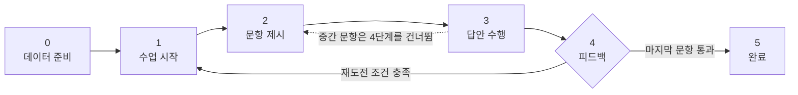
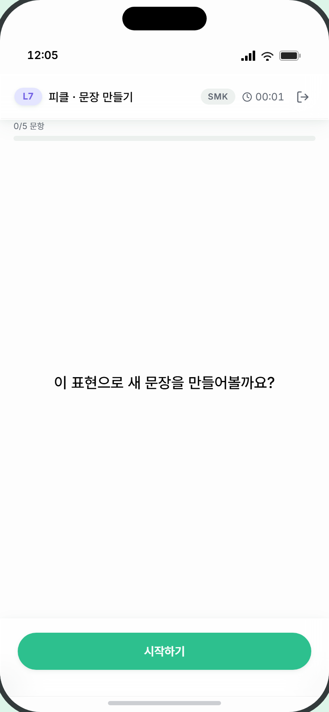
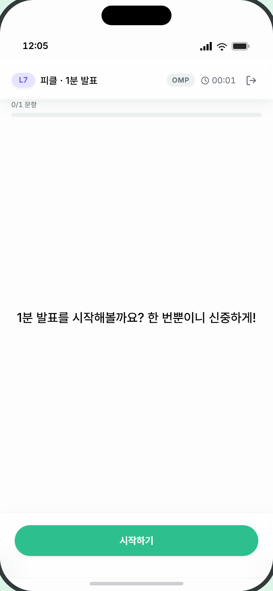
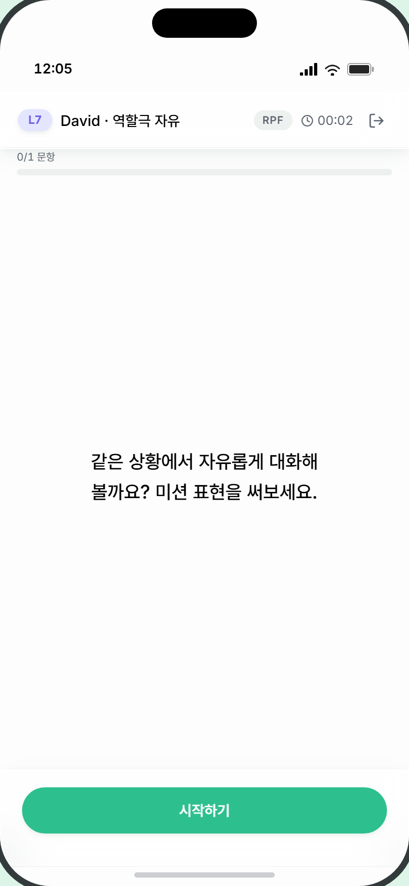
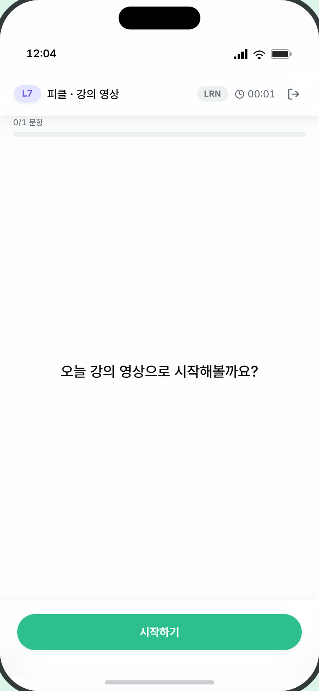
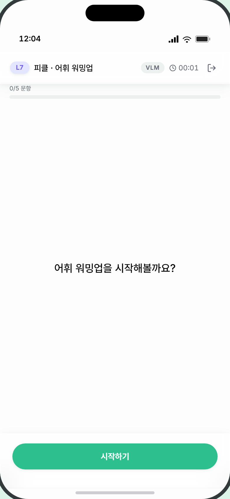
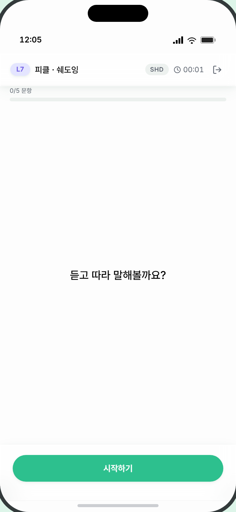
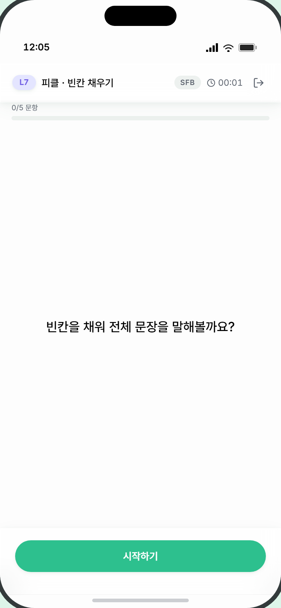

# 2. 모듈 공통 화면 패턴

> **대상** — UI/UX 디자이너. 8개 학습 모듈이 **공유하는** 레이아웃·부품·상태를 정의한다.
> **먼저 읽을 것** — [0. 디자인 브리프](0_디자인브리프.md)
> **이어서 볼 것** — 모듈마다 다른 화면은 [3. 모듈별 화면 명세](3_모듈별화면명세.md)

---

## 적용 범위

이 문서의 규칙은 **8개 학습 모듈(LRN·VLM·SHD·SFB·SMK·RPB·RPF·OMP)** 에 적용됩니다.

**적용되지 않는 화면**
- FRT 자유대화 — 자체 헤더·입력부 ([문서 1](1_화면흐름도와공용화면.md))
- 레벨테스트 P-ALT — 자체 레이아웃 ([문서 6](6_레벨테스트화면명세.md))
- 홈·기록·리포트 — 공용/기록 화면 ([문서 1](1_화면흐름도와공용화면.md)·[5](5_리포트기록화면명세.md))

**부분 예외**
- **RPF**는 하단 액션 바를 쓰지 않고 자체 대형 마이크 버튼(80px)을 씁니다.
- **OMP**는 하단 바에 보조 버튼 하나만 전체 너비로 놓습니다.

---

## 화면 구조

모든 모듈 화면은 아래 수직 구조를 따릅니다. **본문만 단계에 따라 교체**됩니다.

```
┌─────────────────────────────────┐
│           모듈 헤더              │  ← 상단 고정(sticky), 반투명
├─────────────────────────────────┤
│           진도 바                │  ← 헤더 바로 아래
├─────────────────────────────────┤
│                                 │
│           본문 영역              │  ← 단계별 교체
│      (남는 공간을 모두 차지)      │
│                                 │
├─────────────────────────────────┤
│         하단 액션 바             │  ← 하단 고정, 반투명
└─────────────────────────────────┘
```

---

## 1. 모듈 헤더

화면 최상단 고정. 반투명 유리 느낌 배경.

```
┌─────────────────────────────────────────┐
│ [L11] 피클 · 문장 만들기   [SMK] 🕐02:34 [↗]│
└─────────────────────────────────────────┘
```

| 요소 | 내용 | 제약 |
|---|---|---|
| 레벨 뱃지 | `L1`~`L18`. **레벨 그룹별 색상 6종** | 좌측 끝, 11px 볼드 |
| 모듈 라벨 | `캐릭터 · 모듈명` 형식 | **최대 160px, 넘치면 말줄임.** RPB·RPF는 캐릭터 자리에 **페르소나 이름**이 들어감 |
| 모듈 코드 뱃지 | `SMK` 등 회색 알약 | 10px 볼드, 자간 넓게 |
| 경과 시간 | 시계 아이콘 + `MM:SS` | 모듈 진입 후 경과. 12px |
| 나가기 | 로그아웃 아이콘 버튼 | **탭 시 확인 없이 즉시 이탈** |

**레벨 그룹 색상 6종** — 스타터 / 비기너 / 중급 / 중상급 / 고급 / 프로피션트. 각각 연한 배경 + 진한 글자 조합입니다.

> ⚠️ **나가기에 확인 절차가 없습니다.** 학습 중 실수로 누르면 즉시 나가집니다. 확인 대화상자 추가를 검토해 주세요.

---

## 2. 진도 바

헤더 바로 아래.

```
┌─────────────────────────────────────────┐
│ 2/5 문항                        재도전   │  ← 10px
│ ████████░░░░░░░░░░░░░░░░░░░░░░░░░░      │  ← 6px 높이
└─────────────────────────────────────────┘
```

| 요소 | 내용 | 제약 |
|---|---|---|
| 진도 텍스트 | `2/5 문항` | 10px 회색, 좌측 |
| 재도전 표시 | `재도전` **주황색** | 재도전 중일 때만. 우측 |
| 진행 바 | 완료 문항 비율. 0.5초 전환 애니메이션 | 높이 6px, 청록 |

> ⚠️ **진도바가 모듈마다 다르게 움직입니다.**
>
> | 모듈 | 진도바 표기 | 실제 반복 |
> |---|---|---|
> | LRN | `0/1` → `1/1` | 표현 카드 5장 (본문 도트로 별도 표시) |
> | RPF · OMP | `0/1` → `1/1` | 대화 전체 / 발표 전체가 1문항 |
> | SHD | `0/5`~`5/5` | 문장당 속도 3라운드 = 실제 15회 발화 |
> | VLM·SFB·SMK·RPB | 문항 수와 일치 | |
>
> **LRN·RPF·OMP는 진도바가 사실상 작동하지 않습니다.** 진행감을 어떻게 줄지 디자인 판단이 필요합니다.

---

## 3. 6단계 흐름



> ⚠️ **중요 — 중간 문항은 4단계 화면을 건너뜁니다.**
>
> VLM·SHD·SFB·SMK·RPB는 문항 결과를 확인한 뒤 **곧바로 다음 문항으로** 넘어갑니다. 4단계 화면은 **마지막 문항을 끝냈을 때만** 나타납니다. 즉 4단계는 사실상 **"세션 마무리 화면"** 입니다.

| 단계 | 화면 | 담당 |
|---|---|---|
| 0 데이터 준비 | **화면 없음** — 콘텐츠 로딩 순간 | — |
| 1 수업 시작 | 공통 | 이 문서 |
| 2 문항 제시 | **모듈 고유** | [문서 3](3_모듈별화면명세.md) |
| 3 답안 수행 | **모듈 고유** | [문서 3](3_모듈별화면명세.md) |
| 4 피드백 | 공통 | 이 문서 |
| 5 완료 | 공통 (SMK·RPB·RPF·OMP는 고유) | 이 문서 / [문서 3](3_모듈별화면명세.md) |

---

### 단계 1 — 수업 시작

```
┌─────────────────────────────────┐
│  헤더 / 진도바 (0/N)             │
│                                 │
│                                 │
│    이 표현으로 새 문장을          │  ← 화면 세로 중앙
│    만들어볼까요?                  │     18px 중간 굵기
│                                 │     중앙 정렬
│                                 │
├─────────────────────────────────┤
│        [ 시작하기 ]              │
└─────────────────────────────────┘
```

| 요소 | 내용 | 제약 |
|---|---|---|
| 시작 멘트 | 모듈별 고정 문장 | **18px 중간 굵기, 중앙 정렬, 줄 균형 맞춤.** 1~2줄 |
| [시작하기] | 주 버튼 | |

> ⚠️ **말풍선이 아닙니다.** 현재 구현은 캐릭터 이미지나 말풍선 없이 **텍스트만 화면 중앙에** 놓여 있습니다. 캐릭터를 넣을지는 디자인 결정 사항입니다.

**모듈별 시작 멘트**

| 모듈 | 문구 |
|---|---|
| LRN | `오늘 강의 영상으로 시작해볼까요?` |
| VLM | `어휘 워밍업을 시작해볼까요?` |
| SHD | `듣고 따라 말해볼까요?` |
| SFB | `빈칸을 채워 전체 문장을 말해볼까요?` |
| SMK | `이 표현으로 새 문장을 만들어볼까요?` |
| RPB | `표준 대화를 따라 말해볼까요?` |
| RPF | `같은 상황에서 자유롭게 대화해볼까요? 미션 표현을 써보세요.` |
| OMP | `1분 발표를 시작해볼까요? 한 번뿐이니 신중하게!` |

**실제 화면** — 짧은 멘트(SMK)와 긴 멘트(OMP·RPF)의 차이를 확인해 주세요. 레이아웃은 모든 모듈이 동일합니다.

| SMK (짧음) | OMP (김) | RPF (가장 김) |
|---|---|---|
|  |  |  |

| LRN | VLM | SHD | SFB | RPB |
|---|---|---|---|---|
|  |  |  |  |  |

---

### 단계 4 — 피드백

**앞서 말했듯 마지막 문항에서만 나타납니다.** 두 가지 변형이 있습니다.

#### 4-A · 마무리 (재도전 조건 미충족)

```
┌─────────────────────────────────┐
│  헤더 / 진도바 (M/M)             │
│                                 │
│     표현 5개 응용 완료!           │  ← 중앙, 18px
│                                 │
├─────────────────────────────────┤
│        [ 마무리하기 ]            │
└─────────────────────────────────┘
```

#### 4-B · 재도전 (통과율 70% 미만)

```
┌─────────────────────────────────┐
│  헤더 / 진도바 (M/M)             │
│                                 │
│     표현 5개 응용 완료!           │
│                                 │
├─────────────────────────────────┤
│    한 번 더 다양하게 해볼까요?     │  ← 액션바 힌트 슬롯
│        [ 다시 해보기 ]           │
└─────────────────────────────────┘
```

> ⚠️ **재도전 안내는 별도 카드가 아니라 하단 액션 바의 힌트 슬롯에 들어갑니다.** 본문에는 완료 멘트만 있습니다.

**재도전이 실제로 있는 모듈은 SFB·SMK·RPB 3개뿐입니다.** ([§5 정책 표](#5-재시도재도전-정책) 참조)

**모듈별 완료 멘트(4단계)** — `{N}`은 문항 수로 치환됩니다.

| 모듈 | 문구 |
|---|---|
| LRN | `표현 5개 만남 완료!` |
| VLM | `어휘 5개 인지 완료!` |
| SHD | `쉐도잉 5문장 완료!` |
| SFB | `빈칸 5문장 완성!` |
| SMK | `표현 5개 응용 완료!` |
| RPB | `표준 대화 정착 완료!` |
| RPF | `자유 역할극 완료!` |
| OMP | `발표 완료!` |

---

### 단계 5 — 완료 (표준형)

```
┌─────────────────────────────────┐
│  헤더 / 진도바 (M/M)             │
│                                 │
│    쉐도잉 완료! 다음 모듈로       │  ← 중앙, 18px
│    가볼까요?                     │
│                                 │
├─────────────────────────────────┤
│          [ 완료 ]                │
└─────────────────────────────────┘
```

| 요소 | 내용 |
|---|---|
| 완료 멘트 | 모듈별 고정 문장 |
| 주 버튼 | `완료` → 홈으로. **픽클래스 모듈 연결 시 `다음 모듈로`** |

> **표준 완료 화면을 쓰는 모듈은 LRN·VLM·SHD·SFB 4개뿐입니다.** SMK·RPB·RPF·OMP는 각자 고유 완료 화면을 씁니다 → [문서 3](3_모듈별화면명세.md)

---

## 4. 하단 액션 바

본문 아래에 붙는 반투명 고정 바. **슬롯 3개**로 구성됩니다.

```
┌─────────────────────────────────────────┐
│         [ 힌트 슬롯 ]                    │  ← 없으면 영역 없음
│  [메타]  [        주 버튼        ]      │
└─────────────────────────────────────────┘
```

| 슬롯 | 용도 | 예시 |
|---|---|---|
| **힌트** | 버튼 위 상태 안내. 중앙 정렬, **최소 높이 확보**(단계 전환 시 높이 점프 방지) | `녹음 중…`, `발음을 채점하고 있어요…` |
| **메타** | 좌측 작은 진도 표기 | `2 / 5` |
| **버튼** | 1~2개 가로 배치 | 아래 |

### 버튼 3종

| 종류 | 형태 | 특징 |
|---|---|---|
| **주 버튼** | 청록 채움 알약, **행의 남는 너비를 모두 차지**, 흰 글씨 | 탭 시 살짝 축소 |
| **보조 버튼** | 테두리 알약, 회색 글씨 | 단독일 땐 전체 너비도 가능 |
| **녹음 버튼** | **64×64 원형** | 아래 |

### 주 버튼 상태 (3가지)

| 상태 | 표현 |
|---|---|
| 기본 | 청록 채움 |
| **자동 진행 중** | 버튼 안에 **좌→우로 반투명 흰 게이지가 차오름**. RPB에서 사용 |
| 비활성 | 40% 투명도 |

### 녹음 버튼 상태 (3가지)

| 상태 | 표현 |
|---|---|
| 대기 | 청록 채움 + 마이크 아이콘(28px) |
| **녹음 중** | **빨강 채움 + 정지(■) 아이콘** + **목소리 크기에 따라 바깥 링이 커졌다 작아짐** |
| **채점 중** | 버튼이 사라지고 그 자리에 **회전 스피너**(32px) |

---

## 5. 발음 결과 공통 부품

발음 평가가 있는 모듈(SHD·SFB·SMK·RPB·OMP)과 기록 화면이 공유합니다.

### 5-A · 발음 4지표

```
정확도 ███████░  85    유창성 ██████░░  72
완성도 ████████  90    억양   ████░░░░  48
```

- **2열 그리드**로 배치됩니다(세로 4행이 아닙니다)
- 지표 4개: 정확도 · 유창성 · 완성도 · 억양
- 각 행: 라벨(고정 너비 40px) + 진행 바(4px 높이) + 숫자(0~100, 우측 정렬)
- 값이 없으면 `-` 표시

### 5-B · 단어별 발음 색상

발화 인식 결과를 단어 단위로 색을 달리해 나열합니다. **줄바꿈되며 흐릅니다.**

| 색상 | 의미 | 조건 |
|---|---|---|
| 기본 (본문색) | 정상 | 오류 없음 + 정확도 80 이상 |
| **황색** | 주의 | 정확도 60~79 |
| **빨강** | 오발음 | 오발음 판정 또는 정확도 60 미만 |
| **흐린 취소선** | 누락 | 말하지 않은 단어 |
| **황색 기울임** | 삽입 | 대본에 없는 단어를 말함 |

> 이 5가지 색이 **한 문장 안에 섞여 나옵니다.** 가독성이 떨어지지 않도록 신중히 설계해 주세요.

### 5-C · 통과/실패 원형 아이콘

| 위치 | 크기 | 통과 | 실패 |
|---|---|---|---|
| SHD 라운드 결과 | 56px | 연녹 배경 + 청록 ✓ | 회색 배경 + 회색 ✗ |
| SFB·SMK 결과 | 64px | 〃 | 〃 |
| RPB 결과 | **44px** | 〃 | 〃 |
| 시도 카드·상호작용 | 16~20px | 〃 | 〃 |

크기가 **네 종류**입니다. 정리할지 판단해 주세요.

---

## 6. 재시도·재도전 정책

| 용어 | 뜻 |
|---|---|
| **재시도** | 같은 문항에서 발화를 다시 하는 것 |
| **재도전** | 세션 전체를 처음부터 다시 하는 것 (통과율 70% 미만 시 1회) |
| **무발화** | 아무 말도 하지 않은 상황의 처리 방식 |

| 모듈 | 재시도 | 재도전(70%) | 무발화 처리 |
|---|---|---|---|
| LRN | 없음 | 없음 | 탭 강제 (발화 없음) |
| VLM | 없음 | 없음 | 탭 강제 (발화 없음) |
| SHD | **속도 라운드별 무제한** | **없음** | 발화 강제 |
| SFB | 1회/문항 | **있음** | 발화 강제 |
| SMK | 1회/문항 | **있음** | **20초 후 힌트 1회** |
| RPB | 1회/턴 | **있음** | **전용 안내 화면**(채점·횟수 소모 없음) |
| RPF | 없음 | 없음 | 오류 문구 후 되돌림 |
| OMP | 없음 | 없음 | 시간 기반(60초 고정) |

> **SHD는 세션 재도전이 없습니다.** 학습 피로를 줄이기 위해 폐지하고, 대신 결과 화면에서 **"이 속도 다시"를 횟수 제한 없이** 제공합니다.
>
> 재시도 횟수와 재도전 기준(70%)은 **관리자 설정으로 바뀔 수 있습니다.** 고정값으로 가정하지 마세요.

---

## 7. 로딩·오류 표현

| 상황 | 현재 표현 |
|---|---|
| 콘텐츠 로딩(0단계) | **화면 없음** — 로딩이 순간이라 별도 화면을 두지 않음 |
| 모듈 진입 준비 | 화면 전체에 회전 스피너 하나 |
| 채점 중 | 액션 바 힌트 문구 + 버튼 자리 스피너 |
| AI 처리 중 | 본문에 스피너 + 안내 문구 |
| 마이크 권한 거부 | 본문 하단 **작은 빨간 텍스트** |
| 음성 인식 실패 | 본문 하단 작은 빨간 텍스트 |

> ⚠️ **오류 표현이 전부 "작은 빨간 텍스트" 하나뿐입니다.** 마이크 권한 거부처럼 학습을 아예 진행할 수 없는 상황도 같은 방식으로 표시됩니다. **오류 상태 디자인이 이 문서 세트에서 가장 비어 있는 영역입니다** — [문서 4](4_화면인벤토리와상태.md)에 정리해 두었습니다.

---

## 8. 애니메이션·모션

코드에 이미 정의된 값입니다. 새로 정하기 전에 확인해 주세요.

| 이름 | 용도 | 시간 |
|---|---|---|
| 페이드인 | 요소 등장 | 250ms |
| 슬라이드업 | 아래에서 올라옴 | 300ms (탄성) |
| 스케일인 | 확대 등장 | 150ms (탄성) |
| 펄스 링 | 녹음 중 링 | 1.2s 반복 |
| 타이핑 점 | AI 응답 대기 | 1.4s 반복 |
| 커서 깜빡임 | 텍스트 입력 | 0.8s 반복 |
| 셔머 | 스켈레톤 | 1.6s 반복 |
| 소프트 펄스 | 은은한 강조 | 1.8s 반복 |
| 진도 바 | 진행률 변화 | 500ms |
| 레이더 차트 | 리포트 진입 | 800ms |

**이징 2종** — 탄성(살짝 튀는 느낌) / 부드러움(일반 전환)
