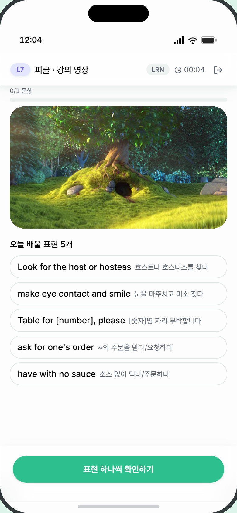
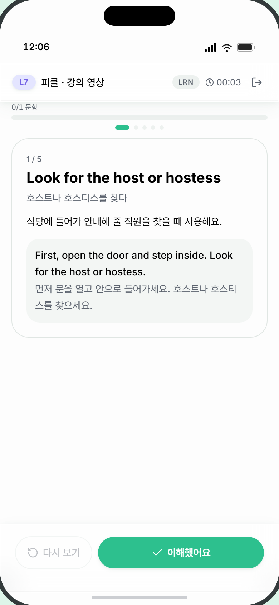
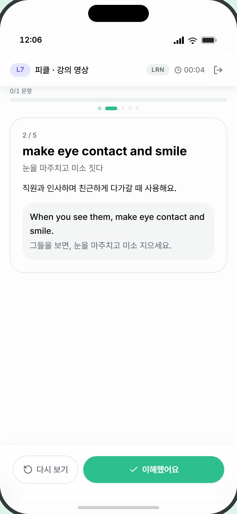
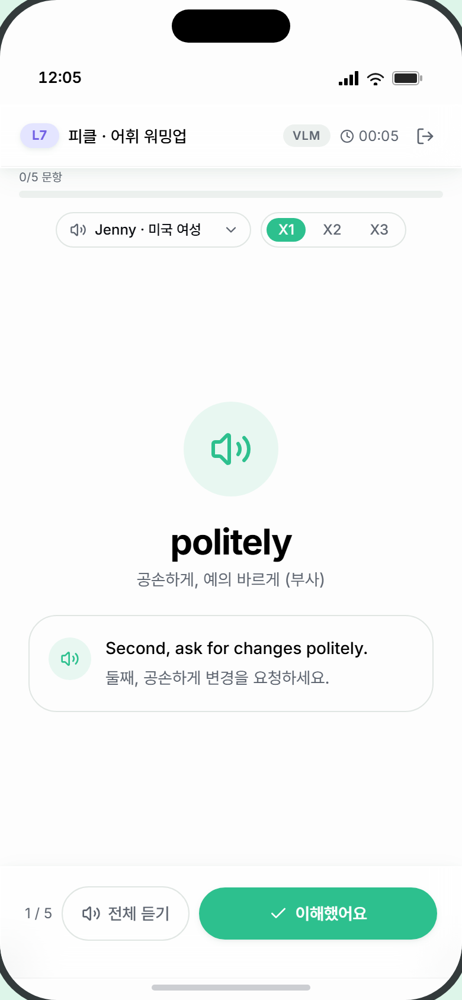
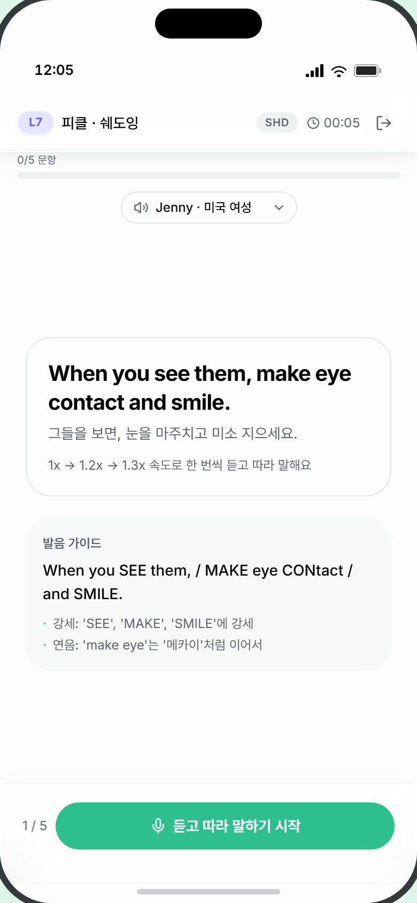
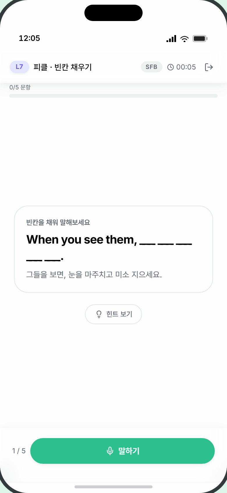
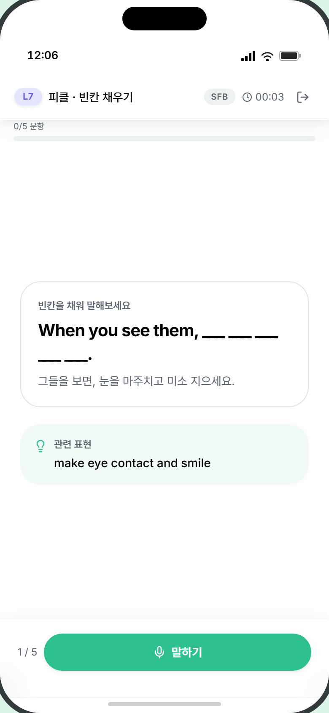
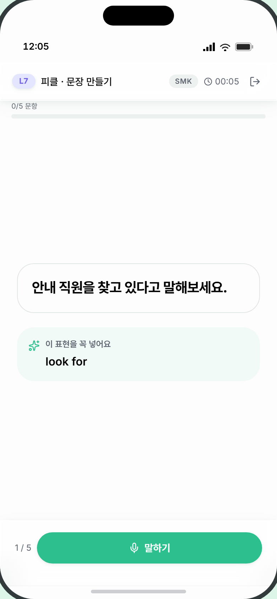
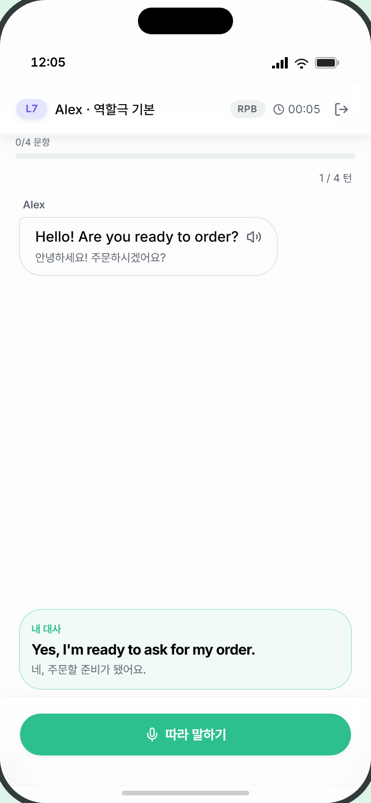
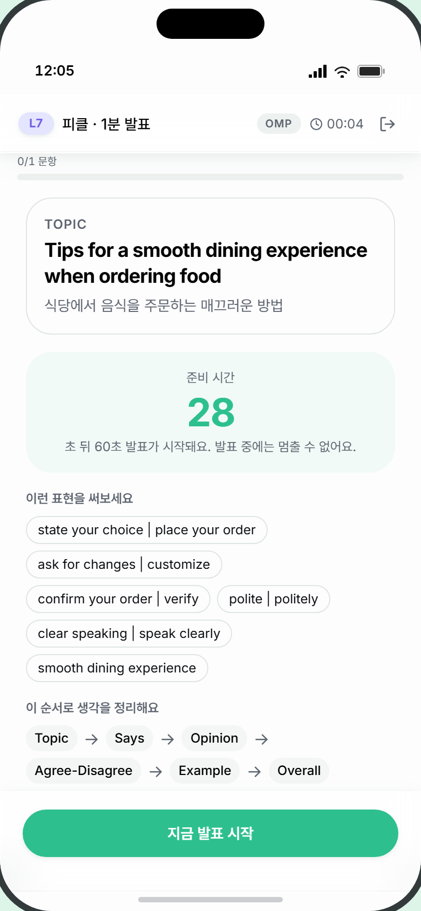

# 3. 모듈별 화면 명세

> **대상** — UI/UX 디자이너. 8개 학습 모듈이 **각자 다르게 쓰는 화면**(2단계 문항 제시 · 3단계 답안 수행 · 고유 완료 화면)을 정의한다.
> **먼저 읽을 것** — [0. 디자인 브리프](0_디자인브리프.md) · [2. 모듈 공통 화면 패턴](2_모듈공통화면패턴.md)
> **함께 볼 것** — [4. 화면 인벤토리 & 상태](4_화면인벤토리와상태.md)에 여기 나온 모든 화면이 체크리스트로 정리돼 있다.

---

## 이 문서를 읽는 법

모든 모듈은 [공통 6단계](2_모듈공통화면패턴.md)를 따른다. 그중 **1·4·5단계는 공통 UI**라 이 문서에서 다루지 않고(고유 완료 화면을 가진 4개 모듈만 예외), **2단계와 3단계만 모듈마다 다르다.** 이 문서는 그 차이를 다룬다.

각 화면은 아래 블록으로 반복 서술한다.

| 항목 | 뜻 |
|---|---|
| **목적** | 학습자가 이 화면에서 무엇을 하는가 |
| **진입 / 이탈** | 어떻게 들어오고 어떻게 나가는가 |
| **와이어** | 현재 구현된 요소 배치(디자인 시안이 아니라 **구조 참조용**) |
| **요소 표** | 요소 · 내용 · **데이터 출처** · **제약** |
| **상태 변형** | 이 화면이 가질 수 있는 모든 시각 상태 |
| **카피** | 실제 노출 문구 원본 |
| **참조** | 개발자 확인용 코드 경로 |

**「데이터 출처」와 「제약」 칸이 가장 중요합니다.** 콘텐츠 대부분이 외부(픽클래스)에서 주입되거나 LLM이 생성하므로 **길이가 고정되지 않습니다.** 제약 칸의 글자 수·개수 범위를 넘어가는 경우를 반드시 디자인에 반영해 주세요.

---

## 콘텐츠 분량 기준값

디자인 시 "몇 개가 들어오는가"의 기준입니다. 아래는 현재 데모 콘텐츠(레스토랑 주제) 기준이며, **실제 운영 콘텐츠는 픽클래스가 주입하므로 개수가 달라질 수 있습니다.** 반드시 가변으로 설계해 주세요.

| 모듈 | 진도바 문항 수 | 실제 반복 단위 | 비고 |
|---|---|---|---|
| LRN | **1** | 표현 카드 5장 | 진도바는 1/1로 거의 안 움직임 — 카드 진행은 본문 상단 도트가 담당 |
| VLM | 5 | 단어 5개 | 단어 1개 = 문항 1개 |
| SHD | 5 | 문장 5개 × **속도 3라운드**(1x / 1.2x / 1.3x) | 실제 발화 횟수 = 5 × 3 = 15회 |
| SFB | 5 | 빈칸 문장 5개 | |
| SMK | 5 | 목표 표현 5개 | |
| RPB | **4** | 전체 대화 8턴 중 **학습자 턴 4개**만 문항 | NPC 턴 4개는 사이에 끼워 재생 |
| RPF | **1** | NPC 턴 최대 4회(분기 풀 크기) | 대화 전체가 문항 1개 |
| OMP | **1** | 준비 30초 → 발표 60초 | 발표 전체가 문항 1개 |

---
---

# LRN — 학습 (강의 영상)

헤더 라벨 `피클 · 강의 영상` · 코드 뱃지 `LRN` · 발화 없음(탭으로만 진행)

## LRN-2 · 영상 + 표현 미리보기

**목적** — 오늘 배울 표현이 무엇인지 영상과 목록으로 한눈에 훑는다.
**진입** — 1단계 [시작하기] 탭
**이탈** — [표현 하나씩 확인하기] → LRN-3

```
┌─────────────────────────────────┐
│  헤더 / 진도바                    │
├─────────────────────────────────┤
│ ┌─────────────────────────────┐ │
│ │                             │ │
│ │      영상 (16:9)            │ │  ← 자동재생·무음·루프
│ │                             │ │
│ └─────────────────────────────┘ │
│                                 │
│  오늘 배울 표현 5개               │
│  ┌─────────────────────────────┐│
│  │ have a table for   자리를…  ││  ← 목록, 스크롤
│  ├─────────────────────────────┤│
│  │ ask for one's order …       ││
│  └─────────────────────────────┘│
├─────────────────────────────────┤
│    [ 표현 하나씩 확인하기 ]       │
└─────────────────────────────────┘
```

| 요소 | 내용 | 데이터 출처 | 제약 |
|---|---|---|---|
| 영상 플레이어 | 16:9, 모서리 둥글게, 검정 배경 | 콘텐츠 `videoUrl` | **자동재생·무음·루프·인라인 재생.** 재생/일시정지·볼륨 컨트롤 없음 |
| 영상 없음 대체 | 검정 박스 안 안내 문구 | `videoUrl` 부재 시 | 아래 카피 참조 |
| 표현 개수 제목 | `오늘 배울 표현 N개` | `expressionList.length` | N은 3~10 가변 |
| 표현 목록 항목 | 영어 표현 + 한글 뜻(작게, 옆에) | `expression` / `meaningKr` | 표현 1~6단어, 뜻 5~20자. **길면 줄바꿈됨** |

**상태 변형** — ① 영상 정상 재생 ② 영상 URL 없음(대체 박스) ③ 표현 목록이 길어 스크롤

**카피** — 영상 없음: `영상 준비 중` / 버튼: `표현 하나씩 확인하기`

> ⚠️ **자막이 없습니다.** 원본 영상에 싱크 자막 데이터가 없어 자막 트랙을 붙이지 않았습니다. 자막이 필요하면 콘텐츠 전달 계약부터 바뀌어야 하므로, 디자인에 자막 영역을 넣기 전에 확인이 필요합니다.

**참조** — [LrnVideoIntro.tsx](../../apps/web/src/components/module/lrn/LrnVideoIntro.tsx)



---

## LRN-3 · 표현 카드 (순차 N장)

**목적** — 표현을 한 장씩 정독한다. **마지막 카드까지 [이해했어요]를 눌러야만** 넘어간다(건너뛰기 불가).
**진입** — LRN-2에서 [표현 하나씩 확인하기]
**이탈** — 마지막 카드에서 [다 이해했어요] → 4단계

```
┌─────────────────────────────────┐
│  헤더 / 진도바 (1/1 고정)         │
├─────────────────────────────────┤
│        ▬  ·  ·  ·  ·             │  ← 카드 진행 도트 (현재=길쭉)
│ ┌─────────────────────────────┐ │
│ │ 2 / 5                       │ │
│ │ have a table for   [🔊]     │ │  ← 오디오 있을 때만 버튼
│ │ 자리를 잡다                  │ │
│ │                             │ │
│ │ 식당에서 인원 수를 말하며…    │ │
│ │ ┌─────────────────────────┐ │ │
│ │ │ Can I have a table for  │ │ │  ← 예문 블록
│ │ │ 두 명 자리 있나요?        │ │ │
│ │ └─────────────────────────┘ │ │
│ └─────────────────────────────┘ │
├─────────────────────────────────┤
│  [ ↺ 다시 보기 ]  [ ✓ 이해했어요 ] │
└─────────────────────────────────┘
```

| 요소 | 내용 | 데이터 출처 | 제약 |
|---|---|---|---|
| 카드 진행 도트 | 현재 카드=길쭉한 알약, 지난 카드=작은 점(진하게), 남은 카드=작은 점(흐리게) | 카드 인덱스 | 개수 = 표현 수(3~10) |
| 카드 내 번호 | `2 / 5` | 인덱스 | |
| 표현 | 큰 볼드 | `expression` | 1~6단어 |
| 오디오 버튼 | 원형, 재생 중 아이콘 pulse | `audioUrl` | **현재 데모 콘텐츠에는 오디오가 없어 버튼이 안 보입니다.** 픽클래스 연동 후 노출 |
| 뜻 | 작은 회색 | `meaningKr` | 5~20자 |
| 설명 | 본문 | `usage` | 20~60자, 2~3줄 |
| 예문 블록 | 회색 배경, 영문(볼드) + 한글(회색) | `exampleEn` / `exampleKr` | 각 1~2줄 |
| [다시 보기] | 보조 버튼. **첫 카드에서는 비활성** | — | |
| [이해했어요] | 주 버튼. 마지막 카드에서 라벨이 `다 이해했어요`로 바뀜 | — | |

**상태 변형** — ① 첫 카드(다시 보기 비활성) ② 중간 카드 ③ 마지막 카드(라벨 변경) ④ 오디오 버튼 있음/없음 ⑤ 오디오 재생 중(pulse)

**카피** — `다시 보기` · `이해했어요` · `다 이해했어요`

**참조** — [LrnExpressionCard.tsx](../../apps/web/src/components/module/lrn/LrnExpressionCard.tsx)

| 첫 카드 (다시 보기 비활성) | 둘째 카드 (도트 이동) |
|---|---|
|  |  |

---
---

# VLM — 어휘 워밍업

헤더 라벨 `피클 · 어휘 워밍업` · 코드 뱃지 `VLM` · 발화 없음(탭으로만 진행)

## VLM-2 · 단어 카드 (듣기 + 이해 확인)

**목적** — 단어를 듣고 뜻·예문을 확인한 뒤 스스로 "이해했다"고 표시한다.
**진입** — 1단계 [시작하기], 또는 이전 단어에서 [이해했어요]
**이탈** — [이해했어요] → 다음 단어(중간) / 4단계(마지막)

> **중요** — VLM은 **중간 단어에서 피드백 화면(4단계)을 건너뜁니다.** [이해했어요]를 누르면 곧바로 다음 단어 카드로 전환됩니다. 4단계 화면은 마지막 단어를 끝냈을 때 **한 번만** 나타납니다.

```
┌─────────────────────────────────┐
│  헤더 / 진도바 (2/5 문항)         │
├─────────────────────────────────┤
│    [🔊 목소리 ▾]  [X1][X2][X3]   │  ← 보이스 선택 + 반복 횟수
│                                 │
│            ╭───────╮            │
│            │  🔊   │            │  ← 단어 듣기 (80px 원형)
│            ╰───────╯            │
│                                 │
│           politely              │  ← 30px 볼드
│      공손하게, 예의 바르게        │
│                                 │
│  ┌─────────────────────────────┐│
│  │ [🔊] Second, ask for        ││  ← 예문 카드
│  │      changes politely.      ││
│  │      둘째, 공손하게…         ││
│  └─────────────────────────────┘│
├─────────────────────────────────┤
│ 2/5  [ 🔊 전체 듣기 ] [ ✓ 이해했어요 ]│
└─────────────────────────────────┘
```

| 요소 | 내용 | 데이터 출처 | 제약 |
|---|---|---|---|
| 보이스 선택 | 알약형 셀렉트, 좌측 스피커 아이콘 + 우측 화살표 | 고정 보이스 목록 | 네이티브 `<select>`. 디자인 시 **OS 기본 드롭다운이 뜬다**는 점 유의 |
| 반복 횟수 | `X1` `X2` `X3` 세그먼트. 선택 시 즉시 재생 | 로컬 상태(기본 X1) | **배속이 아니라 반복 횟수** — 라벨 오해 주의 |
| 단어 듣기 버튼 | 80×80 원형. 재생 중 배경 채움 + 아이콘 pulse | — | |
| 단어 | 30px 볼드 | `word` | 1단어, 3~15자 |
| 뜻 | 작은 회색 | `meaningKr` | 5~30자 |
| 예문 카드 | 36px 원형 재생 버튼 + 영문(볼드)/한글(회색) | `sampleEn` / `sampleKr` | 각 1~2줄 |
| 액션바 좌측 메타 | `2 / 5` | 인덱스 | |
| [전체 듣기] | 보조 버튼 — 단어+예문 세트를 반복 횟수만큼 연속 재생 | — | |
| [이해했어요] | 주 버튼. **재생 중에는 비활성(40% 투명)** | — | |

**상태 변형** — ① 진입 직후 자동 재생 중(주 버튼 비활성) ② 대기 ③ 단어만 재생 중 ④ 예문만 재생 중 ⑤ 전체 재생 중 ⑥ 보이스 변경 직후 재생

**동작 메모** — 카드 진입 시 [단어 → 예문] 세트가 **자동 재생**됩니다. 재생이 끝나야 [이해했어요]가 활성화됩니다.

**카피** — `전체 듣기` · `이해했어요`

**참조** — [VlmWordCard.tsx](../../apps/web/src/components/module/vlm/VlmWordCard.tsx)



---
---

# SHD — 쉐도잉

헤더 라벨 `피클 · 쉐도잉` · 코드 뱃지 `SHD` · **발화 필수**

> **구조 요약** — 문장 5개. 각 문장마다 **속도 3라운드**(1x → 1.2x → 1.3x)를 돈다. 라운드 하나 = "1회 듣기(자동) → 1회 말하기 → 결과 확인". 즉 화면이 문장당 3번 반복됩니다.

## SHD-2 · 문장 인트로

**목적** — 따라 말할 문장과 발음 가이드를 미리 읽는다. **여기서는 음성이 재생되지 않는다**(듣기는 전부 다음 화면의 라운드 안에서).
**진입** — 1단계 [시작하기], 또는 이전 문장 완료
**이탈** — [듣고 따라 말하기 시작] → SHD-3

```
┌─────────────────────────────────┐
│  헤더 / 진도바 (1/5 문항)         │
├─────────────────────────────────┤
│         [🔊 목소리 ▾]            │
│                                 │
│  ┌─────────────────────────────┐│
│  │ Can I have a table for two? ││  ← 20px 볼드
│  │ 두 명 자리 있나요?            ││
│  │ 1x → 1.2x → 1.3x 속도로      ││
│  │ 한 번씩 듣고 따라 말해요       ││
│  └─────────────────────────────┘│
│  ┌─────────────────────────────┐│
│  │ 발음 가이드                  ││
│  │ 캔 아이 해브 어 테이블…       ││
│  │ · table의 t는 강하게          ││
│  │ · for two는 붙여서            ││
│  └─────────────────────────────┘│
├─────────────────────────────────┤
│ 1/5   [ 🎤 듣고 따라 말하기 시작 ] │
└─────────────────────────────────┘
```

| 요소 | 내용 | 데이터 출처 | 제약 |
|---|---|---|---|
| 보이스 선택 | VLM과 동일 | 고정 목록 | |
| 문장 | 20px 볼드 | `sentence` | 5~15단어, **2~3줄까지 늘어날 수 있음** |
| 뜻 | 작은 회색 | `meaningKr` | 10~30자 |
| 라운드 예고 | `1x → 1.2x → 1.3x 속도로 한 번씩 듣고 따라 말해요` | `passSpeeds` 배열 | **속도 개수가 2~4개로 달라질 수 있음** |
| 발음 가이드 | 한글 음차 표기 | `phoneticGuide` | 1~2줄 |
| 발음 포인트 | 불릿 목록(청록 `·` + 회색 텍스트) | `pronunciationPoints` | **1~4개 가변** |

**상태 변형** — 단일 상태

**카피** — `발음 가이드` · `듣고 따라 말하기 시작`

**참조** — [ShdSentenceCard.tsx](../../apps/web/src/components/module/shd/ShdSentenceCard.tsx)



---

## SHD-3 · 속도 라운드 (5개 상태)

**목적** — 속도별로 듣고 따라 말하고 채점 결과를 확인한다.
**진입** — SHD-2에서 [듣고 따라 말하기 시작]
**이탈** — 최종 결과에서 [다음 문장] 또는 [마무리하기]

**이 화면은 상단(문장 + 라운드 표시)이 고정된 채 본문과 하단 바만 5개 상태로 바뀝니다.** 디자이너는 5장을 모두 그려야 합니다.

```
┌─────────────────────────────────┐
│  헤더 / 진도바                    │
├─────────────────────────────────┤
│  ┌─────────────────────────────┐│  ← 상단 고정
│  │ Can I have a table for two? ││
│  │ 두 명 자리 있나요?            ││
│  │  ▬▬▬   ▬▬▬   ▬▬▬            ││  ← 라운드 게이지 3칸
│  │  1x    1.2x   1.3x          ││     (현재=청록+pulse)
│  └─────────────────────────────┘│
├─────────────────────────────────┤
│                                 │
│        [ 본문 — 상태별 교체 ]     │
│                                 │
├─────────────────────────────────┤
│        [ 하단 바 — 상태별 교체 ]  │
└─────────────────────────────────┘
```

### 상태 ① listening — 원어민 음성 재생 중

| 영역 | 내용 |
|---|---|
| 본문 | 발음 가이드 카드(SHD-2와 동일) |
| 하단 힌트 | `원어민 발음을 들어보세요 (1x)` — 현재 속도가 들어감 |
| 하단 버튼 | 녹음 버튼 **비활성**(40% 투명) |

### 상태 ② recording — 녹음 중

| 영역 | 내용 |
|---|---|
| 본문 | 발음 가이드 카드 |
| 하단 힌트 | `다 말했으면 멈추기를 누르세요` |
| 하단 버튼 | 녹음 버튼 = **빨강 배경 + 정지(■) 아이콘**, 목소리 크기에 따라 **바깥 링이 커졌다 작아짐** |

### 상태 ③ scoring — 채점 중

| 영역 | 내용 |
|---|---|
| 본문 | 발음 가이드 카드 |
| 하단 힌트 | `발음을 채점하고 있어요…` |
| 하단 버튼 | 버튼 자리에 **회전 스피너**(64×64 영역) |

### 상태 ④ roundResult — 라운드 결과

```
│      ╭─────╮                    │
│      │  ✓  │  ← 56px 원형        │  통과=연녹 배경/청록 아이콘
│      ╰─────╯                    │  실패=회색 배경/회색 X
│         85%                     │  ← 30px 볼드
│      발음 정확도                  │
│  ┌─────────────────────────────┐│
│  │ 단어별 발음                  ││
│  │ Can I have a table for two  ││  ← 단어별 색상
│  │ 정확도 ███████░ 85           ││
│  │ 유창성 ██████░░ 72           ││  ← 4지표 2열 그리드
│  │ 완성도 ████████ 90           ││
│  │ 억양   ████░░░░ 48           ││
│  └─────────────────────────────┘│
│  좋아요, 잘 따라 말했어요!         │
├─────────────────────────────────┤
│1/5 [↺ 이 속도 다시] [다음 속도(1.2x)]│
└─────────────────────────────────┘
```

| 요소 | 내용 | 제약 |
|---|---|---|
| 통과/실패 원형 | 56×56 | |
| 발음 정확도 | `85%` 30px 볼드 + `발음 정확도` 라벨 | **0~100 정수 %** |
| 단어별 발음 | 단어를 색상으로 나열 — [공통 패턴 §5-B](2_모듈공통화면패턴.md) | 5~15단어, **줄바꿈됨** |
| 발음 4지표 | 정확도·유창성·완성도·억양 — 2열 그리드 | |
| 결과 멘트 | 통과/실패에 따라 다름 | |
| [이 속도 다시] | 보조 버튼 — **횟수 제한 없음** | |
| [다음 속도 (1.2x)] | 주 버튼. 마지막 라운드면 `결과 보기` | 속도 값이 라벨에 들어감 |

### 상태 ⑤ finalResult — 문장 최종 결과

```
│      ╭─────╮                    │
│      │  ✓  │                    │
│      ╰─────╯                    │
│         81%                     │
│    평균 발음 정확도               │
│  ┌─────────────────────────────┐│
│  │ 정확도 ███████░ 81           ││  ← 4지표(라운드 평균)
│  │ …                           ││
│  │ ─────────────────────────── ││
│  │ 1x        85%  ✓            ││  ← 라운드별 요약
│  │ 1.2x      80%  ✓            ││
│  │ 1.3x      78%  ✗            ││
│  └─────────────────────────────┘│
│  좋아요, 모든 속도를 잘 따라 말했어요!│
├─────────────────────────────────┤
│  1/5      [ 다음 문장 ]           │
└─────────────────────────────────┘
```

| 요소 | 제약 |
|---|---|
| 라운드별 요약 행 | 속도 · 정확도% · 통과 아이콘. **행 수 = 속도 개수(2~4)** |
| 주 버튼 | 마지막 문장이면 `마무리하기` |

**오류 상태** — 마이크 권한 거부 등은 본문 하단에 **빨간 작은 텍스트**로 표시됩니다(결과 상태에서는 숨김).

**카피 전체**
- `원어민 발음을 들어보세요 (1x)` / `다 말했으면 멈추기를 누르세요` / `발음을 채점하고 있어요…`
- 라운드 통과: `좋아요, 잘 따라 말했어요!` / 미달: `70% 이상을 목표로 이 속도를 다시 해볼 수 있어요`
- 최종 통과: `좋아요, 모든 속도를 잘 따라 말했어요!` / 미달: `아쉬워요, 다음 문장에서 이어서 연습해요`
- 버튼: `이 속도 다시` · `다음 속도 (1.2x)` · `결과 보기` · `다음 문장` · `마무리하기`

**참조** — [ShdRecordCard.tsx](../../apps/web/src/components/module/shd/ShdRecordCard.tsx)

> 📷 미촬영: `SHD-3-listening` · `SHD-3-recording` · `SHD-3-roundResult` · `SHD-3-finalResult` — 백엔드(DB·AI 키) 필요

---
---

# SFB — 빈칸 채우기

헤더 라벨 `피클 · 빈칸 채우기` · 코드 뱃지 `SFB` · **발화 필수**

> SHD와 **같은 표현 세트**를 씁니다. SHD에서 들은 문장의 핵심부를 빈칸으로 바꿔 스스로 떠올려 말하게 하는 단계입니다.

## SFB-2 · 빈칸 문항 제시

**목적** — 빈칸이 뚫린 문장을 보고 무엇을 말할지 떠올린다. **정답을 미리 보여주지 않는다.**
**진입** — 1단계 [시작하기], 또는 이전 문항 완료
**이탈** — [말하기] → SFB-3

```
┌─────────────────────────────────┐
│  헤더 / 진도바 (1/5 문항)         │
├─────────────────────────────────┤
│  ┌─────────────────────────────┐│
│  │ 빈칸을 채워 말해보세요        ││  ← 작은 회색 라벨
│  │ Can I ______ for two?       ││  ← 20px 볼드
│  │ 두 명 자리 있나요?            ││
│  └─────────────────────────────┘│
│                                 │
│        [ 💡 힌트 보기 ]          │  ← 기본 상태: 버튼만
│                                 │
├─────────────────────────────────┤
│  1/5      [ 🎤 말하기 ]          │
└─────────────────────────────────┘
```

| 요소 | 내용 | 데이터 출처 | 제약 |
|---|---|---|---|
| 안내 라벨 | `빈칸을 채워 말해보세요` | 고정 | |
| 빈칸 문장 | 20px 볼드 | `question.text` | 빈칸 표기 형태는 콘텐츠가 결정 |
| 뜻 | 회색 | `meaningKr` | 10~30자 |
| 힌트 | **기본 숨김.** [힌트 보기] 탭 시 카드로 펼쳐짐(되돌릴 수 없음) | `hints` | 힌트가 **답을 거의 그대로 노출**하므로 신중한 시각 처리 필요 |

**상태 변형** — ① 힌트 접힘(버튼) ② 힌트 펼침(연청록 배경 카드 + 전구 아이콘)

**카피** — `빈칸을 채워 말해보세요` · `힌트 보기` · `관련 표현` · `말하기`

**참조** — [SfbPresentCard.tsx](../../apps/web/src/components/module/sfb/SfbPresentCard.tsx)




---

## SFB-3 · 발화 · 채점 (4개 상태)

**목적** — 빈칸을 채운 전체 문장을 말하고 채점받는다.
**진입** — SFB-2에서 [말하기] → **곧바로 녹음이 시작됩니다**(마이크를 다시 누를 필요 없음)
**이탈** — 결과에서 [다음 문제] 또는 [마무리하기]

```
┌─────────────────────────────────┐
│  헤더 / 진도바                    │
├─────────────────────────────────┤
│  ┌─────────────────────────────┐│  ← 상단 고정
│  │ Can I ______ for two?       ││  ← 채점 전: 빈칸 문장
│  │ (결과에선 완성 문장으로 교체)  ││  ← 채점 후: 정답 공개
│  │ 두 명 자리 있나요?            ││
│  └─────────────────────────────┘│
├─────────────────────────────────┤
│      [ 본문 — 채점 전엔 비어 있음 ]│
├─────────────────────────────────┤
│      [ 하단 바 — 상태별 교체 ]    │
└─────────────────────────────────┘
```

| 상태 | 상단 카드 | 본문 | 하단 힌트 | 하단 버튼 |
|---|---|---|---|---|
| ① idle | 빈칸 문장 | 비어 있음 | `마이크를 누르고 전체 문장을 말하세요` | 녹음 버튼(기본) |
| ② recording | 빈칸 문장 | 비어 있음 | `다 말했으면 멈추기를 누르세요` | 녹음 버튼(빨강·정지·음성 링) |
| ③ scoring | 빈칸 문장 | 비어 있음 | `발음을 채점하고 있어요…` | 스피너 |
| ④ result | **완성 문장 공개** | 결과 뷰 | — | [다시 해보기]* + [다음 문제] |

\* [다시 해보기]는 **미달했고 재시도 기회(1회)가 남았을 때만** 표시됩니다.

### ④ result 본문

```
│        ╭───────╮                │
│        │   ✓   │  ← 64px 원형    │
│        ╰───────╯                │
│    85%          100%            │  ← 두 지표 나란히 (30px)
│  발음 정확도    표현 사용         │
│                                 │
│  좋아요, 표현을 정확히 인출했어요!  │
│  ┌─────────────────────────────┐│
│  │ 발음 포인트                  ││
│  │ · table의 t는 강하게          ││
│  └─────────────────────────────┘│
```

| 요소 | 내용 | 제약 |
|---|---|---|
| 통과/실패 원형 | 64×64 | |
| 발음 정확도 | `85%` | 0~100 정수 |
| **표현 사용** | `100%` — 빈칸에 들어갈 표현을 실제로 말했는지의 비율 | 0~100 정수. **SHD에는 없는 SFB 고유 지표** |
| 결과 멘트 | 통과/미달 | |
| 발음 포인트 | 불릿 목록 | 1~4개. **없을 수도 있음** |

**본문에 비어 있는 상태(①②③)가 3개나 됩니다.** 화면이 허전해 보이지 않도록 디자인 보완이 필요한 지점입니다.

**카피** — `마이크를 누르고 전체 문장을 말하세요` · `다 말했으면 멈추기를 누르세요` · `발음을 채점하고 있어요…` · 통과 `좋아요, 표현을 정확히 인출했어요!` / 미달 `70% 이상을 목표로 한 번 더 해볼까요?` · `발음 포인트` · `다시 해보기` · `다음 문제` · `마무리하기`

**참조** — [SfbRecordCard.tsx](../../apps/web/src/components/module/sfb/SfbRecordCard.tsx)

> 📷 미촬영: `SFB-3-idle` · `SFB-3-result` — 백엔드(DB·AI 키) 필요

---
---

# SMK — 문장 만들기

헤더 라벨 `피클 · 문장 만들기` · 코드 뱃지 `SMK` · **발화 필수** · **AI 사용**

> 정답이 하나가 아닌 첫 모듈입니다. 목표 표현을 써서 **새 문장을 자유롭게** 만들어 말합니다. 통과 기준은 발음이 아니라 **목표 표현을 실제로 썼는가**입니다.

## SMK-2 · 문항 제시

**목적** — 무엇에 대해 말할지(한글 가이드)와 반드시 쓸 표현을 확인한다. **모범 영어 문장은 보여주지 않는다.**
**진입** — 1단계 [시작하기], 또는 이전 문항 완료
**이탈** — [말하기] → SMK-3

```
┌─────────────────────────────────┐
│  헤더 / 진도바 (1/5 문항)         │
├─────────────────────────────────┤
│  ┌─────────────────────────────┐│
│  │ 자리를 요청하는 문장을        ││  ← 20px 볼드 (한글 지시문)
│  │ 만들어 말해보세요             ││
│  └─────────────────────────────┘│
│  ┌─────────────────────────────┐│
│  │ ✨ 이 표현을 꼭 넣어요        ││  ← 연청록 배경
│  │    have a table for         ││
│  └─────────────────────────────┘│
├─────────────────────────────────┤
│  1/5      [ 🎤 말하기 ]          │
└─────────────────────────────────┘
```

| 요소 | 내용 | 데이터 출처 | 제약 |
|---|---|---|---|
| 한글 가이드 | 20px 볼드. **지시문 자체가 콘텐츠**(고정 안내문 없음) | `question.text` | 15~40자, 1~3줄 |
| 목표 표현 블록 | 연청록 배경 + ✨ 아이콘 + 라벨 + 표현 | `targetExpression` | 표현 1~5단어 |

**상태 변형** — 단일 상태

**카피** — `이 표현을 꼭 넣어요` · `말하기`

**참조** — [SmkPresentCard.tsx](../../apps/web/src/components/module/smk/SmkPresentCard.tsx)



---

## SMK-3 · 발화 · 채점 (4개 상태 + 무발화 힌트)

**목적** — 목표 표현을 넣어 새 문장을 말한다.
**진입** — SMK-2에서 [말하기] → 마이크 준비되면 **자동으로 녹음 시작**
**이탈** — 결과에서 [다음 문제] 또는 [마무리하기]

| 상태 | 상단 카드 | 본문 | 하단 힌트 | 하단 버튼 |
|---|---|---|---|---|
| ① idle (마이크 준비 중) | 가이드 + 목표 표현(청록) | 비어 있음 | `마이크를 준비하고 있어요…` | 녹음 버튼 **비활성** |
| ② recording | 가이드 + 목표 표현 | 비어 있음 → **20초 후 힌트 카드** | `다 말했으면 멈추기를 누르세요` | 녹음 버튼(빨강·정지) |
| ③ scoring | 가이드 + 목표 표현 | 비어 있음 | `발화를 확인하고 있어요…` | 스피너 |
| ④ result | 가이드 + **모범 문장 공개** | 결과 뷰 | — | [다시 해보기]* + [다음 문제] |

### 무발화 힌트 (②에서 20초 경과 시)

```
│  ┌─────────────────────────────┐│
│  │ 💡 이렇게 시작해보세요:       ││  ← 연청록 배경, 전구 아이콘
│  │    "Can I have a table…"    ││     줄바꿈 그대로 표시
│  └─────────────────────────────┘│
```

20초는 관리자 설정으로 바뀔 수 있습니다. 한 번 뜨면 그대로 유지됩니다.

### ④ result 본문

```
│        ╭───────╮                │
│        │   ✓   │                │
│        ╰───────╯                │
│    78%          100%            │
│  발음 정확도    표현 사용         │
│  좋아요, 표현을 잘 활용했어요!     │
│  ┌─────────────────────────────┐│
│  │ 내가 말한 문장                ││  ← STT 인식 결과
│  │ Can I have a table for two? ││
│  └─────────────────────────────┘│
│  ┌─────────────────────────────┐│
│  │ 이렇게도 말할 수 있어요        ││
│  │ · Do you have a table for…  ││
│  │ · We'd like a table for…    ││
│  └─────────────────────────────┘│
```

| 요소 | 내용 | 제약 |
|---|---|---|
| 발음 정확도 / 표현 사용 | 두 지표 나란히 | 0~100 정수 |
| **내가 말한 문장** | STT가 인식한 학습자 발화 원문 | **길이 완전 가변.** 인식 실패 시 이 블록 자체가 없음 |
| 이렇게도 말할 수 있어요 | 대안 예시 불릿 | **1~4개 가변. 없을 수도 있음** |

> ⚠️ **통과 기준이 발음이 아닙니다.** 발음 정확도가 낮아도 목표 표현을 썼으면 통과(✓)입니다. 두 숫자가 나란히 있어 오해할 수 있으니 **표현 사용 쪽을 시각적으로 강조**하는 편이 좋습니다.

**카피** — `마이크를 준비하고 있어요…` · `다 말했으면 멈추기를 누르세요` · `발화를 확인하고 있어요…` · 통과 `좋아요, 표현을 잘 활용했어요!` / 미달 `목표 표현을 넣어 한 번 더 말해볼까요?` · `내가 말한 문장` · `이렇게도 말할 수 있어요`

**참조** — [SmkRecordCard.tsx](../../apps/web/src/components/module/smk/SmkRecordCard.tsx)

> 📷 미촬영: `SMK-3-recording` · `SMK-3-hint` · `SMK-3-result` — 백엔드(DB·AI 키) 필요

---

## SMK-5 · 완료 — 응용 코칭 (고유 완료 화면)

**목적** — 전체 문항의 발화를 AI가 종합해 만든 코칭을 읽는다.
**진입** — 마지막 문항 4단계에서 [마무리하기]
**이탈** — [완료] 또는 [다음 모듈로]

```
┌─────────────────────────────────┐
│  헤더 / 진도바 (5/5)              │
├─────────────────────────────────┤
│      응용 완료! 다음 모듈로        │  ← 완료 멘트 (중앙, 18px)
│      가볼까요?                   │
│                                 │
│  ┌─────────────────────────────┐│
│  │ ✨ 응용 코칭                 ││
│  │ 표현을 다양한 상황에 잘…      ││
│  │ · 관사 a/the 사용에 주의       ││
│  │ · 문장을 조금 더 길게          ││
│  └─────────────────────────────┘│
├─────────────────────────────────┤
│         [ 완료 ]                 │
└─────────────────────────────────┘
```

**상태 변형 (3가지 — 모두 그려야 합니다)**

| 상태 | 표시 |
|---|---|
| ① 코칭 생성 중 | 완료 멘트 + 회전 스피너 + `코칭을 정리하고 있어요…` |
| ② 코칭 도착 | 완료 멘트 + 응용 코칭 카드 |
| ③ **코칭 실패/없음** | **완료 멘트만.** 카드 영역이 통째로 사라짐 |

③은 AI 호출 실패 시 발생하며 실제로 일어납니다. 화면이 텅 비어 보이지 않도록 설계해 주세요.

| 요소 | 데이터 출처 | 제약 |
|---|---|---|
| 완료 멘트 | 고정 문구 | |
| 코칭 피드백 | **AI 생성** | **길이 완전 가변**(2~5줄 예상) |
| 팁 불릿 | **AI 생성** | **0~5개 가변** |

**카피** — 완료 멘트 `응용 완료! 다음 모듈로 가볼까요?` · `코칭을 정리하고 있어요…` · `응용 코칭` · 버튼 `완료` (모듈 체이닝 시 `다음 모듈로`)

**참조** — [SmkCoachingCard.tsx](../../apps/web/src/components/module/smk/SmkCoachingCard.tsx) · [SmkCoachingBody.tsx](../../apps/web/src/components/module/smk/SmkCoachingBody.tsx)

> 📷 미촬영: `SMK-5-loading` · `SMK-5-result` — 백엔드(DB·AI 키) 필요

---
---

# RPB — 역할극 기본

헤더 라벨 `{페르소나 이름} · 역할극 기본` (예: `Alex · 역할극 기본`) · 코드 뱃지 `RPB` · **발화 필수**

> **캐릭터가 바뀝니다.** 앞의 5개 모듈은 AI 튜터 "피클"이지만, RPB·RPF는 **상황 속 NPC**(웨이터 Alex 등)입니다. 헤더 라벨도 페르소나 이름으로 바뀝니다.
>
> **채팅 화면 위에서 진행됩니다.** 대화 8턴 중 학습자 턴 4개가 각각 문항입니다.

## RPB-2 · 제시 (NPC 대사 재생)

**목적** — 상대의 말을 듣고, 내가 말할 대사를 확인한다.
**진입** — 1단계 [시작하기], 또는 이전 턴 완료
**이탈** — 자동(카운트다운 2초 후) 또는 [바로 말하기] → RPB-3

```
┌─────────────────────────────────┐
│  헤더 / 진도바                    │
├─────────────────────────────────┤
│                      1 / 4 턴    │  ← 우측 정렬 작게
│  ┌ Alex ───────────────┐        │  ← NPC 버블 (좌, 흰 카드)
│  │ Hi, welcome!    [🔊] │        │     재생 중=청록 테두리+배경
│  │ 안녕하세요, 어서오세요 │        │
│  └─────────────────────┘        │
│           ┌─────────────────┐   │  ← 학습자 버블 (우, 청록 채움)
│           │ Table for two.  │   │
│           └─────────────────┘   │
│  ┌─────────────────────────────┐│
│  │ 내 대사                      ││  ← 대사 큐 (청록 테두리)
│  │ Can I have a table for two? ││
│  │ 두 명 자리 있나요?            ││
│  └─────────────────────────────┘│
├─────────────────────────────────┤
│      곧 녹음이 시작돼요           │  ← armed 상태에서만
│      [ 🎤 바로 말하기 ▓▓░░ ]     │  ← 버튼 안 게이지가 채워짐
└─────────────────────────────────┘
```

| 요소 | 내용 | 데이터 출처 | 제약 |
|---|---|---|---|
| 턴 표시 | `1 / 4 턴` 우측 정렬 | — | |
| NPC 버블 | 좌측, 이름 라벨 + 흰 카드(좌상단 모서리 각짐) + 스피커 버튼. 영문 + 한글 뜻 | 대본 `en` / `meaningKr` | 1~2줄 |
| NPC 버블(재생 중) | **청록 테두리 + 연청록 배경 + 스피커 아이콘 pulse** | — | |
| 학습자 버블 | 우측, 청록 채움 + 흰 글씨(우상단 모서리 각짐) | 대본 | 지난 턴만 표시 |
| 대사 큐 | 청록 테두리 + 연청록 배경. `내 대사` 라벨 + 영문(볼드) + 한글 | `learnerTargetLines` | 1~2줄 |
| 주 버튼 | 재생 중 `따라 말하기` → 재생 끝나면 `바로 말하기` + **버튼 안에 좌→우 진행 게이지** | — | 게이지 2초 |

**상태 변형** — ① NPC 대사 재생 중(`따라 말하기`, 힌트 없음) ② 재생 완료·카운트다운 중(`바로 말하기` + 게이지 + `곧 녹음이 시작돼요`) ③ [다시 듣기] 탭으로 카운트다운 해제 후 재생

**동작 메모** — 버튼을 누르지 않아도 **자동으로 녹음 단계로 넘어갑니다.** 버튼은 "즉시 넘어가기"용입니다. NPC 버블의 스피커를 누르면 카운트다운이 취소되고 다시 재생됩니다.

**참조** — [RpbSpeakCard.tsx](../../apps/web/src/components/module/rpb/RpbSpeakCard.tsx) · [RpbChatLog.tsx](../../apps/web/src/components/module/rpb/RpbChatLog.tsx)



---

## RPB-3 · 수행 (5개 상태)

**목적** — 내 대사를 따라 말하고 채점받는다.
**진입** — RPB-2에서 자동/수동 전환 → **곧바로 녹음 시작**
**이탈** — 자동(2초 후) 또는 [다음 차례] → 다음 턴

채팅 로그 + 대사 큐는 그대로 유지되고, 대사 큐 **아래**에 상태별 요소가 추가됩니다.

| 상태 | 대사 큐 아래 추가 요소 | 하단 힌트 | 하단 버튼 |
|---|---|---|---|
| ① idle | — | `마이크를 누르고 따라 말하세요` | 녹음 버튼 |
| ② recording | **무음 게이지**(가로 96px 얇은 바, 조용해지면 차오름) | `다 말했으면 잠시 기다리세요 — 자동으로 채점돼요` | 녹음 버튼(빨강·정지·음성 링) |
| ③ scoring | — | `발음을 채점하고 있어요…` | 스피너 |
| ④ result | 결과 요약(아래) | — | [다시 해보기]* + [다음 차례] + **자동 진행 게이지** |
| ⑤ **no-speech** | — | `목소리가 들리지 않았어요. 마이크를 눌러 다시 말해보세요` | 녹음 버튼 |

⑤ no-speech는 **RPB에만 있는 상태**입니다. 아무 말도 안 했을 때 채점 없이·재시도 횟수 소모 없이 되돌립니다.

### ④ result 요약 (작게, 채팅 로그 하단)

```
│   ╭────╮      88%               │  ← 44px 원형 + 24px 숫자 가로 배치
│   │ ✓  │   발음 정확도            │
│   ╰────╯                        │
│   좋아요, 잘 따라 말했어요!        │
```

앞선 모듈들의 결과 뷰(64px 원형·30px 숫자·세로 배치)보다 **작고 가로 배치**입니다. 채팅 로그를 가리지 않기 위한 구성입니다.

**자동 진행** — 통과했거나 재시도 기회가 없으면 **2초 뒤 자동으로 다음 턴**으로 넘어갑니다(주 버튼 안 게이지가 채워짐). 미달 + 재시도 가능한 경우에만 멈춰서 기다립니다.

**카피** — `마이크를 누르고 따라 말하세요` · `다 말했으면 잠시 기다리세요 — 자동으로 채점돼요` · `발음을 채점하고 있어요…` · `목소리가 들리지 않았어요. 마이크를 눌러 다시 말해보세요` · 통과 `좋아요, 잘 따라 말했어요!` / 미달 `70% 이상을 목표로 해볼까요?` · `다시 해보기` · `다음 차례` · `마무리하기`

> 📷 미촬영: `RPB-3-recording` · `RPB-3-result` — 백엔드(DB·AI 키) 필요

---

## RPB-5 · 완료 — 전체 대화 + 미션 표현 (고유 완료 화면)

**목적** — 완성된 전체 대화를 다시 보고 미션 표현을 얼마나 썼는지 확인한다.
**진입** — 마지막 턴 4단계에서 [마무리하기] · **이탈** — [완료] / [다음 모듈로]

```
┌─────────────────────────────────┐
│  헤더 / 진도바 (4/4)              │
├─────────────────────────────────┤
│  ┌ Alex ──────────┐             │  ← 전체 8턴 대화 (스크롤)
│  │ Hi, welcome!   │             │
│  └────────────────┘             │
│         ┌──────────────────┐    │
│         │ Table for two.   │    │
│         └──────────────────┘    │
│         … (8턴 전체)             │
│  ┌─────────────────────────────┐│
│  │ 미션 표현 사용          3/4  ││  ← 24px 볼드
│  │ ████████████████░░░░        ││
│  │ 역할극 완료! 다음 모듈로…     ││
│  └─────────────────────────────┘│
├─────────────────────────────────┤
│         [ 완료 ]                 │
└─────────────────────────────────┘
```

| 요소 | 내용 | 제약 |
|---|---|---|
| 전체 대화 | NPC/학습자 버블 8턴. **스피커 버튼 없음**(재생 불가) | 턴 수 가변 |
| 미션 표현 사용 | `3/4` 큰 숫자 + 진행 바 | **개수로 표시. 점수(0~100) 아님** |
| 완료 멘트 | 카드 안 작은 회색 텍스트 | |

**카피** — `미션 표현 사용` · 완료 멘트 `역할극 완료! 다음 모듈로 가볼까요?` · `완료`

> 📷 미촬영: `RPB-5` — 백엔드(DB·AI 키) 필요

---
---

# RPF — 역할극 자유

헤더 라벨 `{페르소나 이름} · 역할극 자유` · 코드 뱃지 `RPF` · **발화 필수** · **AI 실시간 대화**

> **정해진 대사가 없습니다.** NPC가 AI로 실시간 응답하고, 학습자는 역할 안에서 자유롭게 답합니다. 8개 모듈 중 유일하게 **매 턴 AI를 호출**합니다.
>
> ⚠️ **이 모듈은 공통 하단 액션 바를 쓰지 않습니다.** 자체 대형 마이크 버튼(80×80)을 씁니다. 다른 모듈과 하단 구조가 다르다는 점을 유의해 주세요.

## RPF-2 · 실시간 대화

**목적** — NPC와 자유롭게 대화하며 미션 표현을 써본다.
**진입** — 1단계 [시작하기] → **NPC가 먼저 인사를 건넵니다**
**이탈** — NPC 턴이 상한(4회)에 도달하면 자동 종료 → 5단계

**표면이 2가지입니다 — 음성 모드 / 채팅 모드. 상단 토글로 전환하며, 각각 다른 화면입니다.**

```
── 음성 모드(기본) ──          ── 채팅 모드 ──
┌─────────────────────┐      ┌─────────────────────┐
│ 헤더 / 진도바         │      │ 헤더 / 진도바         │
├─────────────────────┤      ├─────────────────────┤
│ [🌊 음성][💬 채팅]    │      │ [🌊 음성][💬 채팅]    │  ← 토글(선택=청록 채움)
├─────────────────────┤      ├─────────────────────┤
│                     │      │ ┌ AI 말풍선 ────┐   │
│    ∿∿∿∿∿∿∿∿∿       │      │ │ Hi, welcome! │   │  ← 단어 단위로
│    (음성 파형)       │      │ └──────────────┘   │     타이핑되듯 노출
│                     │      │      ┌──────────┐  │
│                     │      │      │ 내 발화   │  │
├─────────────────────┤      ├─────────────────────┤
│ 미션: 표현1 · 표현2   │      │ 미션: 표현1 · 표현2   │  ← 한 줄, 말줄임
│      ╭─────╮        │      │      ╭─────╮        │
│      │ 🎤  │ 80px   │      │      │ 🎤  │        │
│      ╰─────╯        │      │      ╰─────╯        │
│ 마이크를 누르고 역할  │      │ 마이크를 누르고 역할  │
│ 안에서 말하세요       │      │ 안에서 말하세요       │
└─────────────────────┘      └─────────────────────┘
```

**상태 변형 (5개 × 2모드)**

| 상태 | 하단 영역 표시 |
|---|---|
| ① ai_speaking | 회전 스피너 + `{페르소나}가 말하고 있어요…` — **마이크 버튼 없음** |
| ② idle (내 차례) | 마이크 버튼(청록) + `마이크를 누르고 역할 안에서 말하세요` |
| ③ user_speaking | 마이크 버튼(빨강·정지·음성 링) + **실시간 자막**(버튼 위, 최대 2줄) + `다 말했으면 멈추기를 누르세요` |
| ④ processing | 회전 스피너 + `발화를 정리하고 있어요…` |
| ⑤ ended | `대화를 마무리할게요.` — 버튼 없음 |

| 요소 | 내용 | 데이터 출처 | 제약 |
|---|---|---|---|
| 모드 토글 | 알약형 세그먼트 2칸 | — | |
| 음성 파형 | AI 음성·내 음성에 반응 | 실시간 오디오 | |
| 채팅 말풍선 | AI 응답이 **단어 단위로 순차 노출**(타이핑 효과) | **AI 생성** | **길이 완전 가변** |
| 미션 표현 줄 | `미션: 표현1 · 표현2` 한 줄, 넘치면 말줄임 | `missionExpressions` | **2~4개. 길면 잘림** — 처리 방식 검토 필요 |
| 실시간 자막 | 내가 말하는 중 인식되는 텍스트 | STT | 최대 2줄, 넘치면 잘림 |
| 오류 | 빨간 작은 텍스트, 하단 | — | 무발화 시 `발화가 인식되지 않았어요. 마이크를 누르고 다시 말해보세요.` |

**참조** — [RpfConversation.tsx](../../apps/web/src/components/module/rpf/RpfConversation.tsx)

> 📷 미촬영: `RPF-2-voice` · `RPF-2-chat` · `RPF-2-speaking` — 백엔드(DB·AI 키) 필요

---

## RPF-5 · 완료 — 대화 요약 + 상호작용 평가 (고유 완료 화면)

**목적** — 나눈 대화를 돌아보고 미션 표현 사용·상호작용 평가를 확인한다.
**진입** — 대화 종료 후 4단계 [마무리하기] · **이탈** — [완료] / [다음 모듈로]

```
┌─────────────────────────────────┐
│  ┌ Alex ──────────┐             │  ← 전체 대화 (한글 뜻 없음)
│  │ Hi, welcome!   │             │
│  └────────────────┘             │
│         ┌──────────────────┐    │
│         │ (내 발화 원문)    │    │
│         └──────────────────┘    │
│  ┌─────────────────────────────┐│
│  │ 미션 표현 사용          2/3  ││
│  │ ████████████░░░░░░          ││
│  │ ─────────────────────────── ││
│  │ 상호작용                     ││
│  │ ✓ 상대 질문에 적절히 답함     ││
│  │ ✗ 되묻기 시도                ││
│  │   질문을 한 번도 하지 않았어요 ││
│  │ 좋은 대화였어요!              ││
│  └─────────────────────────────┘│
├─────────────────────────────────┤
│         [ 완료 ]                 │
└─────────────────────────────────┘
```

**상태 변형** — ① **분석 중**(카드 안에 스피너 + `대화를 분석하고 있어요…`) ② 결과 표시 ③ 평가 실패(미션 사용만 표시, 상호작용 블록 없음)

| 요소 | 내용 | 데이터 출처 | 제약 |
|---|---|---|---|
| 전체 대화 | RPB와 같은 버블. **한글 뜻이 없습니다**(자유 발화라 번역본 없음) | 대화 이력 | 턴 수 가변 |
| 미션 표현 사용 | `2/3` + 진행 바 | AI 판정 | 개수 표시 |
| 상호작용 항목 | ✓/✗ 원형 아이콘(16px) + 기준명 + 설명 | **AI 생성** | **0~5개 가변. 설명은 없을 수도 있음** |

**카피** — `대화를 분석하고 있어요…` · `미션 표현 사용` · `상호작용` · 완료 멘트 `좋은 대화였어요! 미션 사용과 상호작용을 확인해볼까요?`

> 📷 미촬영: `RPF-5-loading` · `RPF-5-result` — 백엔드(DB·AI 키) 필요

---
---

# OMP — 1분 발표

헤더 라벨 `피클 · 1분 발표` · 코드 뱃지 `OMP` · **발화 필수** · **AI 채점** · **재시도·재도전 없음**

> **한 번뿐입니다.** 준비 30초 → 발표 60초. 발표 중에는 멈출 수 없고 다시 할 수도 없습니다. 시험에 가까운 긴장감이 있는 모듈이라 **디자인 톤을 다르게 가져갈 여지**가 있습니다.

## OMP-2 · 준비 (30초 카운트다운)

**목적** — 토픽·키워드·구성 틀을 보며 30초 동안 머릿속으로 준비한다.
**진입** — 1단계 [시작하기]
**이탈** — 카운트 0 **자동** 또는 [지금 발표 시작] → OMP-3

```
┌─────────────────────────────────┐
│  헤더 / 진도바 (0/1)              │
├─────────────────────────────────┤
│  ┌─────────────────────────────┐│
│  │ TOPIC                       ││
│  │ Ordering food at a restaurant││  ← 18px 볼드
│  │ 식당에서 음식 주문하기         ││
│  └─────────────────────────────┘│
│  ┌─────────────────────────────┐│
│  │       준비 시간               ││  ← 연청록 배경
│  │         30                  ││  ← 36px 볼드 청록
│  │ 초 뒤 60초 발표가 시작돼요.    ││
│  │ 발표 중에는 멈출 수 없어요.    ││
│  └─────────────────────────────┘│
│  이런 표현을 써보세요             │
│  (politely)(order)(sauce)…      │  ← 알약 태그
│  이 순서로 생각을 정리해요         │
│  [Topic]→[Says]→[Opinion]→…     │  ← 6단계 흐름
├─────────────────────────────────┤
│      [ 지금 발표 시작 ]           │
└─────────────────────────────────┘
```

| 요소 | 내용 | 데이터 출처 | 제약 |
|---|---|---|---|
| TOPIC 카드 | 라벨 + 영문 토픽(18px 볼드) + 한글 | `topic.en` / `topic.kr` | 영문 5~10단어, **2줄까지** |
| 준비 카운트 | 36px 볼드 청록 숫자, 매초 감소 | `prepSeconds`(기본 30) | 30 → 0 |
| 경고 문구 | `발표 중에는 멈출 수 없어요` | 고정 | **긴장 유발 문구 — 시각 강조 검토 필요** |
| 키워드 태그 | 알약형 테두리 태그, 줄바꿈 | `keywords` | **5~8개 가변** |
| 메모 틀 | 단계 칩 + `→` 화살표로 연결 | `memoTemplate` | **6단계**(Topic·Says·Opinion·Agree-Disagree·Example·Overall). **영문 그대로 노출됨** — 한글화 검토 필요 |

**상태 변형** — 카운트다운 진행(30→0)만. 본문 스크롤 가능.

**참조** — [OmpPresentCard.tsx](../../apps/web/src/components/module/omp/OmpPresentCard.tsx)



---

## OMP-3 · 발표 (60초, 3개 상태)

**목적** — 60초 동안 토픽에 대해 자유롭게 발표한다.
**진입** — OMP-2에서 자동/수동 → 마이크 준비되면 **자동 녹음 시작**
**이탈** — 60초 자동 종료 또는 [발표 마치기]

```
┌─────────────────────────────────┐
│  ┌─────────────────────────────┐│
│  │   ● 발표 중                  ││  ← 빨간 점 pulse
│  │        47                   ││  ← 36px 볼드 청록
│  │      ████████░░░░           ││  ← 남은 시간 바(줄어듦)
│  └─────────────────────────────┘│
│  키워드 사용 2/6                 │
│  (✓politely)(✓order)(sauce)…    │  ← 말하면 초록으로 변함
│  ┌─────────────────────────────┐│
│  │ (실시간 자막)                ││  ← 말하는 대로 쌓임
│  │ I want to order some food…  ││
│  └─────────────────────────────┘│
├─────────────────────────────────┤
│      [ 발표 마치기 ]              │  ← 보조 버튼(전체 너비)
└─────────────────────────────────┘
```

| 상태 | 표시 |
|---|---|
| ① preparing | 회색 점 + `마이크를 준비하고 있어요…`, 카운트 60 정지, [발표 마치기] **비활성** |
| ② recording | 빨간 점 pulse + `발표 중`, 카운트 감소, 자막·키워드 실시간 갱신 |
| ③ scoring | **화면 전체 교체** — 40px 회전 스피너 + `발표를 정리하고 있어요…` |

| 요소 | 내용 | 제약 |
|---|---|---|
| 타이머 | 36px 볼드 + 남은 시간 바 | 60 → 0 |
| 키워드 체크리스트 | 미사용=테두리 회색 / **사용=연녹 배경 + ✓ 아이콘**. 말하는 즉시 바뀜 | 5~8개 |
| 실시간 자막 | 회색 배경 박스, 스크롤 | **길이 완전 가변** |
| 자막 비어 있을 때 | 마이크 아이콘 + `토픽에 대해 자유롭게 말해보세요` | 빈 상태 디자인 필요 |
| [발표 마치기] | **보조 버튼이 전체 너비** — 다른 모듈과 다른 유일한 구성 | |

**카피** — `발표 중` · `마이크를 준비하고 있어요…` · `토픽에 대해 자유롭게 말해보세요` · `키워드 사용 2/6` · `발표 마치기` · `발표를 정리하고 있어요…`

**참조** — [OmpRecordCard.tsx](../../apps/web/src/components/module/omp/OmpRecordCard.tsx)

> 📷 미촬영: `OMP-3-recording` · `OMP-3-scoring` — 백엔드(DB·AI 키) 필요

---

## OMP-5 · 완료 — 채점 리포트 (고유 완료 화면)

**목적** — 발표 결과를 5개 카드로 확인한다. **8개 모듈 중 정보량이 가장 많은 화면입니다.**
**진입** — 발표 종료 후 · **이탈** — [완료] / [다음 모듈로]

```
┌─────────────────────────────────┐
│  ┌─────────────────────────────┐│
│  │ 공인시험 환산      [임시(예시)]││  ① 24px 볼드 2개 가로
│  │ IM2        130              ││
│  │ OPIc    TOEIC Speaking      ││
│  │ 실제 환산 공식 확정 전 예시…   ││
│  └─────────────────────────────┘│
│  ┌─────────────────────────────┐│
│  │ 발화 5축                     ││  ② 라벨+바+숫자 5행
│  │ 발음   ████████░░  78        ││
│  │ 유창성 ██████░░░░  62        ││
│  │ 문법   ███████░░░  71        ││
│  │ 화용   ████████░░  80        ││
│  │ 발화량 █████░░░░░  55        ││
│  └─────────────────────────────┘│
│  ┌─────────────────────────────┐│
│  │ 발표 4영역                   ││  ③ 영역명+점수+설명
│  │ 구성          75            ││
│  │  도입-본론-결론 구조가…       ││
│  └─────────────────────────────┘│
│  ┌─────────────────────────────┐│
│  │ 키워드 사용            4/6   ││  ④
│  └─────────────────────────────┘│
│  ┌─────────────────────────────┐│
│  │ ✨ 코칭                      ││  ⑤ AI 생성
│  │ 전반적으로 잘 전달했어요…      ││
│  │ · 문장 사이 쉼을 짧게          ││
│  └─────────────────────────────┘│
│  발표 완료! 시험 환산 점수를…     │
├─────────────────────────────────┤
│         [ 완료 ]                 │
└─────────────────────────────────┘
```

**상태 변형** — ① **채점 중**(스피너 + `발표를 채점하고 있어요…`) ② 결과 표시 ③ **채점 실패**(키워드 사용 카드만 남고 ①②③⑤ 카드가 전부 사라짐)

| 카드 | 데이터 출처 | 제약 |
|---|---|---|
| ① 공인시험 환산 | 클라이언트 계산 | **`임시(예시)` 뱃지 필수.** 실제 공식 미확정 — 뱃지·주의 문구를 절대 빼면 안 됩니다 |
| ② 발화 5축 | **AI 생성** | 5개 고정(발음·유창성·문법·화용·발화량), 각 0~100 |
| ③ 발표 4영역 | **AI 생성** | **개수 가변**, 설명은 없을 수도 있음 |
| ④ 키워드 사용 | 클라이언트 계산 | `4/6` 개수 |
| ⑤ 코칭 | **AI 생성** | 피드백 2~5줄 + 팁 0~5개 |

> ⚠️ **②의 5축과 [공통 패턴 §5-A](2_모듈공통화면패턴.md)의 발음 4지표는 다른 것입니다.** 5축은 AI가 매기는 발표 평가이고, 4지표는 발음 엔진이 내는 값입니다. 같은 화면에 함께 나오지는 않지만 앱 전체로 보면 **비슷한 바 차트가 두 종류** 존재하니 시각적으로 구분해 주세요.

**카피** — `공인시험 환산` · `임시(예시)` · `실제 환산 공식 확정 전 예시 값이에요. 참고용으로만 봐주세요.` · `발화 5축` · `발표 4영역` · `키워드 사용` · `코칭` · `발표를 채점하고 있어요…` · 완료 멘트 `발표 완료! 시험 환산 점수를 확인해볼까요?`

**참조** — [OmpCompleteView.tsx](../../apps/web/src/components/module/omp/OmpCompleteView.tsx)

> 📷 미촬영: `OMP-5-loading` · `OMP-5-result` — 백엔드(DB·AI 키) 필요

---
---

## 부록 · 모듈 간 차이 한눈에

디자인 일관성을 맞출 때 확인할 표입니다.

| 항목 | LRN | VLM | SHD | SFB | SMK | RPB | RPF | OMP |
|---|---|---|---|---|---|---|---|---|
| 캐릭터 | 피클 | 피클 | 피클 | 피클 | 피클 | NPC | NPC | 피클 |
| 발화 | ✗ | ✗ | ✓ | ✓ | ✓ | ✓ | ✓ | ✓ |
| AI 사용 | ✗ | ✗ | ✗ | ✗ | ✓ | ✗ | ✓ | ✓ |
| 채팅 화면 | ✗ | ✗ | ✗ | ✗ | ✗ | ✓ | ✓ | ✗ |
| 3단계 상태 수 | — | — | **5** | 4 | 4 | **5** | 5 | 3 |
| 고유 완료 화면 | ✗ | ✗ | ✗ | ✗ | ✓ | ✓ | ✓ | ✓ |
| 중간 4단계 화면 | — | **건너뜀** | **건너뜀** | **건너뜀** | **건너뜀** | **건너뜀** | — | — |
| 문항당 재시도 | ✗ | ✗ | **무제한**(속도별) | 1회 | 1회 | 1회 | ✗ | ✗ |
| 전체 재도전(70%) | ✗ | ✗ | ✗ | ✓ | ✓ | ✓ | ✗ | ✗ |
| 하단 액션 바 | 공통 | 공통 | 공통 | 공통 | 공통 | 공통 | **자체** | 공통 |
| 결과 지표 | — | — | 발음 정확도 | 발음 + **표현 사용** | 발음 + **표현 사용** | 발음 정확도 | **미션 + 상호작용** | **5축 + 4영역** |

**「중간 4단계 화면 건너뜀」이 중요합니다.** [공통 패턴](2_모듈공통화면패턴.md)의 "4-A 중간 문항 통과" 화면은 **실제로 거의 나타나지 않습니다.** 대부분 모듈이 결과 확인 후 바로 다음 문항으로 넘어갑니다. 4단계 화면은 **마지막 문항을 끝냈을 때만** 보입니다.
