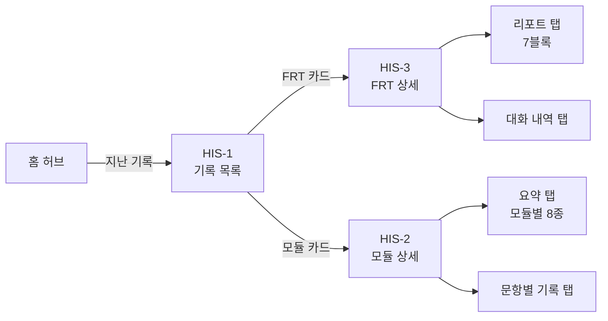
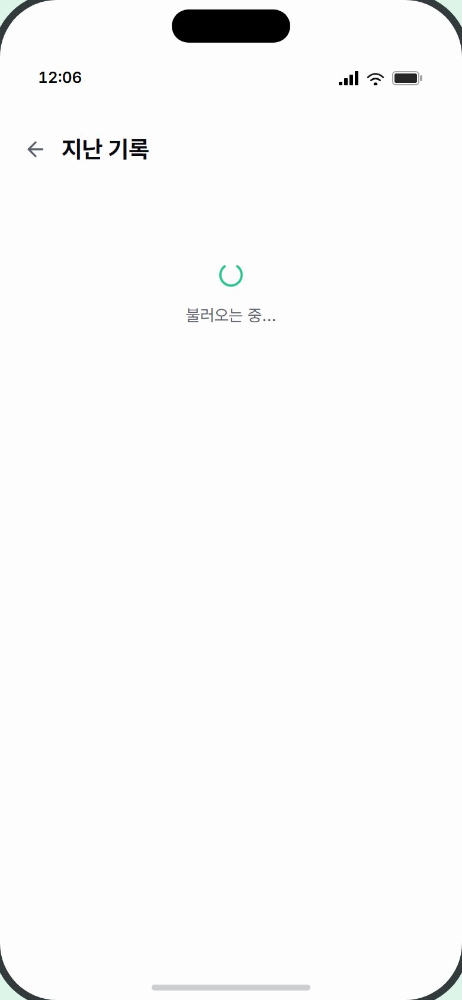

# 5. 리포트 · 지난 기록 화면 명세

> **대상** — UI/UX 디자이너. 학습이 끝난 뒤 결과를 보는 화면들을 정의한다.
> **먼저 읽을 것** — [0. 디자인 브리프](0_디자인브리프.md)
> **함께 볼 것** — [3. 모듈별 화면 명세](3_모듈별화면명세.md)(라이브 완료 화면) · [4. 화면 인벤토리 & 상태](4_화면인벤토리와상태.md)

---

## 이 문서의 범위

학습 **직후**에 보는 완료 화면은 [문서 3](3_모듈별화면명세.md)에 있습니다. 이 문서는 **나중에 다시 보는** 화면을 다룹니다.



**중요한 구조적 사실** — 세션 상세는 **FRT와 8개 모듈이 완전히 다른 화면**입니다. 탭 이름도 내용도 다릅니다.

| | FRT 세션 | 8개 모듈 세션 |
|---|---|---|
| 탭 | `리포트` / `대화 내역` | `요약` / `문항별 기록` |
| 리포트 | **AI가 생성하는 7블록 KPI 리포트** | 없음 — 모듈별 결과 재현 |
| 생성 시점 | **화면 진입 시 AI 호출** | 저장된 결과를 그대로 표시(재호출 없음) |

---

## 화면 목록

| ID | 화면 | 상태 수 |
|---|---|---|
| HIS-1 | 지난 기록 목록 | 4 |
| HIS-2 | 세션 상세 — 모듈 | 5 |
| HIS-2-A | └ 문항별 기록 탭 | 1 |
| HIS-3 | 세션 상세 — FRT | 5 |
| HIS-3-R | └ 리포트 탭 (7블록) | 3 |
| HIS-3-T | └ 대화 내역 탭 | 3 |

---
---

## HIS-1 · 지난 기록 목록

**목적** — 완료한 세션을 모듈별로 묶어 보여준다.
**진입** — 홈 허브 우상단 [지난 기록]
**이탈** — 카드 탭 → 세션 상세 / [←] → 홈

```
┌─────────────────────────────────┐
│ [←]  지난 기록                   │  ← 20px 볼드
│                                 │
│ 자유 대화        3회             │  ← 그룹 제목 + 횟수
│ ┌─────────────────────────────┐ │
│ │ 💬 [L11] 식당에서 주문하기   │ │  ← 모듈 아이콘(악센트 색)
│ │    8월 3일  💬 12턴  🕐 7분  │ │
│ │                          [>] │ │
│ └─────────────────────────────┘ │
│ ┌─────────────────────────────┐ │
│ │ …                            │ │
│ └─────────────────────────────┘ │
│                                 │
│ 쉐도잉           2회             │
│ ┌─────────────────────────────┐ │
│ │ 🎤 [L11] 쉐도잉              │ │
│ │    8월 2일  5/6 통과         │ │  ← 모듈은 요약 한 줄
│ │                          [>] │ │
│ └─────────────────────────────┘ │
└─────────────────────────────────┘
```

| 요소 | 내용 | 데이터 출처 | 제약 |
|---|---|---|---|
| 그룹 제목 | 모듈 이름 + `N회` | — | **모듈 순서 고정.** 기록이 없는 모듈은 그룹 자체가 없음 |
| 카드 아이콘 | 40px 둥근 사각형, 모듈 악센트 색 10% 배경 + 악센트 아이콘 | [모듈 악센트 표](0_디자인브리프.md) | 9종 |
| 레벨 뱃지 | `L11`, 레벨 그룹별 색 | — | L1~L18 |
| 제목 | FRT=토픽 이름 / 모듈=모듈 이름 | — | 말줄임 |
| 메타 (FRT) | 날짜 · `12턴` · `7분` | — | |
| 메타 (모듈) | 날짜 · **모듈별 요약 한 줄** | 서버 생성 | 모듈마다 형식이 다름 |

### 상태 변형 (4가지)

| 상태 | 표시 |
|---|---|
| ① 로딩 | 회전 스피너 + `불러오는 중...` (상단 64px 여백) |
| ② **비어 있음** | 흐린 시계 아이콘(40px) + `아직 완료된 기록이 없습니다` |
| ③ 오류 | 빨간 텍스트로 오류 메시지 |
| ④ 목록 표시 | 위 구성 |

**카피** — `지난 기록` · `N회` · `불러오는 중...` · `아직 완료된 기록이 없습니다`

**참조** — [HistoryListScreen.tsx](../../apps/web/src/components/HistoryListScreen.tsx) · [HistorySessionCard.tsx](../../apps/web/src/components/HistorySessionCard.tsx)


> 📷 미촬영: `HIS-1` — 백엔드(DB·AI 키) 필요

---
---

## HIS-2 · 세션 상세 — 8개 모듈

**목적** — 그때 학습한 내용과 결과를 다시 본다.
**진입** — 기록 목록에서 모듈 카드 탭 (또는 어드민 세션 목록)
**이탈** — [←]

```
┌─────────────────────────────────┐
│ [←]  세션 상세                   │  ← 18px 볼드
│ ┌─────────────────────────────┐ │
│ │ [L11]  쉐도잉      8. 2.     │ │  ← 세션 정보 바
│ └─────────────────────────────┘ │
│ ┌───────────┬───────────┐      │
│ │   요약    │ 문항별 기록 │      │  ← 세그먼트 탭
│ └───────────┴───────────┘      │  (시도 기록 있을 때만)
├─────────────────────────────────┤
│                                 │
│    [ 탭 내용 — 스크롤 ]          │
│                                 │
└─────────────────────────────────┘
```

### 상단 고정 영역

| 요소 | 내용 | 제약 |
|---|---|---|
| 세션 정보 바 | 레벨 뱃지 + 모듈 이름 + 우측 날짜 | 살짝 떠 보이는 표면 |
| 탭 | `요약` / `문항별 기록` 2칸 세그먼트 | ⚠️ **시도 기록이 있을 때만 나타납니다.** LRN·VLM은 발화가 없어 **탭이 아예 없습니다** |

### 상태 변형 (5가지)

| 상태 | 표시 |
|---|---|
| ① 로딩 | 스피너 + `결과 불러오는 중...` |
| ② 요약 탭 | 모듈별 재현(아래) |
| ③ 문항별 기록 탭 | 시도 카드 목록 |
| ④ **저장된 결과 없음** | `저장된 결과가 없어요.` |
| ⑤ **재현 불가** | `재현할 수 있는 학습 기록이 없어요.` 또는 시도 카드로 강등 표시 |

④⑤가 실제로 발생합니다 — 오래된 세션이나 중도 이탈 세션에서 데이터가 부족할 때입니다.

### 상단 안내 배너 (조건부, 최대 2개)

요약 탭 맨 위에 회색 배너가 붙을 수 있습니다.

| 조건 | 문구 |
|---|---|
| 세션 당시 문항 원문이 저장되지 않음 | `데모 콘텐츠 기준으로 문항을 표시합니다(세션 당시 원문 미저장).` |
| 완료하지 않은 세션 | `진행 중인 세션 — 답안 수행 · 문항 3/6 · 재도전` |

---

### 요약 탭 — 모듈별 재현 (8종)

**모듈마다 다른 내용이 나옵니다.** 라이브 완료 화면과 비슷하지만 **완료 멘트와 완료 버튼이 없고**, AI를 다시 부르지 않습니다.

| 모듈 | 요약 탭에 표시되는 것 |
|---|---|
| **LRN** | 표현 카드 목록(학습한 표현 전체) |
| **VLM** | 단어 목록 |
| **SHD** | 문장별 그룹 + 속도 라운드별 시도 카드 + **내 발음 듣기** |
| **SFB** | 문항별 빈칸/완성 문장 + 시도 카드 + 내 발음 듣기 |
| **SMK** | 문항별 목표 표현·내 발화 + **응용 코칭 카드** + 내 발음 듣기 |
| **RPB** | **미션 표현 사용 카드** + 전체 대화 버블 |
| **RPF** | **미션 표현 사용 + 상호작용 평가** + 전체 대화 버블 |
| **OMP** | 발표 평가 카드 묶음(공인시험 환산·5축·4영역·키워드·코칭) + 내 발음 듣기 |

> **RPB·RPF·OMP·SMK의 요약 탭은 라이브 완료 화면과 같은 부품을 씁니다.** 디자인을 새로 만들 필요 없이 [문서 3](3_모듈별화면명세.md)의 해당 완료 화면 디자인을 재사용하면 됩니다. 단 **완료 멘트·완료 버튼은 빼야 합니다.**

---

### HIS-2-A · 문항별 기록 탭 — 시도 카드

발화한 모든 시도가 카드로 쌓입니다. 재시도한 것도 전부 남습니다.

```
┌─────────────────────────────────┐
│ ┌─────────────────────────────┐ │
│ │ 시도 1  [1.2x] [재도전]  [✓]│ │  ← 배지들 + 통과 아이콘
│ │ Can I have a table for two? │ │  ← 참조 문장
│ │ Can I have a table for two  │ │  ← 단어별 색상
│ │ 정확도 ███████░ 85           │ │
│ │ 유창성 ██████░░ 72           │ │  ← 발음 4지표
│ │ 완성도 ████████ 90           │ │
│ │ 억양   ████░░░░ 48           │ │
│ │ [ ▶ 내 발음 듣기 ]           │ │  ← 녹음 재생
│ └─────────────────────────────┘ │
│ ┌─────────────────────────────┐ │
│ │ 시도 2 …                     │ │
│ └─────────────────────────────┘ │
└─────────────────────────────────┘
```

| 요소 | 내용 | 제약 |
|---|---|---|
| 시도 번호 | `시도 1` | |
| 속도 배지 | `1.2x` | **SHD만** 표시 |
| 재도전 배지 | `재도전` 주황 | 재도전 사이클 시도에만 |
| 통과 아이콘 | 20px 원형 ✓/✗ | 없을 수도 있음 |
| 참조 문장 | 목표 문장 | 그룹 헤더가 이미 보여줄 땐 숨김 |
| 단어별 발음 | 색상 나열 | 없을 수도 있음 |
| 발음 4지표 | 2열 그리드 | 없을 수도 있음 |
| **내 발음 듣기** | 테두리 알약 버튼. 재생 중 `정지`로 변경 | **녹음이 저장된 경우만** |

**상태 변형** — 재생 중 / 대기. 버튼 자체가 없는 경우도 있음.

**카피** — `시도 N` · `재도전` · `내 발음 듣기` · `정지`

**참조** — [HistoryDetailScreen.tsx](../../apps/web/src/components/HistoryDetailScreen.tsx) · [ModuleHistorySummary.tsx](../../apps/web/src/components/module/ModuleHistorySummary.tsx) · [ModuleAttemptCard.tsx](../../apps/web/src/components/module/ModuleAttemptCard.tsx)

> 📷 미촬영: `HIS-2-summary` · `HIS-2-attempts` — 백엔드(DB·AI 키) 필요

---
---

## HIS-3 · 세션 상세 — FRT (자유 대화)

**목적** — 자유 대화 세션의 KPI 리포트와 대화록을 본다.
**진입** — 기록 목록에서 FRT 카드 탭
**이탈** — [←]

상단 구조는 HIS-2와 같고, **탭 이름이 `리포트` / `대화 내역`** 입니다.

### 상태 변형 (5가지)

| 상태 | 표시 |
|---|---|
| ① **리포트 생성 중** | 64px 원형 안 ✨ 아이콘 + 우상단 작은 스피너 + `리포트 불러오는 중...` |
| ② 리포트 표시 | 7블록(아래) |
| ③ **학습량 부족** | 56px 회색 원형 + `평가 리포트가 없어요` + `학습량이 부족하여 평가 리포트가 생성되지 않았습니다. / 대화 내역 탭에서 기록은 다시 볼 수 있어요.` |
| ④ 오류 | 빨간 텍스트 |
| ⑤ 대화 내역 탭 | 말풍선 목록 |

> ⚠️ **①의 로딩이 깁니다.** 리포트는 화면에 들어올 때마다 AI가 생성합니다(수 초 소요). 그래서 로딩 상태에 전용 일러스트를 넣어 뒀습니다. **여기가 디자인 투자 가치가 높은 지점입니다.**
>
> ⚠️ **③은 자주 발생합니다.** 대화 턴이 부족하면 리포트가 아예 생성되지 않습니다.

---

### HIS-3-R · 리포트 탭 — 7블록

```
┌─────────────────────────────────┐
│ ① 히어로                         │
│ ┌─────────────────────────────┐ │
│ │      [L11 · 중급]            │ │  ← 레벨 그룹 뱃지
│ │  이 레벨의 학습 목표와 비교한  │ │
│ │  결과예요                     │ │
│ │  일상 주제 대화 유지 — 상세…  │ │
│ │                             │ │
│ │        발화량 8문장           │ │
│ │           ╱╲                │ │
│ │  화용성  ╱  ╲  발음          │ │  ← 5각 레이더 260px
│ │   72%   ╲  ╱   85%          │ │     정점마다 KPI 색 도트
│ │      문법╲╱유창성            │ │     + 절대값 라벨
│ │      6/8   95 WPM           │ │
│ │  안쪽일수록 현재 레벨 목표에… │ │
│ └─────────────────────────────┘ │
│                                 │
│ ② 레벨 변경 권장  (조건부)        │
│ ③ 총평 (AI 생성)                 │
│                                 │
│ 세부 지표                        │  ④
│ ┌─────────────────────────────┐ │
│ │ 💬 발화량         8문장   [v]│ │  ← 접힘/펼침
│ │    평균 12 words/문장…       │ │
│ ├─────────────────────────────┤ │
│ │ 🎤 발음 정확도      85%      │ │
│ │                  목표 80%   │ │
│ ├─────────────────────────────┤ │
│ │ 📊 유창성       95 WPM      │ │
│ │ 📖 화용성          72%      │ │
│ │ ✏️ 문법 정확성  6/8 문장 정확 │ │
│ └─────────────────────────────┘ │
│                                 │
│ ⑤ 잘한 점 / 개선할 점            │
│ ⑥ 교정 이력  (조건부)            │
│ ⑦ Next Steps                    │
└─────────────────────────────────┘
```

| # | 블록 | 내용 | 제약 |
|---|---|---|---|
| ① | **히어로 + 레이더** | 레벨 뱃지 + 레벨 목표 문구 + **5각 레이더 차트(260px)** | 아래 상세 |
| ② | 레벨 변경 권장 | 레벨 상/하향 권장 카드 | **권장이 없으면 블록 자체가 사라짐** |
| ③ | 총평 | AI가 쓴 종합 피드백 + 튜터 이름 | **길이 완전 가변**, 한/영 병기 |
| ④ | 세부 지표 (KPI 카드 5장) | 접었다 펼치는 카드 | 아래 상세 |
| ⑤ | 잘한 점 / 개선할 점 | AI 생성 목록 2블록 | 개수 가변 |
| ⑥ | 교정 이력 | 대화 중 문법 교정 기록 | **없으면 블록 사라짐** |
| ⑦ | Next Steps | 다음 학습 제안 | 한/영 병기 |

#### ① 레이더 차트 상세

| 요소 | 내용 |
|---|---|
| 축 | **5개 고정** — 발화량 · 발음 · 유창성 · 문법 · 화용성 |
| 반경 | 레벨 목표 대비 **달성률(0~100%)** — 이건 내부 계산용 |
| 정점 라벨 | 축 이름(10px 회색) + **절대값**(12px 볼드, KPI 고유색) |
| 격자 | 3겹 오각형 |
| 애니메이션 | 진입 시 중심에서 0.8초에 걸쳐 펼쳐짐, 라벨은 0.6초 후 순차 페이드인 |
| 하단 문구 | `안쪽일수록 현재 레벨 목표에 미달, 바깥쪽일수록 목표 달성을 뜻해요.` |

> ⚠️ **레이더의 반경은 달성률이지만 화면에 쓰는 숫자는 절대값입니다.** `8문장` `85%` `95 WPM` `6/8` `72%` 처럼 단위가 축마다 다릅니다. 이 다섯 개가 한 화면에 붙으므로 **정렬과 가독성이 까다로운 지점**입니다.

#### ④ KPI 카드 상세

```
┌─────────────────────────────────┐
│ [🎤]  발음 정확도          85%  │  ← 아이콘 36px(KPI색 10% 배경)
│                        목표 80% │     값 16px 볼드 KPI색
│       연결성 88% · 운율 79% ·   │  ← 요약 한 줄(10px, 말줄임)
│       완성도 92%            [v] │
├─────────────────────────────────┤
│   (펼침 시 상세 지표 표시)        │
└─────────────────────────────────┘
```

| 카드 | 1차 지표 | 목표 병기 | 요약 |
|---|---|---|---|
| 발화량 | `8문장` | 없음 | `평균 12 words/문장 (목표 8-15) · 340초` |
| 발음 정확도 | `85%` | `목표 80%` | `연결성 88% · 운율 79% · 완성도 92%` |
| 유창성 | `95 WPM` | `목표 130 WPM` | `분당 말한 단어수(WPM) · 정확 단어 210개 · 5.2분` |
| 화용성 | `72%` | `목표 75%` | `질문력 68% · 맥락 76%` |
| 문법 정확성 | `6/8 문장 정확` | `목표 정확도 80%` | `정확도 75% · 오류 3건` |

**KPI 카드 상태 변형 (4가지 — 모두 그려야 합니다)**

| 상태 | 표시 |
|---|---|
| ① 접힘 | 위 구성, 우측 ∨ 아이콘 |
| ② 펼침 | ∨가 180° 회전 + 구분선 아래 상세 영역 |
| ③ **측정 안 됨** | 값 자리에 회색 `측정 안 됨`, 요약이 `발음 평가가 측정되지 않았습니다`로 교체, **펼침 불가**(∨ 없음) |
| ④ **옛 리포트** | 값이 전부 `—`(em dash), 요약이 `지난 버전 리포트로 상세 수치가 없어요`, **펼침 불가** |

③은 발음 평가에 실패한 세션, ④는 예전 버전으로 만들어진 리포트에서 나타납니다. **둘 다 실제로 존재하는 데이터**이므로 반드시 디자인해 주세요.

**참조** — [ReportBody.tsx](../../apps/web/src/components/report/ReportBody.tsx) · [KpiCard.tsx](../../apps/web/src/components/report/KpiCard.tsx) · [RadarChart.tsx](../../apps/web/src/components/report/RadarChart.tsx) · [kpiMeta.ts](../../apps/web/src/components/report/kpiMeta.ts)

> 📷 미촬영: `HIS-3-report-1` · `HIS-3-report-2` · `HIS-3-kpi-expanded` — 백엔드(DB·AI 키) 필요

---

### HIS-3-T · 대화 내역 탭

**목적** — 그때 나눈 대화를 다시 읽고, **당시 녹음을 다시 듣는다.**

```
┌─────────────────────────────────┐
│ ┌─────────────────────────────┐ │
│ │ 🔊 말풍선을 탭하면 그때 녹음된│ │  ← 최초 1회만 노출
│ │    음성을 다시 들을 수 있어요 │ │     [X]로 닫으면 다시 안 뜸
│ │                          [X] │ │
│ └─────────────────────────────┘ │
│  ┌────────────────┐             │
│  │ AI 말풍선       │             │
│  └────────────────┘             │
│         ┌──────────────────┐    │
│         │ 내 발화           │    │  ← 탭하면 녹음 재생
│         │ (교정 노트 포함)  │    │
│         └──────────────────┘    │
└─────────────────────────────────┘
```

| 요소 | 내용 | 제약 |
|---|---|---|
| 재생 안내 배너 | 청록 테두리 + 스피커 아이콘 + 닫기 | **최초 1회만.** 녹음이 있는 메시지가 있을 때만 |
| 말풍선 | AI(좌) / 학습자(우) | 대화 중과 같은 컴포넌트, **애니메이션 없이** |
| 재생 가능 표시 | 녹음이 있는 말풍선 | 탭하면 재생, 재생 중 상태 표시 |
| 교정 음성 | 교정 문장도 따로 재생 가능 | 교정이 있는 경우만 |

**상태 변형** — ① 안내 배너 있음 ② 배너 없음 ③ **대화 내역 없음**(`대화 내역이 없습니다`)

**카피** — `말풍선을 탭하면 그때 녹음된 음성을 다시 들을 수 있어요.` · `대화 내역이 없습니다`

> 📷 미촬영: `HIS-3-transcript` — 백엔드(DB·AI 키) 필요

---
---

## 부록 · 리포트 디자인 시 지켜야 할 원칙

> ⚠️ **0~100 종합점수를 만들지 마세요.** 5개 KPI를 평균 내 "종합 82점" 같은 숫자를 만드는 것은 제품 원칙상 금지입니다. 레이더의 반경은 내부적으로 달성률을 쓰지만 **화면에는 절대값만** 나옵니다.
>
> ⚠️ **KPI 5색은 고정입니다.** 화이트라벨(다른 브랜드로 재배포)에서도 이 색은 바뀌지 않습니다. 브랜드 컬러를 바꾸더라도 이 5색은 유지해야 합니다.
>
> | KPI | 색상 | 아이콘 |
> |---|---|---|
> | 발화량 | `#0f6e56` | 말풍선 |
> | 발음 | `#185fa5` | 마이크 |
> | 유창성 | `#534ab7` | 계기판 |
> | 화용성 | `#d4537e` | 책 |
> | 문법 | `#ba7517` | 펜 |
>
> ⚠️ **"없으면 사라지는" 블록이 많습니다.** 레벨 변경 권장·교정 이력은 조건부이고, KPI 카드는 값이 `—`나 `측정 안 됨`일 수 있습니다. **모든 블록이 다 있는 상태만 디자인하면 실제 화면에서 구멍이 생깁니다.**
