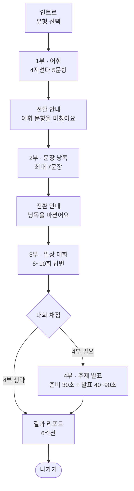
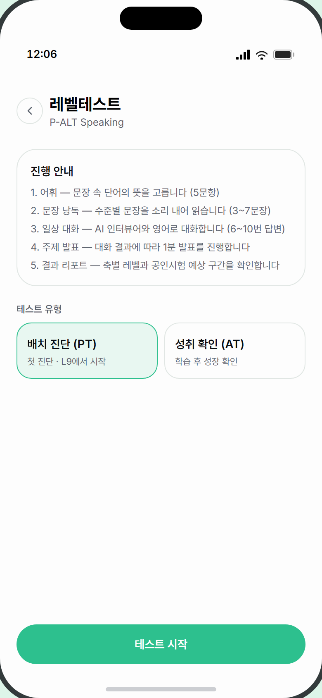
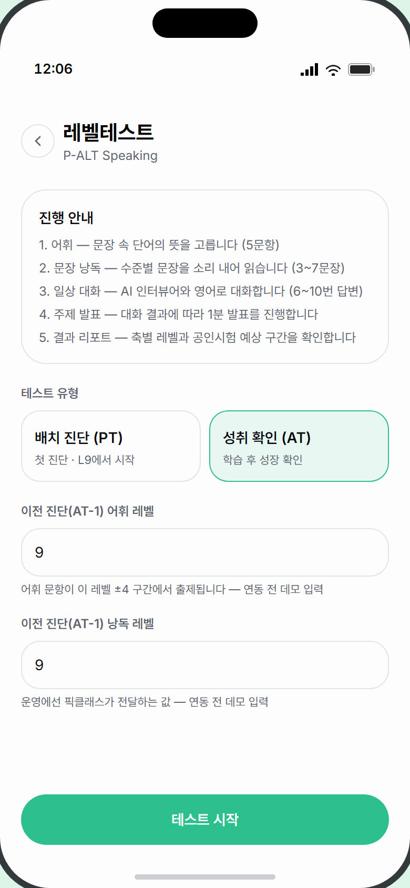
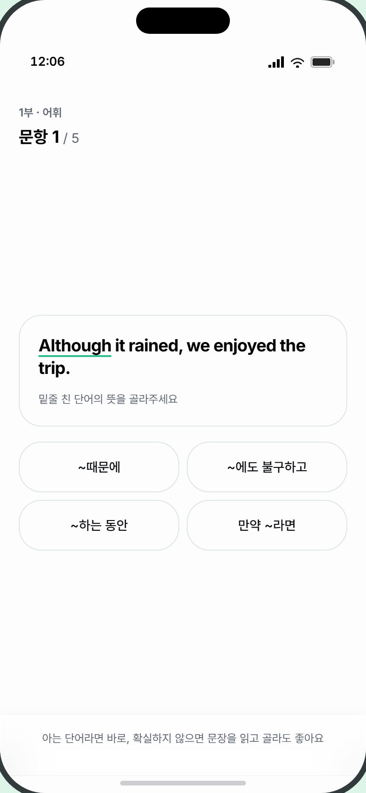
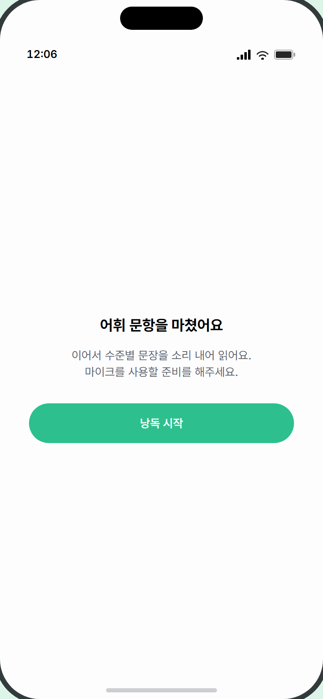

# 6. 레벨테스트(P-ALT) 화면 명세

> **대상** — UI/UX 디자이너. 레벨 진단 테스트 P-ALT의 전 화면을 정의한다.
> **먼저 읽을 것** — [0. 디자인 브리프](0_디자인브리프.md)
> **함께 볼 것** — [4. 화면 인벤토리 & 상태](4_화면인벤토리와상태.md)

---

## ⚠️ 이 흐름은 학습 모듈과 별개입니다

P-ALT는 [모듈 공통 화면 패턴](2_모듈공통화면패턴.md)을 **따르지 않습니다.**

| 항목 | 8개 학습 모듈 | P-ALT |
|---|---|---|
| 상단 헤더 | 레벨 뱃지 · 캐릭터 · 시간 · 나가기 | **없음** — 대신 각 화면 좌상단에 `1부 · 어휘` 같은 작은 라벨 |
| 진도 바 | 있음(`N/M 문항`) | **없음** — 파트마다 자체 표기 방식 |
| 나가기 | 헤더 아이콘, 언제든 가능 | **인트로 화면에만 있음.** 시작하면 나갈 방법이 없음 |
| 6단계 구조 | 따름 | 따르지 않음(P1→P2→P3→P4→리포트) |
| 캐릭터 | 피클 / NPC | **없음** — P3만 "인터뷰어"라는 익명 화자 |

**디자인 판단이 필요한 지점입니다.** 현재는 파트별로 레이아웃이 제각각이라 "하나의 테스트를 치르고 있다"는 감각이 약합니다. 공통 헤더·전체 진행 표시를 새로 설계할지 검토해 주세요.

또 하나 — **시작하면 중단할 수 없습니다.** 나가기 버튼이 없고 이탈 확인도 없습니다. 실수로 브라우저를 닫으면 처음부터 다시 해야 합니다. 이 부분도 설계 검토 대상입니다.

---

## 전체 흐름



**4부는 건너뛸 수 있습니다.** 3부 대화 채점 결과에 따라 자동으로 결정되며, 학습자는 선택할 수 없습니다. 리포트에는 "이번 테스트에선 발표 파트를 진행하지 않았어요"라고 표시됩니다.

**소요 시간 추정** — 어휘 5문항(1~2분) + 낭독 3~7문장(2~4분) + 대화 6~10턴(4~7분) + 발표(2분) ≈ **10~15분**

---

## 화면 목록

| ID | 화면 | 상태 수 |
|---|---|---|
| ALT-0 | 인트로 (유형 선택) | 2 |
| ALT-P1 | 1부 어휘 — 4지선다 | 1 |
| ALT-D1 | 전환 안내 (어휘 → 낭독) | 1 |
| ALT-P2 | 2부 문장 낭독 | **5** |
| ALT-D2 | 전환 안내 (낭독 → 대화) | 1 |
| ALT-P3 | 3부 일상 대화 | 5 × 2모드 |
| ALT-P3-S | 3부 채점 중 / 실패 | 2 |
| ALT-P4-P | 4부 발표 준비 | 1 |
| ALT-P4-R | 4부 발표 녹음 | 3 |
| ALT-P4-S | 4부 무발화 / 채점 실패 | 2 |
| ALT-R | 결과 리포트 (6섹션) | 2 |

---
---

## ALT-0 · 인트로 (유형 선택)

**목적** — 테스트 구성을 안내하고 유형(PT/AT)을 고른다.
**진입** — 홈 허브 → [레벨테스트] 카드
**이탈** — [테스트 시작] → 1부 / 좌상단 [←] → 홈

```
┌─────────────────────────────────┐
│ [←]  레벨테스트                  │
│      P-ALT Speaking             │
│                                 │
│ ┌─────────────────────────────┐ │
│ │ 진행 안내                    │ │
│ │ 1. 어휘 — 문장 속 단어의…    │ │
│ │ 2. 문장 낭독 — 수준별…       │ │
│ │ 3. 일상 대화 — AI 인터뷰어…  │ │
│ │ 4. 주제 발표 — 대화 결과에…  │ │
│ │ 5. 결과 리포트 — 축별 레벨…  │ │
│ └─────────────────────────────┘ │
│                                 │
│ 테스트 유형                      │
│ ┌───────────┐ ┌───────────┐    │
│ │배치 진단(PT)│ │성취 확인(AT)│   │  ← 2열, 선택=청록 테두리
│ │첫 진단·L9  │ │학습 후 성장 │    │
│ └───────────┘ └───────────┘    │
│                                 │
│ (AT 선택 시 레벨 입력 2개 추가)   │
│                                 │
│      [ 테스트 시작 ]             │
└─────────────────────────────────┘
```

| 요소 | 내용 | 제약 |
|---|---|---|
| 뒤로 버튼 | 32px 원형 테두리 | **여기서만 나갈 수 있음** |
| 진행 안내 | 5줄 번호 목록 | 고정 문구 |
| 유형 선택 | 2열 카드, 선택 시 청록 테두리 + 연청록 배경 | 2개 고정 |
| AT 추가 입력 | **숫자 입력 필드 2개**(어휘 레벨 / 낭독 레벨) | ⚠️ **데모 전용.** 운영에서는 픽클래스가 값을 전달하므로 이 영역이 사라집니다 |

> ⚠️ **AT 입력 필드는 디자인 범위에서 빼도 됩니다.** 픽클래스 연동 후에는 노출되지 않습니다. 다만 연동 계약이 아직 확정되지 않아 현재 코드에 남아 있습니다.

**카피** — `레벨테스트` · `P-ALT Speaking` · `진행 안내` · `테스트 유형` · `배치 진단 (PT)` / `첫 진단 · L9에서 시작` · `성취 확인 (AT)` / `학습 후 성장 확인` · `테스트 시작`

**참조** — [AltIntro.tsx](../../apps/web/src/components/alt/AltIntro.tsx)

| PT 선택 (기본) | AT 선택 — 레벨 입력 2개 노출 |
|---|---|
|  |  |

---

## ALT-P1 · 1부 어휘 (4지선다 5문항)

**목적** — 문장 속 밑줄 단어의 한국어 뜻을 고른다. 발화 없음.
**진입** — 인트로 [테스트 시작]
**이탈** — 5문항 완료 → 전환 안내

```
┌─────────────────────────────────┐
│ 1부 · 어휘                       │  ← 작은 회색 라벨
│ 문항 2 / 5                       │  ← 18px 볼드 + 회색 분모
│                                 │
│ ┌─────────────────────────────┐ │
│ │ She spoke politely to the   │ │  ← 18px 볼드
│ │ ‾‾‾‾‾‾‾‾ (밑줄 = 청록 2px)  │ │
│ │ 밑줄 친 단어의 뜻을 골라주세요 │ │
│ └─────────────────────────────┘ │
│                                 │
│ ┌───────────┐ ┌───────────┐    │
│ │ 공손하게   │ │ 빠르게     │    │  ← 2×2 격자
│ ├───────────┤ ├───────────┤    │
│ │ 조용히     │ │ 갑자기     │    │
│ └───────────┘ └───────────┘    │
├─────────────────────────────────┤
│ 아는 단어라면 바로, 확실하지 않으면│  ← 하단 고정 안내
│ 문장을 읽고 골라도 좋아요          │
└─────────────────────────────────┘
```

| 요소 | 내용 | 데이터 출처 | 제약 |
|---|---|---|---|
| 파트 라벨 | `1부 · 어휘` | 고정 | |
| 문항 번호 | `문항 2 / 5` | — | 항상 5문항 |
| 문장 | 18px 볼드, 대상 단어에 **청록 밑줄(2px, 4px 오프셋)** | 문항 은행 | 5~12단어, 2줄까지 |
| 안내 문구 | `밑줄 친 단어의 뜻을 골라주세요` | 고정 | |
| 선택지 | **2×2 격자**, 카드형. 탭 시 살짝 축소 + 연청록 플래시 | 문항 은행 | 4개 고정, 각 2~10자 |
| 하단 안내 | 반투명 고정 바 | 고정 | 버튼 없음 |

**상태 변형** — 단일 상태. **정답/오답을 보여주지 않습니다** — 탭 즉시 다음 문항으로 넘어갑니다.

> **응답 시간을 잽니다.** 3초 안에 맞히면 "확실히 안다", 그보다 오래 걸리면 "아마 안다"로 다르게 판정합니다. 다만 **학습자에게는 타이머를 보여주지 않습니다.** 시간 압박을 주지 않으려는 의도이므로, 디자인에도 타이머를 추가하지 마세요.

**카피** — `1부 · 어휘` · `문항 N / 5` · `밑줄 친 단어의 뜻을 골라주세요` · `아는 단어라면 바로, 확실하지 않으면 문장을 읽고 골라도 좋아요`

**참조** — [AltP1Stage.tsx](../../apps/web/src/components/alt/p1/AltP1Stage.tsx)



---

## ALT-D1 / ALT-D2 · 전환 안내

**목적** — 다음 파트로 넘어가기 전 마음의 준비를 시킨다(특히 마이크 사용 안내).

```
┌─────────────────────────────────┐
│                                 │
│                                 │
│      어휘 문항을 마쳤어요         │  ← 18px 볼드, 중앙
│                                 │
│   이어서 수준별 문장을 소리 내어   │
│   읽어요.                        │
│   마이크를 사용할 준비를 해주세요. │
│                                 │
│      [ 낭독 시작 ]               │  ← 최대 320px
│                                 │
│                                 │
└─────────────────────────────────┘
```

| 화면 | 제목 | 본문 | 버튼 |
|---|---|---|---|
| ALT-D1 | `어휘 문항을 마쳤어요` | `이어서 수준별 문장을 소리 내어 읽어요.` / `마이크를 사용할 준비를 해주세요.` | `낭독 시작` |
| ALT-D2 | `낭독을 마쳤어요` | `이어서 AI 인터뷰어와 짧은 영어 대화를 나눠요.` / `편하게, 문장으로 답해보세요.` | `대화 시작` |

**상태 변형** — 단일 상태

> **3부 → 4부 사이에는 전환 안내가 없습니다.** 대화가 끝나면 채점 화면을 거쳐 곧바로 발표 준비 카운트다운(30초)이 시작됩니다. **가장 부담이 큰 파트 직전에 마음의 준비 시간이 없다**는 뜻이라, 전환 화면 추가를 검토할 만합니다.

**참조** — [AltScreen.tsx](../../apps/web/src/components/alt/AltScreen.tsx)



---

## ALT-P2 · 2부 문장 낭독 (5개 상태)

**목적** — 화면의 문장을 소리 내어 읽는다. **원어민 음성을 들려주지 않습니다**(SHD와 다른 점 — 순수 낭독 측정).
**진입** — 전환 안내 [낭독 시작]
**이탈** — 종료 조건 충족 시 [낭독 마치기] → 전환 안내

> 문항 수가 **3~7문장으로 가변**입니다. 실력에 따라 일찍 끝날 수 있어 진행률을 정확히 보여줄 수 없습니다. 그래서 `문장 2 / 최대 7`로 표기합니다.

이 파트는 **모듈 공통 하단 액션 바를 그대로 씁니다**(P-ALT에서 유일).

| 상태 | 본문 | 하단 힌트 | 하단 버튼 |
|---|---|---|---|
| ① ready | 문장 카드 + `자연스러운 속도로 또박또박 읽어주세요` | `준비되면 버튼을 누르고 읽어주세요` | 녹음 버튼 |
| ② recording | 문장 카드 | `다 읽었으면 멈추기를 누르세요` | 녹음 버튼(빨강·정지·음성 링) |
| ③ scoring | 문장 카드 | `낭독을 채점하고 있어요…` | 스피너 |
| ④ result | **문장 카드 사라짐** → 결과 뷰 | — | [다음 문장] 또는 [낭독 마치기] |
| ⑤ **silent** | 문장 카드 + 회색 안내 박스 | — | [다시 준비] + [바로 다시 읽기] |

### ④ result 본문

```
│ ┌─────────────┐ ┌─────────────┐│
│ │     142     │ │    94%      ││  ← 24px 볼드, 2열
│ │ 분당 단어 수 │ │ 단어 일치율  ││
│ │ (목표 130)  │ │             ││
│ └─────────────┘ └─────────────┘│
│ ┌─────────────────────────────┐│
│ │ 단어별 인식                  ││
│ │ She spoke politely to the…  ││  ← 단어별 색상
│ └─────────────────────────────┘│
```

| 요소 | 내용 | 제약 |
|---|---|---|
| 분당 단어 수 | `142` + `분당 단어 수 (목표 130)` | 정수. 목표값은 레벨에 따라 달라짐 |
| 단어 일치율 | `94%` | 0~100 정수 |
| 단어별 인식 | [공통 패턴 §5-B](2_모듈공통화면패턴.md)와 같은 색상 규칙 | 5~15단어 |

> **판정 등급과 레벨 이동은 보여주지 않습니다.** 측정값(WPM·일치율)만 노출하는 것이 원칙입니다. "레벨이 올랐다/내렸다"를 절대 표시하지 마세요.

### ⑤ silent — 무발화

```
│ ┌─────────────────────────────┐│
│ │      잘 들리지 않았어요       ││
│ │ 마이크에 조금 더 가까이서     ││
│ │ 다시 읽어주세요               ││
│ └─────────────────────────────┘│
├─────────────────────────────────┤
│ 2/7 [↺ 다시 준비] [🎤 바로 다시 읽기]│
```

무발화는 **시도 횟수로 세지 않습니다.** 문장 번호가 그대로 유지됩니다.

**카피** — `2부 · 문장 낭독` · `문장 N / 최대 7` · `자연스러운 속도로 또박또박 읽어주세요` · `준비되면 버튼을 누르고 읽어주세요` · `다 읽었으면 멈추기를 누르세요` · `낭독을 채점하고 있어요…` · `분당 단어 수 (목표 130)` · `단어 일치율` · `단어별 인식` · `잘 들리지 않았어요` / `마이크에 조금 더 가까이서 다시 읽어주세요` · `다시 준비` · `바로 다시 읽기` · `다음 문장` · `낭독 마치기`

**참조** — [AltP2Stage.tsx](../../apps/web/src/components/alt/p2/AltP2Stage.tsx)

> 📷 미촬영: `ALT-P2-ready` · `ALT-P2-result` · `ALT-P2-silent` — 백엔드(DB·AI 키) 필요

---

## ALT-P3 · 3부 일상 대화 (5개 상태 × 2모드)

**목적** — AI 인터뷰어와 영어로 대화한다. **IELTS Speaking Part 1과 같은 포맷.**
**진입** — 전환 안내 [대화 시작] → **인터뷰어가 먼저 질문합니다**
**이탈** — 6~10회 답변 후 자동 종료 → 채점

화면 구조는 [RPF 실시간 대화](3_모듈별화면명세.md)와 **거의 같습니다**(음성/채팅 토글 + 파형 + 80px 마이크). 차이점만 정리합니다.

| 항목 | RPF | ALT-P3 |
|---|---|---|
| 상단 라벨 | 모듈 헤더 | `3부 · 일상 대화` 작은 라벨 |
| 진행 표시 | 없음 | `답변 3 / 최대 10` |
| 미션 표현 줄 | 있음 | **없음** |
| 화자 호칭 | 페르소나 이름 (`Alex가 말하고 있어요…`) | **`인터뷰어가 말하고 있어요…`** |
| 마이크 안내 | `역할 안에서 말하세요` | **`문장으로 답해보세요`** |

```
┌─────────────────────────────────┐
│ 3부 · 일상 대화                  │
│ [🌊 음성][💬 채팅]               │
├─────────────────────────────────┤
│                                 │
│         ∿∿∿∿∿∿∿∿∿              │  ← 음성 모드: 파형
│                                 │     채팅 모드: 말풍선 목록
├─────────────────────────────────┤
│      답변 3 / 최대 10            │
│         ╭─────╮                 │
│         │ 🎤  │  80px           │
│         ╰─────╯                 │
│  마이크를 누르고 문장으로 답해보세요│
└─────────────────────────────────┘
```

**상태** — ① `인터뷰어가 말하고 있어요…`(스피너) ② 내 차례(마이크) ③ 말하는 중(빨강 + 실시간 자막 2줄) ④ `발화를 정리하고 있어요…`(스피너) ⑤ `대화를 마무리할게요.`

### 채점 화면 (ALT-P3-S)

| 상태 | 표시 |
|---|---|
| 채점 중 | 스피너 + `대화를 채점하고 있어요…` + `문법·표현·화용·어휘를 함께 살펴봅니다` |
| **채점 실패** | `채점에 실패했어요` + `네트워크 상태를 확인하고 다시 시도해주세요` + [↺ 다시 채점하기] |

채점 실패 화면은 **반드시 디자인해야 합니다.** AI 호출이므로 실패가 실제로 발생하며, 여기서 막히면 테스트 전체가 무의미해집니다.

**참조** — [AltP3Stage.tsx](../../apps/web/src/components/alt/p3/AltP3Stage.tsx) · [AltP3Conversation.tsx](../../apps/web/src/components/alt/p3/AltP3Conversation.tsx)

> 📷 미촬영: `ALT-P3-voice` · `ALT-P3-scoring` · `ALT-P3-error` — 백엔드(DB·AI 키) 필요

---

## ALT-P4-P · 4부 발표 준비 (30초)

**목적** — 주제와 키워드를 보며 30초 동안 머릿속으로 정리한다.
**진입** — 3부 채점 결과가 4부 실행으로 판정된 경우 **자동 진입**
**이탈** — 30초 후 **자동** → 발표 녹음

```
┌─────────────────────────────────┐
│ 4부 · 주제 발표                  │
│ 발표를 준비하세요                 │  ← 18px 볼드
│ ┌─────────────────────────────┐ │
│ │ Describe a place you enjoy  │ │  ← 16px 볼드
│ │ visiting.                   │ │
│ │ (place)(why)(feeling)       │ │  ← 연청록 알약 3개
│ └─────────────────────────────┘ │
│                                 │
│            30                   │  ← 48px 볼드 청록
│         ▬▬▬▬▬▬▬▬                │  ← 176px 진행 바
│  머릿속으로 발표 내용을 정리해보세요│
│  — 시간이 끝나면 바로 발표가        │
│    시작됩니다                     │
└─────────────────────────────────┘
```

| 요소 | 데이터 출처 | 제약 |
|---|---|---|
| 주제 질문 | 주제 은행 | 영문 5~12단어 |
| 키워드 | 주제 은행 | **3개 고정**, 연청록 배경 알약 |
| 카운트다운 | 30초 고정 | 48px, 진행 바 함께 |

> **메모 입력도 건너뛰기도 없습니다.** 버튼이 하나도 없는 화면입니다. 30초를 그냥 기다려야 합니다.

**카피** — `4부 · 주제 발표` · `발표를 준비하세요` · `머릿속으로 발표 내용을 정리해보세요 — 시간이 끝나면 바로 발표가 시작됩니다`

**참조** — [AltP4PrepCard.tsx](../../apps/web/src/components/alt/p4/AltP4PrepCard.tsx)

> 📷 미촬영: `ALT-P4-prep` — 백엔드(DB·AI 키) 필요

---

## ALT-P4-R · 4부 발표 녹음 (40~90초, 3개 상태)

**목적** — 주제에 대해 40~90초 발표한다.
**진입** — 준비 30초 종료 → **자동 녹음 시작**
**이탈** — 90초 자동 종료 또는 [발표 마치기](40초 이후에만 가능)

화면 구성은 [OMP 발표 화면](3_모듈별화면명세.md)과 **거의 같습니다.** 차이점만 정리합니다.

| 항목 | OMP | ALT-P4 |
|---|---|---|
| 발표 시간 | 60초 고정 | **40~90초 가변** |
| [발표 마치기] | 녹음 시작 즉시 활성 | **40초 전까지 비활성** + 남은 시간 안내 |
| 상단 | 모듈 헤더 + 진도바 | `4부 · 주제 발표` 라벨만 |
| 주제 표시 | TOPIC 카드(영문+한글) | **질문 문장 한 줄**(한글 없음) |
| 키워드 개수 | 5~8개 | **3개** |
| 자막 빈 상태 | `토픽에 대해 자유롭게 말해보세요` | `주제에 대해 자유롭게 발표해보세요` |

```
│ 4부 · 주제 발표                  │
│ ┌─────────────────────────────┐ │
│ │   ● 발표 중                  │ │
│ │        67                   │ │  ← 남은 초(90→0)
│ │      ████████░░░            │ │
│ └─────────────────────────────┘ │
│ Describe a place you enjoy…     │
│ (✓place)(why)(feeling)          │  ← 말하면 초록 + ✓
│ ┌─────────────────────────────┐ │
│ │ (실시간 자막)                │ │
│ └─────────────────────────────┘ │
├─────────────────────────────────┤
│ 최소 40초 이상 발표해주세요        │  ← 40초 전까지
│ (17초 남음)                      │
│      [ 발표 마치기 ]  (비활성)    │
└─────────────────────────────────┘
```

**상태** — ① preparing(`마이크를 준비하고 있어요…`) ② recording ③ scoring(전체 화면 스피너 + `발표를 정리하고 있어요…`)

### 발표 후 예외 화면 (ALT-P4-S)

| 상태 | 표시 |
|---|---|
| **무발화** | `발화가 인식되지 않았어요` + `마이크를 확인하고 발표를 다시 진행해주세요` + [↺ 다시 발표하기] |
| **채점 실패** | `채점에 실패했어요` + `네트워크 상태를 확인하고 다시 시도해주세요` + [↺ 다시 채점하기] |

**카피** — `최소 40초 이상 발표해주세요 (17초 남음)` · `주제에 대해 자유롭게 발표해보세요` · `발표 마치기` · `발표를 정리하고 있어요…`

**참조** — [AltP4RecordCard.tsx](../../apps/web/src/components/alt/p4/AltP4RecordCard.tsx) · [AltP4Stage.tsx](../../apps/web/src/components/alt/p4/AltP4Stage.tsx)

> 📷 미촬영: `ALT-P4-record` · `ALT-P4-silent` — 백엔드(DB·AI 키) 필요

---
---

## ALT-R · 결과 리포트 (6섹션)

**목적** — 최종 레벨·축별 결과·학습 처방을 확인한다.
**진입** — 4부 채점 완료(또는 4부 생략 시 3부 채점 완료)
**이탈** — [마치기] → 홈

**앱 전체에서 가장 긴 화면입니다.** 헤더 + 6섹션 + 버튼으로, 세로 스크롤이 깁니다.

```
┌─────────────────────────────────┐
│ 레벨테스트 결과                   │
│ ┌─────────────────────────────┐ │
│ │ L11  [CEFR B1]              │ │  ← 헤더: 36px 볼드
│ │ 일상적 주제에 대해 스스로…    │ │
│ │ ───────────────────────────  │ │
│ │ OPIc 예상 IM2  IELTS 예상 5.0│ │  ← 2열 4항목
│ │ TOEIC-S 130   TOEFL-S 18-19 │ │
│ └─────────────────────────────┘ │
│                                 │
│ 레벨 수렴 경로                    │  ① 섹션 라벨 (카드 밖)
│ ┌─────────────────────────────┐ │
│ │ 1부 · 어휘                   │ │
│ │  ▁ ▃ ▅ ▄ ▅                  │ │  ← 막대 스파크라인
│ │ L9 L10 L12 L11 L11          │ │
│ │ 2부 · 낭독                   │ │
│ │  ▃ ▅ ▄                      │ │
│ └─────────────────────────────┘ │
│                                 │
│ 파트별 결과                       │  ②
│ ┌─────────────────────────────┐ │
│ │ 1부 · 어휘                   │ │
│ │ [L11 수렴 레벨]              │ │  ← 칩 격자
│ │ 추정 어휘량 약 4,200 /       │ │
│ │ 12,000단어 (픽클래스 코퍼스…) │ │
│ │ 2부 · 문장 낭독              │ │
│ │ [L11][L10][L12]             │ │  ← 3열
│ │ 3부 · 일상 대화 [IELTS P1…]  │ │
│ │ [L11][L10][L12][L11]        │ │  ← 4열
│ │ 4부 · 주제 발표 [IELTS P2…]  │ │
│ │ [L12][L11][L11][L12]        │ │
│ └─────────────────────────────┘ │
│                                 │
│ 축별 레벨                        │  ③
│ ┌─────────────────────────────┐ │
│ │ 어휘                   [L11] │ │
│ │  어휘 문항 적응 출제로 수렴…  │ │
│ │ 유창성                 [L10] │ │
│ │ …6개 축                      │ │
│ └─────────────────────────────┘ │
│                                 │
│ 발화 스크립트 분석                │  ④
│ ┌─────────────────────────────┐ │
│ │ ┌─────────────────────────┐ │ │
│ │ │ I go there yesterday    │ │ │  ← 취소선
│ │ │ I went there yesterday  │ │ │  ← 교정문
│ │ │ [시제]                   │ │ │  ← 유형 태그
│ │ └─────────────────────────┘ │ │
│ └─────────────────────────────┘ │
│                                 │
│ 학습 처방                        │  ⑤
│ ┌─────────────────────────────┐ │
│ │ ✓ 유창성 — 발화 자동화 훈련   │ │
│ │   추천: 쉐도잉(SHD) · 문장…  │ │
│ │ ✓ 문법 — 문법 체계 재정립     │ │
│ └─────────────────────────────┘ │
│                                 │
│ 공인시험 예상 구간                │  ⑥
│ ┌─────────────────────────────┐ │
│ │ 레벨 │CEFR│ OPIc │ IELTS   │ │  ← 표 (현재 행 강조)
│ │ L1-3 │ A1 │ NL   │ 3.0     │ │
│ │ L10-12│B1 │ IM2  │ 5.0     │ │  ← 연청록 배경 + 볼드
│ └─────────────────────────────┘ │
│ 환산 기준은 CEFR 연구·공인시험…   │
│                                 │
│      [ 마치기 ]                  │
└─────────────────────────────────┘
```

### 섹션별 요소

| # | 섹션 | 내용 | 제약 |
|---|---|---|---|
| — | **헤더** | `L11` 36px + `CEFR B1` 알약 + 설명 + 공인시험 4종 2열 | 레벨 L1~L18 |
| ① | 레벨 수렴 경로 | 막대 스파크라인 2줄(어휘·낭독). 막대 높이 = `8 + 레벨×3`px | **막대 개수 가변**: 어휘 5개, 낭독 3~7개 |
| ② | 파트별 결과 | 파트마다 레벨 칩 격자. 1부 1열 / 2부 3열 / 3·4부 4열 | 4부 생략 시 안내 문구로 대체 |
| ③ | 축별 레벨 | 6축(어휘·유창성·발음·문법·표현·화용) + 근거 설명 + 레벨 알약 | 어휘 미측정 시 `미측정` 표시 |
| ④ | 발화 스크립트 분석 | 오류마다 원문(취소선) → 교정문 → 유형 태그 | **개수 완전 가변. 0개면 섹션 전체가 사라짐** |
| ⑤ | 학습 처방 | 가장 낮은 2축에 대한 처방 + 추천 모듈 | **항상 2개**(축이 1개뿐이면 1개) |
| ⑥ | 공인시험 예상 구간 | 전체 밴드 표, 현재 밴드 행 강조 | 행 수 고정 |

### 상태 변형

| 상태 | 조건 | 표시 |
|---|---|---|
| ① 전체 결과 | 정상 | 위 구성 그대로 |
| ② **어휘 미측정** | P1 결과 없음 | 헤더가 `발화 부분 결과`로 바뀌고 **레벨·CEFR·공인시험이 전부 사라짐**. 섹션 ①②의 어휘 부분도 사라짐 |
| — | 4부 생략 | 헤더 하단에 안내 문구 추가, 섹션 ②의 4부가 문구로 대체 |
| — | 오류 없음 | 섹션 ④ 전체 사라짐 |

②는 화면이 크게 달라지므로 별도로 디자인해야 합니다.

### 디자인 시 지켜야 할 원칙

> ⚠️ **0~100 종합점수를 만들지 마세요.** 레벨(L1~L18)과 측정값(WPM·%·단어 수)만 노출하는 것이 제품 원칙입니다. "종합 82점" 같은 표현을 넣으면 안 됩니다.
>
> ⚠️ **AT(성취 확인)에서 하락을 부정적으로 표현하지 마세요.** 레벨이 내려갔을 때 빨간색·하향 화살표·"떨어졌어요" 같은 표현을 쓰지 않습니다.
>
> ⚠️ **비교군 지표를 넣지 마세요.** "동일 레벨 평균 대비 상위 20%" 같은 항목은 실제 데이터가 없어 **의도적으로 제외**했습니다. 자리표시자로도 넣지 마세요.
>
> ⚠️ **어휘량은 반드시 모집단과 함께 표기합니다.** `약 4,200 / 12,000단어 (픽클래스 코퍼스 근사 기준)` — `4,200단어` 단독 표기는 금지입니다.

**카피** — `레벨테스트 결과` · `레벨 수렴 경로` · `파트별 결과` · `축별 레벨` · `발화 스크립트 분석` · `학습 처방` · `공인시험 예상 구간` · `추정 어휘량 약 N / N단어 (픽클래스 코퍼스 근사 기준)` · `IELTS Speaking Part 1 동일 포맷` · `이번 테스트에선 발표 파트를 진행하지 않았어요 — 대화 결과가 해당 축에 반영됐습니다` · `환산 기준은 CEFR 연구·공인시험 공식 기술서 기반 예상 구간입니다` · `마치기`

**참조** — [AltReportScreen.tsx](../../apps/web/src/components/alt/report/AltReportScreen.tsx)

> 📷 미촬영: `ALT-R-1` · `ALT-R-2` · `ALT-R-3` — 백엔드(DB·AI 키) 필요

---

## 부록 · P-ALT 고정 수치

| 항목 | 값 |
|---|---|
| 레벨 범위 | L1 ~ L18 |
| PT 시작 레벨 | L9 (어휘·낭독 모두) |
| 1부 어휘 문항 수 | **5문항 고정** |
| 1부 판정 시간 경계 | 3초 (비노출) |
| 2부 낭독 문장 수 | **최대 7문장**(3~7 가변) |
| 3부 대화 답변 수 | **6~10회** |
| 4부 준비 시간 | 30초 |
| 4부 발표 시간 | **최소 40초 · 최대 90초** |
| 리포트 축 수 | 6축(어휘·유창성·발음·문법·표현·화용) |
| 공인시험 환산 | OPIc · IELTS · TOEIC-S · TOEFL-S |
