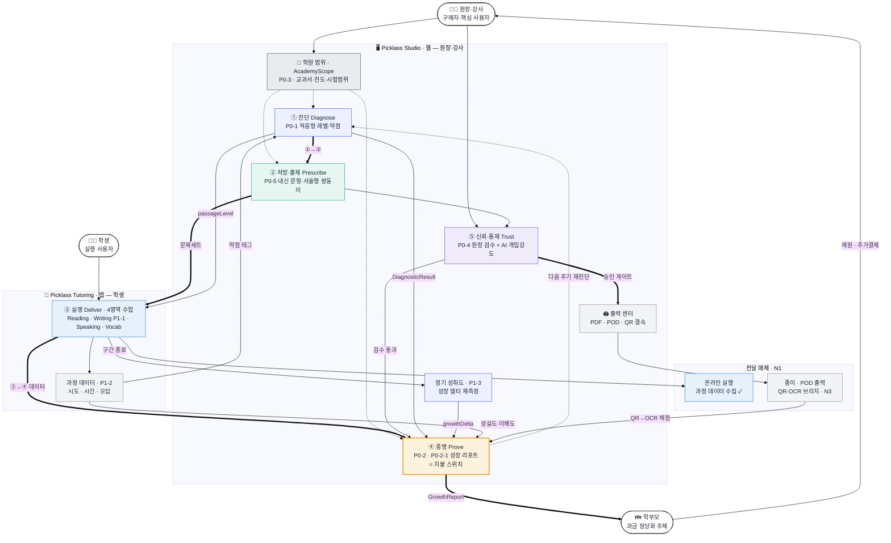

# 03. Picklass 서비스 구조도

| 항목 | 내용 |
|---|---|
| 문서 성격 | 기획 폴더 전체를 종합한 **서비스 구조 한 장 요약**(다이어그램 + 범례) |
| 기준 | 통합기획서 v1.0 · P0-1~5 · P1-1~3 · 전략노트 N1~N3 |
| 연계 | [01 통합기획서](01_통합기획서_v1.0.md)(마스터), [02 솔루션개요](02_솔루션개요_BeforeAfter.md) |
| 라이브 목업 | claude.ai 아티팩트로 발행됨(색상 강조판) |

> **한 줄 논지**: 원장의 **자료제작·출제·채점 노동을 없애고**, 그 과정에 쌓인 데이터로 학부모에게 성장을 증명한다. 제품의 주인공은 "AI가 가르친다"가 아니라 **진단→처방→실행→증명의 폐쇄 루프** — 지불 스위치는 **"성취도가 정확하게 보이는가"** 하나.

---

## 1. 서비스 구조 (다이어그램)

### 1-1. 한눈에 보기 (텍스트 도식)

> 어떤 마크다운 뷰어에서도 그대로 보이는 도식. (색상 렌더는 §1-2 mermaid 또는 아티팩트)

```text
 👨‍🏫 원장·강사
   │
   │  학원 범위 등록 · AcademyScope (P0-3)  →  진단·출제·리포트 공통 스코프
   ▼
 ━━━━━━  🔄 진단 → 처방 → 실행 → 증명  ·  끊기지 않는 폐쇄 루프  ━━━━━━
   │
 ① 진단          · P0-1 적응형 진단 · P1-3 정기 성취도
   │               └ DiagnosticResult → 리포트 초기값  ·  passageLevel → 수업 난이도
   ▼
 ② 처방·출제      · P0-5 내신 자동출제 · 서술형 쌍둥이
   │               └ 생성물 → ⑤검수(P0-4, 승인 게이트) → 🖨️ 출력(PDF·POD·QR)
   ▼
 ③ 실행          · Tutoring 앱 4영역 (Reading · Writing[P1-1] · Speaking · Vocab)
   │               └ 과정 데이터(시도·시간·오답, P1-2)
   ▼
 ④ 증명  ★       · P0-2·P0-2-1 성장 리포트 = 지불 스위치
   │               └ 과정데이터 → 성실도·이해도 반영  ·  약점태그 → ①진단 환류
   ▼
 👪 학부모   →   재원 · 추가결제   →   👨‍🏫 원장     ↺ 루프 반복
                                          (④증명 → ①진단 재측정 · P1-3)

 ┄┄ 전달 매체 (N1) ┄┄
   • 온라인 실행     : 과정 데이터 수집 ✓ (종이로는 불가)
   • 종이·POD 출력   : 내신·시험의 표준 포맷
   • QR·OCR 브리지(N3): 종이 답안 → QR 식별 → 손글씨 OCR 채점 → ④ 증명

 ┄┄ 수익 구조 (N2) ┄┄
   ① 학생당 구독 SW  +  ② 개인화 POD(페이지수 가변)  +  ③ 리포트 프리미엄
```

### 1-2. mermaid 소스 (렌더 지원 뷰어용)



> **읽는 법**: 굵은 화살표(`==>`)가 루프 척추(진단→처방→실행→증명), 점선(`-.->`)이 스코프 전파와 다음 주기 재진단. 증명(리포트)만 금색·굵은 테두리로 **지불 스위치**를 강조.

---

## 2. 5단계 루프

| 단계 | 코드 | 핵심 |
|---|---|---|
| **① 진단 · Diagnose** | P0-1 · P1-3 | 신규생 적응형 진단으로 레벨·강약점 산출. 정기 성취도(P1-3)로 성장 델타 재측정. **리포트의 입력.** |
| **② 처방 · Prescribe** | P0-5 | 우리 학원 시험범위·교과서 종속 자동출제 + 서술형 쌍둥이. **유일한 진짜 신규개발.** |
| **③ 실행 · Deliver** | Tutoring · P1-1 | 4영역 수업 실행 + Writing 첨삭. 완료 여부가 아니라 "진짜 학습했는지" 과정 데이터 수집. |
| **④ 증명 · Prove** | P0-2 · P0-2-1 | **지불 스위치.** 진단·수업·과정 데이터를 학부모 리포트로 자동 생성. 화려함보다 이 아이만의 정확한 데이터. |
| **⑤ 신뢰·통제 · Trust** | P0-4 | 모든 생성물 원장 검수·수정 + AI 개입강도(최소/보통/최대). 검수 없는 자동 발행 금지. |

---

## 3. 데이터 백본

| 엔티티 | 원천 · 역할 | 코드 |
|---|---|---|
| `AcademyScope` | 학원 범위 단일 소스 → 진단·출제·리포트 스코프 | P0-3 |
| `DiagnosticResult` | 진단 레벨·강약점 → 리포트 초기값 | P0-1 |
| `ExamItem` · `EssayTwin` | 내신 문항·서술형 쌍둥이 | P0-5 |
| `ProcessMetric` | 시도·시간·오답 → 리포트·진단 환류 | P1-2 |
| `AchievementResult` | 성장 델타 정식 소스 | P1-3 |
| `GrowthReport` | 학부모 성장 리포트 = 지불 스위치 | P0-2 |

---

## 4. 전달 매체 · 수익 구조

- **온라인 필수** — 진단·수업 실행. 과정 데이터(시도·시간·오답)는 종이로 수집 불가. ([N1](40_N1_콘텐츠전달매체_종이vs온라인_전략노트.md))
- **종이·POD 병행** — 내신·시험은 종이가 표준. 출력 센터가 정식 산출물 채널. ([N1](40_N1_콘텐츠전달매체_종이vs온라인_전략노트.md))
- **QR·OCR 브리지** — QR 결속(학생×문항) + 학생 주도 손글씨 OCR 채점 → 종이 답안도 데이터화. ([N3](40_N3_종이디지털브리지_QR_OCR_전략노트.md))
- **3층 BM** — ①학생당 구독 SW + ②개인화 POD(페이지수 가변 제작비) + ③리포트 프리미엄. ([N2](40_N2_수익모델_개인화POD연계_BM노트.md))

---

## 5. 출처 · 주의

- **출처**: 기획 폴더 종합(통합기획서 v1.0 · P0-1~5 · P1-1~3 · N1~N3).
- **우선순위**: P0 = 12월 파일럿 필수 · P1 = 파일럿 직후.
- **주의**: 전략노트 N1·N2·N3는 제안(미승격). 본 구조도는 요약이며, 각 기능의 정본은 해당 상세기획 문서.
